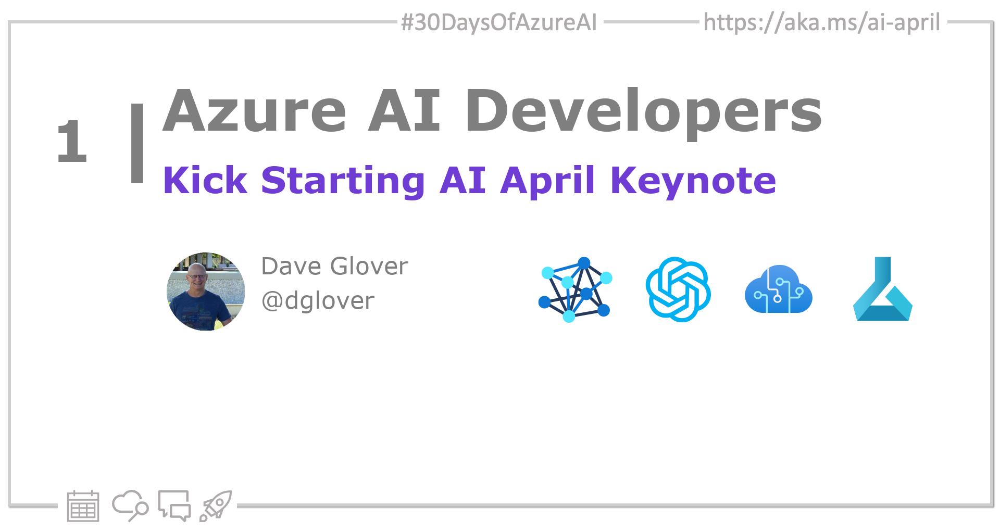

import Social from '@site/src/components/social';

<head>

  <meta name="twitter:url" content="https://azureaidevs.github.io/hub/2023-aia/day1" />
  <meta name="twitter:title" content="Kick Start AI April Keynote" />
  <meta name="twitter:description" content="🚀Welcome to day 1 of #30DaysOfAzureAI. Today, we're excited to share the Global AI Dev Conf keynote featuring senior Azure AI leaders John Montgomery and Bob Breynaert discussing the future of AI." />
  <meta name="twitter:image" content="https://raw.githubusercontent.com/AzureAiDevs/hub/main/website/static/img/2023-aia/banner-day1.png" />
  <meta name="twitter:card" content="summary_large_image" />

  </head>

- 🍿 [Tune into the AI Show](https://aka.ms/ai-april-ai-show)
<!-- - 🧬 [Connect with Humans in AI](/hub/humans-in-ai) -->
- 🗞️ [AiMonthly Newsletter](/hub/ai-update)
- 🌤️ [Continue the Azure AI Cloud Skills Challenge](https://aka.ms/30-days-of-azure-ai-challenge)
- 🏫 [Bookmark the Azure AI Technical Community](https://aka.ms/ai-april-tech-community)
- 🌏 [Join the Global AI Community](https://www.meetup.com/pro/the-global-ai-community)
- 💡 [Suggest a topic for a future post](https://forms.office.com/r/GhtwgHVP9L)

### Please share

<Social
    page_url="https://azureaidevs.github.io/hub/2023-aia/day1"
    image_url="https://raw.githubusercontent.com/AzureAiDevs/hub/main/website/static/img/2023-aia/banner-day1.png"
    title="Kick Start AI April Keynote"
    description= "🚀Welcome to day 1 of #30DaysOfAzureAI. Today, we're excited to share the Global AI Dev Conf keynote featuring senior Azure AI leaders John Montgomery and Bob Breynaert discussing the future of AI."
    hashtags="AzureOpenAI"
    hashtag="#30DaysOfAzureAi"
/>

## 🗓️ Day 1 of #30DaysOfAzureAI

<!-- Short description section -->

**Join us for 30 Days Of Azure AI learning, skilling and discussions**

<!-- Intro section -->

Welcome to the first day of AI April, a month-long celebration of AI and Azure AI. We'll be sharing a series of blog posts, videos, and other content to help you learn more about AI and Azure AI.

AI has been a hot topic for years, but recently we’ve seen the technology become accessible to a broad range of users. For example, it took less than a week for OpenAI’s ChatGPT to reach a million users, and it crossed the 100 million user mark in under two months. It’s a great example of how AI can be used to make our lives easier and more productive.

## 🎯 What we'll cover

<!-- What we'll cover section -->

- Microsoft leadership perspectives
- ChatGPT has sparked public imagination
- Text, coding and image models

<!-- Reference section -->

<!-- Body section -->

## Watch the Global AI Dev Conf Keynote

In this video, John Montgomery, Corporate Vice President of product at Microsoft, and Bob Breynaert, Principal Marketing Manager discuss the power of AI, including text-to-speech and text-to-image models, coding, and language, and how ChatGPT has changed the conversation about AI by making it real for millions of people.

<iframe width="100%" height="420" src="https://www.youtube.com/embed/D7_RN5Gc-RE" title="YouTube video player" frameborder="0" allow="accelerometer; autoplay; clipboard-write; encrypted-media; gyroscope; picture-in-picture; web-share" allowfullscreen></iframe>

## 🙋🏾‍♂️ Questions?

[You can ask questions about this post on GitHub Discussions](https://github.com/AzureAiDevs/hub/discussions/categories/azure-ai-developers)

## 📍 30 days roadmap

What's next? View the [#30DaysOfAzureAI Roadmap](/hub/roadmap/30days)

## 🧲 Subscribe

- [ Subscribe to the AiMonthly RSS XML feed](https://azureaidevs.github.io/hub/ai-update/rss.xml)
- [ Subscribe to the blog RSS XML feed](https://azureaidevs.github.io/hub/2023-aia/rss.xml)