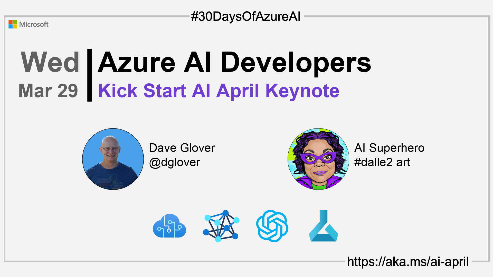

import Social from '@site/src/components/social';

<head>

  <meta name="twitter:url" content="https://azureaidevs.github.io/hub/2023-aia/day1" />
  <meta name="twitter:title" content="Kick Start AI April Keynote" />
  <meta name="twitter:description" content="🚀Welcome to day 1 of #30DaysOfAzureAI. Join us for 30 Days Of Azure AI learning, skilling and discussions" />
  <meta name="twitter:image" content="https://azureaidevs.github.io/hub/img/2023-aia/banner-day1.png" />
  <meta name="twitter:card" content="summary_large_image" />

  <meta property="og:url" content="https://azureaidevs.github.io/hub/2023-aia/day1" />
  <meta property="og:title" content="Kick Start AI April Keynote" />
  <meta property="og:description" content="🚀Welcome to day 1 of #30DaysOfAzureAI. Join us for 30 Days Of Azure AI learning, skilling and discussions" />
  <meta property="og:image" content="https://azureaidevs.github.io/hub/img/2023-aia/banner-day1.png" />
  <meta property="og:type" content="article" />
  <meta property="og:site_name" content="Azure AI Developer" />

  <link rel="canonical"  href="https://azureaidevs.github.io/hub/2023-aia/day1"  />

</head>

- 🍿 [Tune into the AI Show](https://aka.ms/ai-april-ai-show)
- 🌤️ [Continue the Azure AI Cloud Skills Challenge](https://aka.ms/30-days-of-azure-ai-challenge)
- 🏫 [Bookmark the Azure AI Technical Community](https://aka.ms/ai-april-tech-community)
- ❤️ [Learn about the Microsoft MVP Program](https://aka.ms/ai-april-mvp-program)
- 💡 [Suggest a topic for a future post](https://github.com/AzureAiDevs/hub/discussions/categories/call-for-content)

### Please share

<Social
    page_url="https://azureaidevs.github.io/hub/2023-aia/day1"
    image_url="https://azureaidevs.github.io/hub/img/2023-aia/banner-day1.png"
    title="Kick Start AI April Keynote"
    description= "🚀Day 1 of #30DaysOfAzureAI. Today, we're excited to share the Global AI Dev Conf keynote featuring senior Azure AI leaders John Montgomery and Bob Breynaert discussing the future of AI."
    hashtags="AI,AzureOpenAI"
    hashtag="#30DaysOfAzureAi"
/>

## 🗓️ Day 1 of #30DaysOfAzureAI

<!-- README
The following description is also used for the tweet. So it should be action oriented and grab attention 
If you update the description, please update the description: in the frontmatter as well.
-->

**Join us for 30 Days Of Azure AI learning, skilling and discussions**

<!-- README
The following is the intro to the post. It should be a short teaser for the post.
-->

Welcome to the first day of AI April, a month-long celebration of AI and Azure AI. We'll be sharing a series of blog posts, videos, and other content to help you learn more about AI and Azure AI.

AI has been a hot topic for years, but recently we’ve seen the technology become accessible to a broad range of users. For example, it took less than a week for OpenAI’s ChatGPT to reach a million users, and it crossed the 100 million user mark in under two months. It’s a great example of how AI can be used to make our lives easier and more productive.

## 🎯 What we'll cover

<!-- README
The following list is the main points of the post. There should be 3-4 main points.
 -->

- Microsoft leadership perspectives
- ChatGPT has sparked public imagination
- Text, coding and image models

<!-- 
- Main point 1
- Main point 2
- Main point 3 
- Main point 4
-->

<!-- README
Add or update a list relevant references here. These could be links to other blog posts, Microsoft Learn Module, videos, or other resources.
-->

<!-- README
The following is the body of the post. It should be an overview of the post that you are referencing.
See the Learn More section, if you supplied a canonical link, then will be displayed here.
-->

## Watch the Global AI Dev Conf Keynote

In this video, John Montgomery, Corporate Vice President of product at Microsoft, and Bob Breynaert, Principal Marketing Manager discuss the power of AI, including text-to-speech and text-to-image models, coding, and language, and how ChatGPT has changed the conversation about AI by making it real for millions of people.

<iframe width="100%" height="420" src="https://www.youtube.com/embed/D7_RN5Gc-RE" title="YouTube video player" frameborder="0" allow="accelerometer; autoplay; clipboard-write; encrypted-media; gyroscope; picture-in-picture; web-share" allowfullscreen></iframe>

## 🙋🏾‍♂️ Questions?

[Remember, you can ask a question about this post on GitHub Discussions](https://github.com/AzureAiDevs/hub/discussions/categories/azure-ai-developers)

## 📍 30 days roadmap

What's next? View the [#30DaysOfAzureAI Roadmap](/hub/roadmap/30days)

[ Click to subscribe](https://azureaidevs.github.io/hub/2023-aia/rss.xml)