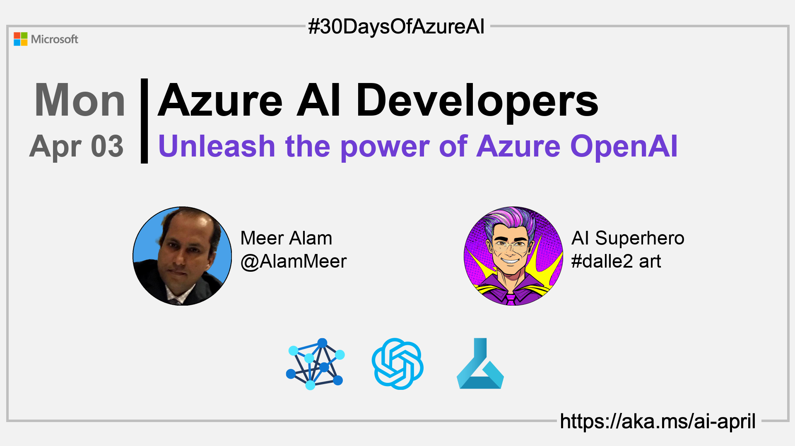

<head>  

  <link rel="canonical" href="https://techcommunity.microsoft.com/t5/fasttrack-for-azure/unleashing-the-power-of-ai-with-azure-openai-a-simple-guide-to/ba-p/3725706"  />

</head>

- 👓 [Read today's article](https://techcommunity.microsoft.com/t5/fasttrack-for-azure/unleashing-the-power-of-ai-with-azure-openai-a-simple-guide-to/ba-p/3725706)
- 📬 [Sign up for the Microsoft AI and Machine Learning Newsletter](https://aka.ms/azure-ai-dev-newsletter)
<!-- - 📰 [Subscribe to the #30DaysOfAzureAI RSS feed](https://azureaidevs.github.io/hub/2023-aia/rss.xml) -->
- 🌤️ [Continue the Azure AI Cloud Skills Challenge](https://aka.ms/30-days-of-azure-ai-challenge)
- 🏫 [Bookmark the Azure AI Technical Community](https://techcommunity.microsoft.com/t5/artificial-intelligence-and/ct-p/AI)
- 🙋🏾‍♂️ [Ask a question about this post on GitHub Discussions](https://github.com/AzureAiDevs/hub/discussions/categories/2-unleash-the-power-of-azure-openai)
- 💡 [Suggest a topic for a future post](https://github.com/AzureAiDevs/hub/discussions/categories/call-for-content)

## 🗓️ Day 2 of #30DaysOfAzureAI

<!-- README
The following description is also used for the tweet. So it should be action oriented and grab attention 
If you update the description, please update the description: in the frontmatter as well.
-->

**Unleashing the power of AI with Azure OpenAI: A simple guide to get started**

<!-- README
The following is the intro to the post. It should be a short teaser for the post.
-->

Welcome to the first day of the Azure AI fundamentals week. This week is for everyone; you might be an ai app Developer, a Data Scientist, or an ML or MLOps Engineer. 

The talk of the town is ChatGPT and generative AI, so what better place to start than an introduction to the Azure OpenAI Service.

## 🎯 What we'll cover

<!-- README
The following list is the main points of the post. There should be 3-4 main points.
 -->

- Azure OpenAI Service.
- Using large-scale generative AI models.
- Code generation and reasoning over data.
- DALL-E 2 model.

<!-- 
- Main point 1
- Main point 2
- Main point 3 
- Main point 4
-->

<!-- README
Add or update a list relevant references here. These could be links to other blog posts, Microsoft Learn Module, videos, or other resources.
-->

## 📚 References

- [Azure OpenAI Service](https://azure.microsoft.com/products/cognitive-services/openai-service?WT.mc_id=aiml-89446-dglover)
- [Learn Module: Introduction to Azure OpenAI Service](https://learn.microsoft.com/training/modules/explore-azure-openai?WT.mc_id=aiml-89446-dglover)
- [Case Study: Making generative AI training simple and cost-efficient with PeriFlow and Azure](https://startups.microsoft.com/blog/making-generative-ai-training-simple?WT.mc_id=aiml-89446-dglover)

<!-- README
The following is the body of the post. It should be an overview of the post that you are referencing.
See the Learn More section, if you supplied a canonical link, then will be displayed here.
-->

## 🚌 Intro to Azure OpenAI Service

[Today's article](https://techcommunity.microsoft.com/t5/fasttrack-for-azure/unleashing-the-power-of-ai-with-azure-openai-a-simple-guide-to/ba-p/3725706) eases us into the world of the Azure OpenAI Service. The large-scale generative AI models developed by OpenAI can be used in areas such as code generation and reasoning over data, while the DALL-E 2 model can create images from a written description. The service also offers the Codex model, which is capable of generating code from natural language. 

The service is available in the Azure Marketplace and can be deployed to Microsoft's Azure cloud with features such as security, compliance and regional availability. 

## 👓 Read today's article

Today's [article](https://techcommunity.microsoft.com/t5/fasttrack-for-azure/unleashing-the-power-of-ai-with-azure-openai-a-simple-guide-to/ba-p/3725706).

## 🙋🏾‍♂️ Questions?

[Remember, you can ask a question about this post on GitHub Discussions](https://github.com/AzureAiDevs/Discussions/discussions/categories/2-unleash-the-power-of-azure-openai)

## 📍 30 days roadmap

What's next? View the [#30DaysOfAzureAI Roadmap](/hub/roadmap/30days)

[ Click to subscribe](https://azureaidevs.github.io/hub/2023-aia/rss.xml)