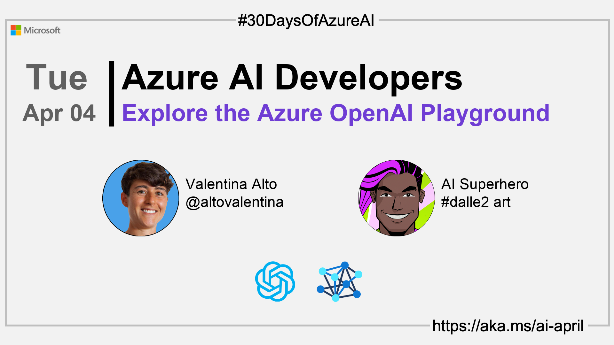

import Social from '@site/src/components/social';

<head>

  <meta name="twitter:url" content="https://azureaidevs.github.io/hub/2023-aia/day3" />
  <meta name="twitter:title" content="Explore the Azure OpenAI Playground" />
  <meta name="twitter:description" content="🏁Welcome to day 3 of #30DaysOfAzureAI. Explore Conversational AI with the Azure OpenAI Service Playground" />
  <meta name="twitter:image" content="https://azureaidevs.github.io/hub/img/2023-aia/banner-day3.png" />
  <meta name="twitter:card" content="summary_large_image" />

  <meta property="og:url" content="https://azureaidevs.github.io/hub/2023-aia/day3" />
  <meta property="og:title" content="Welcome to day 3 🏁Explore the Azure OpenAI Playground" />
  <meta property="og:description" content="Explore Conversational AI with the Azure OpenAI Service Playground https://azureaidevs.github.io/hub/2023-aia/day3 AzureAiDevs,AI AzureOpenAI,ConversationalAI" />
  <meta property="og:image" content="https://azureaidevs.github.io/hub/img/2023-aia/banner-day3.png" />
  <meta property="og:type" content="article" />
  <meta property="og:site_name" content="Azure AI Developer" />

  <link rel="canonical" href="https://medium.com/microsoftazure/azure-openai-playground-279f1f3da562"  />

</head>

- 👓 [View today's article](https://medium.com/microsoftazure/azure-openai-playground-279f1f3da562)
- 🌤️ [Continue the Azure AI Cloud Skills Challenge](https://aka.ms/30-days-of-azure-ai-challenge)
- 🏫 [Bookmark the Azure AI Technical Community](https://techcommunity.microsoft.com/t5/artificial-intelligence-and/ct-p/AI)
- 🙋🏾‍♂️ [Ask a question about this post on GitHub Discussions](https://github.com/AzureAiDevs/hub/discussions/categories/3-explore-the-azure-openai-playground)
- 💡 [Suggest a topic for a future post](https://github.com/AzureAiDevs/hub/discussions/categories/call-for-content)

### Please share

<Social
    page_url="https://azureaidevs.github.io/hub/2023-aia/day3"
    image_url="https://azureaidevs.github.io/hub/img/2023-aia/banner-day3.png"
    title="Explore the Azure OpenAI Playground"
    description= "🏁Day 3 of #30DaysOfAzureAI. Ready to dive into the world of conversational AI? Join us today as we explore the Azure OpenAI Service Playground! From custom datasets to model visualization."
    hashtags="AzureAiDevs,AI,AzureOpenAI,ConversationalAI"
    hashtag="#30DaysOfAzureAi"
/>

## 🗓️ Day 3 of #30DaysOfAzureAI

<!-- README
The following description is also used for the tweet. So it should be action oriented and grab attention 
If you update the description, please update the description: in the frontmatter as well.
-->

**Explore Conversational AI with the Azure OpenAI Service Playground**

<!-- README
The following is the intro to the post. It should be a short teaser for the post.
-->

Yesterday we talked was an introduction to the Azure OpenAI Service. Today we'll dig deeper into the Azure OpenAI Service Playground, so come along, it'll be fun.

## 🎯 What we'll cover

<!-- README
The following list is the main points of the post. There should be 3-4 main points.
 -->

- Azure OpenAI Playground.
- Custom datasets, experiment management, and model visualization.
- Flexible Azure OpenAI service offerings.

<!-- 
- Main point 1
- Main point 2
- Main point 3 
- Main point 4
-->

<!-- README
Add or update a list relevant references here. These could be links to other blog posts, Microsoft Learn Module, videos, or other resources.
-->

## 📚 References

- [Azure OpenAI Service](https://azure.microsoft.com/products/cognitive-services/openai-service?WT.mc_id=aiml-89446-dglover)
- [Quickstart: Get started generating text using Azure OpenAI Service](https://learn.microsoft.com/azure/cognitive-services/openai/quickstart?pivots=programming-language-studio&WT.mc_id=aiml-89446-dglover)
- [Learn Module: Introduction to Azure OpenAI Service](https://learn.microsoft.com/training/modules/explore-azure-openai?WT.mc_id=aiml-89446-dglover)
- [Case Study: Azure OpenAI Service powers the next generation of startups](https://startups.microsoft.com/blog/azure-openai-service-for-startups?WT.mc_id=aiml-89446-dglover)

<!-- README
The following is the body of the post. It should be an overview of the post that you are referencing.
See the Learn More section, if you supplied a canonical link, then will be displayed here.
-->

## 🚌 Getting started with the Azure OpenAI Playground

Read [today's article](https://medium.com/microsoftazure/azure-openai-playground-279f1f3da562) to gain an overview of language models and hyperparameters, with a focus on conversational AI models from OpenAI, and how to use the Azure OpenAI Service Playground to experiment with these models.

Learn about the three main categories of models offered by OpenAI: GPT-3, Codex, and Embeddings, and the different models available within each category. You'll learn how to tune hyperparameters to tailor the models to specific use cases, and how to consume the models using OpenAI's APIs.

## 👓 View today's article

Today's [article](https://medium.com/microsoftazure/azure-openai-playground-279f1f3da562).

## 🙋🏾‍♂️ Questions?

[Remember, you can ask a question about this post on GitHub Discussions](https://github.com/AzureAiDevs/hub/discussions/categories/3-explore-the-azure-openai-playground)

## 📍 30 days roadmap

What's next? View the [#30DaysOfAzureAI Roadmap](/hub/roadmap/30days)

[ Click to subscribe](https://azureaidevs.github.io/hub/2023-aia/rss.xml)