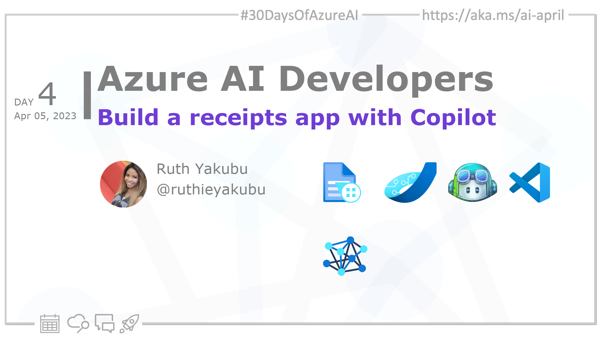

import Social from '@site/src/components/social';

<head>

  <link rel="canonical" href="https://techcommunity.microsoft.com/t5/ai-cognitive-services-blog/how-copilot-helps-developers-generate-code-for-a-form-recognizer/ba-p/3753813?WT.mc_id=aiml-89446-dglover"  />
  </head>

- 👓 [View today's article](https://techcommunity.microsoft.com/t5/ai-cognitive-services-blog/how-copilot-helps-developers-generate-code-for-a-form-recognizer/ba-p/3753813?WT.mc_id=aiml-89446-dglover)
- 🍿 [Tune into the AI Show](https://aka.ms/ai-april-ai-show)
- 🌤️ [Continue the Azure AI Cloud Skills Challenge](https://aka.ms/30-days-of-azure-ai-challenge)
- 🏫 [Bookmark the Azure AI Technical Community](https://aka.ms/ai-april-tech-community)
- ❤️ [Learn about the Microsoft MVP Program](https://aka.ms/ai-april-mvp-program)
- 💡 [Suggest a topic for a future post](https://github.com/AzureAiDevs/hub/discussions/categories/call-for-content)

### Please share

<Social
    page_url="https://azureaidevs.github.io/hub/2023-aia/day4"
    image_url="https://raw.githubusercontent.com/AzureAiDevs/hub/main/website/static/img/2023-aia/banner-day4.png"
    title="Build a receipts app with Copilot"
    description= "🏁Day 4 of #30DaysOfAzureAI. Today, we're diving into GitHub Copilot and Azure #FormRecognizer to build a receipts app. Learn how Copilot can increase productivity."
    hashtags="AI,IntelligentApps"
    hashtag="#30DaysOfAzureAi"
/>

## 🗓️ Day 4 of #30DaysOfAzureAI

<!-- README
The following description is also used for the tweet. So it should be action oriented and grab attention 
If you update the description, please update the description: in the frontmatter as well.
-->

**Learn how to use Copilot to build an intelligent receipts app powered by Azure Form Recognizer**

<!-- README
The following is the intro to the post. It should be a short teaser for the post.
-->

Yesterday we talked about using Azure OpenAI Service playground to explore conversational AI. Today we'll explore how you can use GitHub Copilot as your programming buddy to build an intelligent Receipt processing App.

## 🎯 What we'll cover

<!-- README
The following list is the main points of the post. There should be 3-4 main points.
 -->

- Why use GitHub Copilot.
- Build a receipt app with GitHub Copilot and Azure Form Recognizer
- Copilot increase efficiency and productivity for developers.

<!-- 
- Main point 1
- Main point 2
- Main point 3 
- Main point 4
-->

<!-- README
Add or update a list relevant references here. These could be links to other blog posts, Microsoft Learn Module, videos, or other resources.
-->

## 📚 References

- [What is Azure Form Recognizer?](https://learn.microsoft.com/azure/applied-ai-services/form-recognizer/overview?view=form-recog-3.0.0&WT.mc_id=aiml-89446-dglover)
<!-- - [Learn Module: Learn about Azure Cognitive Services](https://learn.microsoft.com/training/browse/?products=azure-cognitive-services&WT.mc_id=aiml-89446-dglover) -->
- [Learn Module: Introduction to Form Recognizer](https://learn.microsoft.com/training/modules/intro-to-form-recognizer?WT.mc_id=aiml-89446-dglover)
- [Introducing GitHub Copilot: your AI pair programmer](https://github.blog/2021-06-29-introducing-github-copilot-ai-pair-programmer?WT.mc_id=aiml-89446-dglover)
- [Case Study: How Qard went from idea to MVP](https://startups.microsoft.com/blog/qard-idea-to-mvp?WT.mc_id=aiml-89446-dglover)

<!-- README
The following is the body of the post. It should be an overview of the post that you are referencing.
See the Learn More section, if you supplied a canonical link, then will be displayed here.
-->

## 🚌 How Copilot helped a developer write a Form Recognizer app

Read [today's article](https://techcommunity.microsoft.com/t5/ai-cognitive-services-blog/how-copilot-helps-developers-generate-code-for-a-form-recognizer/ba-p/3753813?WT.mc_id=aiml-89446-dglover) to learn how you can use Copilot to help build an app that recognizers printed receipts using the Azure Form Recognizer Cognitive Service. It is a great example of how Copilot can help you to generate code for your AI applications.

Be sure to check it out here: [How Copilot helps developers generate code for a Form Recognizer application](https://techcommunity.microsoft.com/t5/ai-cognitive-services-blog/how-copilot-helps-developers-generate-code-for-a-form-recognizer/ba-p/3753813)

## 👓 View today's article

Today's [article](https://techcommunity.microsoft.com/t5/ai-cognitive-services-blog/how-copilot-helps-developers-generate-code-for-a-form-recognizer/ba-p/3753813?WT.mc_id=aiml-89446-dglover).

## 🙋🏾‍♂️ Questions?

[Remember, you can ask a question about this post on GitHub Discussions](https://github.com/AzureAiDevs/hub/discussions/categories/azure-ai-developers)

## 📍 30 days roadmap

What's next? View the [#30DaysOfAzureAI Roadmap](/hub/roadmap/30days)

[ Click to subscribe to the RSS XML feed](https://azureaidevs.github.io/hub/2023-aia/rss.xml)