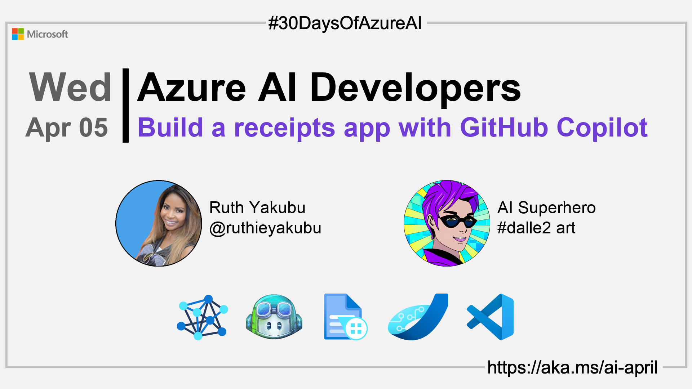

import Social from '@site/src/components/social';

<head>

  <meta name="twitter:url" content="https://azureaidevs.github.io/hub/2023-aia/day4" />
  <meta name="twitter:title" content="Build a receipts app with GitHub Copilot" />
  <meta name="twitter:description" content="🏁Welcome to day 4 of #30DaysOfAzureAI. Today, we're diving into GitHub Copilot and Azure #FormRecognizer to build a receipts app. Learn how Copilot can increase productivity." />
  <meta name="twitter:image" content="https://raw.githubusercontent.com/AzureAiDevs/hub/main/website/static/img/2023-aia/banner-day4.png" />
  <meta name="twitter:card" content="summary_large_image" />

  <link rel="canonical" href="https://techcommunity.microsoft.com/t5/ai-cognitive-services-blog/how-copilot-helps-developers-generate-code-for-a-form-recognizer/ba-p/3753813?WT.mc_id=aiml-89446-dglover"  />
  </head>

- 👓 [View today's article](https://techcommunity.microsoft.com/t5/ai-cognitive-services-blog/how-copilot-helps-developers-generate-code-for-a-form-recognizer/ba-p/3753813?WT.mc_id=aiml-89446-dglover)
- 🍿 [Tune into the AI Show](https://aka.ms/ai-april-ai-show)
- 🧬 [Connect with Humans in AI](/hub/humans-in-ai)
- 🌤️ [Continue the Azure AI Cloud Skills Challenge](https://aka.ms/30-days-of-azure-ai-challenge)
- 🏫 [Bookmark the Azure AI Technical Community](https://aka.ms/ai-april-tech-community)
- ❤️ [Learn about the Microsoft MVP Program](https://aka.ms/ai-april-mvp-program)
- 💡 [Suggest a topic for a future post](https://forms.office.com/r/GhtwgHVP9L)

### Please share

<Social
    page_url="https://azureaidevs.github.io/hub/2023-aia/day4"
    image_url="https://raw.githubusercontent.com/AzureAiDevs/hub/main/website/static/img/2023-aia/banner-day4.png"
    title="Build a receipts app with GitHub Copilot"
    description= "🏁Welcome to day 4 of #30DaysOfAzureAI. Today, we're diving into GitHub Copilot and Azure #FormRecognizer to build a receipts app. Learn how Copilot can increase productivity."
    hashtags="IntelligentApps"
    hashtag="#30DaysOfAzureAi"
/>

## 🗓️ Day 4 of #30DaysOfAzureAI

<!-- Short description section -->

**Learn how to use Copilot to build an intelligent receipts app powered by Azure Form Recognizer**

<!-- Intro section -->

Yesterday we talked about using Azure OpenAI Service playground to explore conversational AI. Today we'll explore how you can use GitHub Copilot as your programming buddy to build an intelligent Receipt processing App.

## 🎯 What we'll cover

<!-- What we'll cover section -->

- Why use GitHub Copilot.
- Build a receipt app with GitHub Copilot and Azure Form Recognizer
- Copilot increase efficiency and productivity for developers.

<!-- Reference section -->

## 📚 References

- [What is Azure Form Recognizer?](https://learn.microsoft.com/azure/applied-ai-services/form-recognizer/overview?view=form-recog-3.0.0&WT.mc_id=aiml-89446-dglover)
<!-- - [Learn Module: Learn about Azure Cognitive Services](https://learn.microsoft.com/training/browse/?products=azure-cognitive-services&WT.mc_id=aiml-89446-dglover) -->
- [Learn Module: Introduction to Form Recognizer](https://learn.microsoft.com/training/modules/intro-to-form-recognizer?WT.mc_id=aiml-89446-dglover)
- [Introducing GitHub Copilot: your AI pair programmer](https://github.blog/2021-06-29-introducing-github-copilot-ai-pair-programmer?WT.mc_id=aiml-89446-dglover)
- [Case Study: How Qard went from idea to MVP](https://startups.microsoft.com/blog/qard-idea-to-mvp?WT.mc_id=aiml-89446-dglover)

<!-- Body section -->

## 🚌 How Copilot helped a developer write a Form Recognizer app

Read [today's article](https://techcommunity.microsoft.com/t5/ai-cognitive-services-blog/how-copilot-helps-developers-generate-code-for-a-form-recognizer/ba-p/3753813?WT.mc_id=aiml-89446-dglover) to learn how you can use Copilot to help build an app that recognizers printed receipts using the Azure Form Recognizer Cognitive Service. It is a great example of how Copilot can help you to generate code for your AI applications.

Be sure to check it out here: [How Copilot helps developers generate code for a Form Recognizer application](https://techcommunity.microsoft.com/t5/ai-cognitive-services-blog/how-copilot-helps-developers-generate-code-for-a-form-recognizer/ba-p/3753813)

## 👓 View today's article

Today's [article](https://techcommunity.microsoft.com/t5/ai-cognitive-services-blog/how-copilot-helps-developers-generate-code-for-a-form-recognizer/ba-p/3753813?WT.mc_id=aiml-89446-dglover).

## 🙋🏾‍♂️ Questions?

[You can ask questions about this post on GitHub Discussions](https://github.com/AzureAiDevs/hub/discussions/categories/azure-ai-developers)

## 📍 30 days roadmap

What's next? View the [#30DaysOfAzureAI Roadmap](/hub/roadmap/30days)

## 🧲 Subscribe

- 📬 [Subscribe to the monthly Azure AI and Machine Learning Tech Newsletter](https://aka.ms/azure-ai-dev-newsletter)
- [ Subscribe to the blog RSS XML feed](https://azureaidevs.github.io/hub/2023-aia/rss.xml)