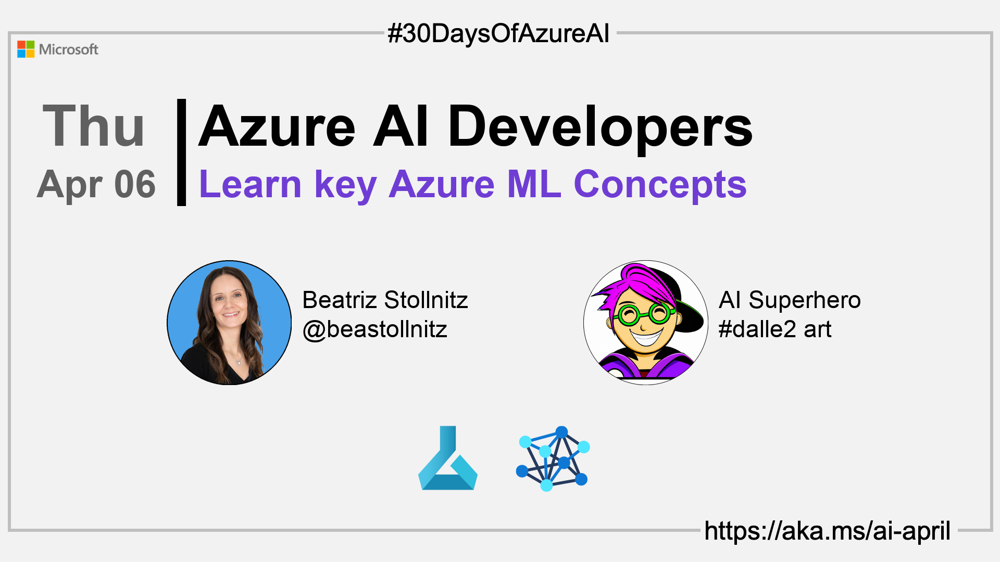

import Social from '@site/src/components/social';

<head>

  <meta name="twitter:url" content="https://azureaidevs.github.io/hub/2023-aia/day5" />
  <meta name="twitter:title" content="Learn key Azure ML Concepts" />
  <meta name="twitter:description" content="🏁Welcome to day 5 of #30DaysOfAzureAI. Unlock the power of machine learning with Azure ML! Learn about the benefits of cloud computing for ML projects and explore key Azure ML concepts with our primer." />
  <meta name="twitter:image" content="https://raw.githubusercontent.com/AzureAiDevs/hub/main/website/static/img/2023-aia/banner-day5.png" />
  <meta name="twitter:card" content="summary_large_image" />

  <link rel="canonical" href="https://bea.stollnitz.com/blog/aml-introduction/"  />
  </head>

- 👓 [View today's article](https://bea.stollnitz.com/blog/aml-introduction/)
- 🍿 [Tune into the AI Show](https://aka.ms/ai-april-ai-show)
<!-- - 🧬 [Connect with Humans in AI](/hub/humans-in-ai) -->
- 🗞️ [AiMonthly Newsletter](/hub/ai-update)
- 🌤️ [Continue the Azure AI Cloud Skills Challenge](https://aka.ms/30-days-of-azure-ai-challenge)
- 🏫 [Bookmark the Azure AI Technical Community](https://aka.ms/ai-april-tech-community)
- 🌏 [Join the Global AI Community](https://www.meetup.com/pro/the-global-ai-community)
- 💡 [Suggest a topic for a future post](https://forms.office.com/r/GhtwgHVP9L)

### Please share

<Social
    page_url="https://azureaidevs.github.io/hub/2023-aia/day5"
    image_url="https://raw.githubusercontent.com/AzureAiDevs/hub/main/website/static/img/2023-aia/banner-day5.png"
    title="Learn key Azure ML Concepts"
    description= "🏁Welcome to day 5 of #30DaysOfAzureAI. Unlock the power of machine learning with Azure ML! Learn about the benefits of cloud computing for ML projects and explore key Azure ML concepts with our primer."
    hashtags="AzureML"
    hashtag="#30DaysOfAzureAi"
/>

## 🗓️ Day 5 of #30DaysOfAzureAI

<!-- Short description section -->

**Learn key Azure ML Concepts with this primer**

<!-- Intro section -->

Yesterday we talked about using Copilot to build an intelligent Receipt processing app. Today we'll explore Azure Machine Learning.

## 🎯 What we'll cover

<!-- What we'll cover section -->

- Why use Azure ML
- The main resources used to train and deploy models in Azure ML 
- The four different ways of creating those resources

<!-- Reference section -->

## 📚 References

- [Learn Module: Introduction to Azure Machine Learning](https://learn.microsoft.com/training/modules/intro-to-azure-ml?WT.mc_id=aiml-89446-dglover)
- [What is Azure Machine Learning?](https://learn.microsoft.com/azure/machine-learning/overview-what-is-azure-machine-learning?WT.mc_id=aiml-89446-dglover)

<!-- Body section -->

## 🚌 Introduction to Azure ML

Read [today's article](https://bea.stollnitz.com/blog/aml-introduction/) to understand the benefits of using cloud computing for machine learning projects, and to get an overview of Microsoft's Azure ML platform. Azure ML enables you to train and deploy machine learning models in the cloud, by creating a variety of resources that help tailor the workflow to your needs. Today's article provides an overview of each of those resources, and explains the four different ways of creating them.

The goal for today is for you to get a foundational understanding of Azure ML concepts, so that you'll be able to follow code samples later in the AI April month.

## 👓 View today's article

Today's [article](https://bea.stollnitz.com/blog/aml-introduction/).

## 🙋🏾‍♂️ Questions?

[You can ask questions about this post on GitHub Discussions](https://github.com/AzureAiDevs/hub/discussions/categories/azure-ai-developers)

## 📍 30 days roadmap

What's next? View the [#30DaysOfAzureAI Roadmap](/hub/roadmap/30days)

## 🧲 Subscribe

- [ Subscribe to the AiMonthly RSS XML feed](https://azureaidevs.github.io/hub/ai-update/rss.xml)
- [ Subscribe to the blog RSS XML feed](https://azureaidevs.github.io/hub/2023-aia/rss.xml)