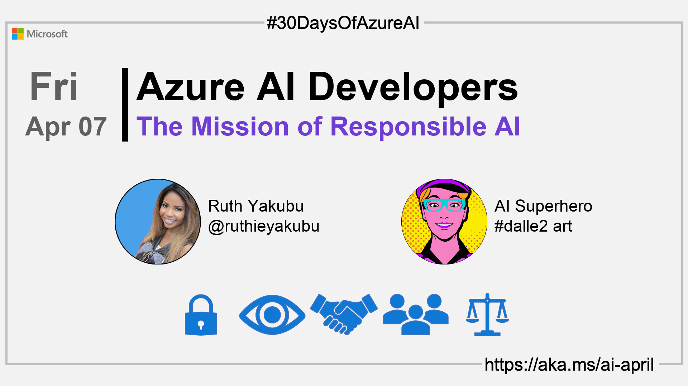

<head>  

  <link rel="canonical" href="https://www.microsoft.com/ai/our-approach"  />

</head>

- 👓 [View today's article](https://www.microsoft.com/ai/our-approach)
- 📬 [Monthly AI and Machine Learning Microsoft Tech Newsletter](https://developer.microsoft.com/en-us/Newsletter/)
<!-- - 📰 [Subscribe to the #30DaysOfAzureAI RSS feed](https://azureaidevs.github.io/hub/2023-aia/rss.xml) -->
- 🌤️ [Continue the Azure AI Cloud Skills Challenge](https://aka.ms/30-days-of-azure-ai-challenge)
- 🏫 [Bookmark the Azure AI Technical Community](https://techcommunity.microsoft.com/t5/artificial-intelligence-and/ct-p/AI)
- 🙋🏾‍♂️ [Ask a question about this post on GitHub Discussions](https://github.com/AzureAiDevs/hub/discussions/categories/6-the-mission-of-responsible-ai)
- 💡 [Suggest a topic for a future post](https://github.com/AzureAiDevs/hub/discussions/categories/call-for-content)

## 🗓️ Day 6 of #30DaysOfAzureAI

<!-- README
The following description is also used for the tweet. So it should be action oriented and grab attention 
If you update the description, please update the description: in the frontmatter as well.
-->

**Why you should care about Responsible AI and Microsoft role**

<!-- README
The following is the intro to the post. It should be a short teaser for the post.
-->

Yesterday was an introduction to the Azure Machine Learning. Today is all about understanding why Microsoft is committed to Responsible AI, and why you should be as well. So, come along, you'll be happy you did.

## 🎯 What we'll cover

<!-- README
The following list is the main points of the post. There should be 3-4 main points.
 -->

- Microsoft's commitment to Responsible AI.
- Why you should care deeply about Responsible AI.
- Microsoft's AI strategy.

<!-- 
- Main point 1
- Main point 2
- Main point 3 
- Main point 4
-->

<!-- README
Add or update a list relevant references here. These could be links to other blog posts, Microsoft Learn Module, videos, or other resources.
-->

## 📚 References

- [Microsoft's approach to using AI responsibly](https://news.microsoft.com/source/features/ai/microsoft-approach-to-ai/#using-ai-responsibly?WT.mc_id=aiml-89446-dglover)
- [Meeting the AI moment: advancing the future through responsible AI](https://blogs.microsoft.com/on-the-issues/2023/02/02/responsible-ai-chatgpt-artificial-intelligence?WT.mc_id=aiml-89446-dglover)

<!-- README
The following is the body of the post. It should be an overview of the post that you are referencing.
See the Learn More section, if you supplied a canonical link, then will be displayed here.
-->

## 🚌 Why Responsible AI is so important

Read [today's article](https://www.microsoft.com/ai/our-approach) to learn about Microsoft's mission to advance AI for everyone, and to understand the principles that guide Microsoft's approach to AI.

Microsoft is investing heavily in AI because it believes that it can benefit everyone at every level of every organization. However, Microsoft acknowledges the need for responsible AI by design, guided by a set of principles: fairness, reliability and safety, privacy and security, inclusiveness, transparency, and accountability.

## 👓 View today's article

Today's [article](https://www.microsoft.com/ai/our-approach).

## 🙋🏾‍♂️ Questions?

[Remember, you can ask a question about this post on GitHub Discussions](https://github.com/AzureAiDevs/Discussions/discussions/categories/6-the-mission-of-responsible-ai)

## 📍 30 days roadmap

What's next? View the [#30DaysOfAzureAI Roadmap](/hub/roadmap/30days)

[ Click to subscribe](https://azureaidevs.github.io/hub/2023-aia/rss.xml)