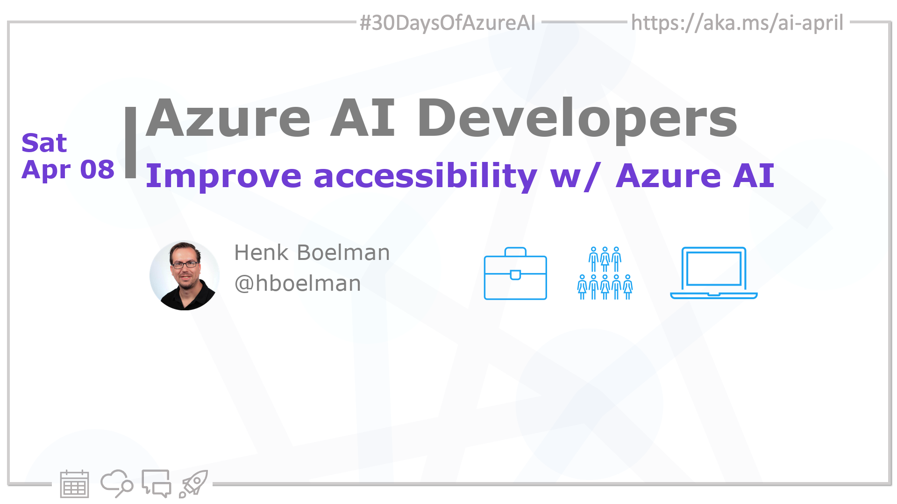

import Social from '@site/src/components/social';

<head>

  <meta name="twitter:url" content="https://azureaidevs.github.io/hub/2023-aia/day7" />
  <meta name="twitter:title" content="Improve accessibility w/ Azure AI" />
  <meta name="twitter:description" content="🏁Welcome to day 7 of #30DaysOfAzureAI. Learn about the 6 ways to improve accessibility with Azure AI" />
  <meta name="twitter:image" content="https://github.com/AzureAiDevs/hub/blob/main/website/static/img/2023-aia/banner-day7.png" />
  <meta name="twitter:card" content="summary_large_image" />

  <meta property="og:url" content="https://azureaidevs.github.io/hub/2023-aia/day7" />
  <meta property="og:title" content="Improve accessibility w/ Azure AI" />
  <meta property="og:description" content="🏁Welcome to day 7 of #30DaysOfAzureAI. Learn about the 6 ways to improve accessibility with Azure AI" />
  <meta property="og:image" content="https://github.com/AzureAiDevs/hub/blob/main/website/static/img/2023-aia/banner-day7.png" />
  <meta property="og:type" content="article" />
  <meta property="og:site_name" content="Azure AI Developer" />

  <link rel="canonical" href="https://azure.microsoft.com/blog/6-ways-to-improve-accessibility-with-azure-ai?WT.mc_id=aiml-89446-dglover"  />

</head>

- 👓 [View today's article](https://azure.microsoft.com/blog/6-ways-to-improve-accessibility-with-azure-ai?WT.mc_id=aiml-89446-dglover)
- 🍿 [Tune into the AI Show](https://aka.ms/ai-april-ai-show)
- 🌤️ [Continue the Azure AI Cloud Skills Challenge](https://aka.ms/30-days-of-azure-ai-challenge)
- 🏫 [Bookmark the Azure AI Technical Community](https://aka.ms/ai-april-tech-community)
- ❤️ [Learn about the Microsoft MVP Program](https://aka.ms/ai-april-mvp-program)
- 💡 [Suggest a topic for a future post](https://github.com/AzureAiDevs/hub/discussions/categories/call-for-content)

### Please share

<Social
    page_url="https://azureaidevs.github.io/hub/2023-aia/day7"
    image_url="https://github.com/AzureAiDevs/hub/blob/main/website/static/img/2023-aia/banner-day7.png"
    title="Improve accessibility w/ Azure AI"
    description= "🏁Day 7 of #30DaysOfAzureAI. Join Microsoft's mission to break down barriers! Learn about the 6 ways to improve accessibility with Azure AI and empower the 1 billion ppl living with disabilities."
    hashtags="AI,Accessibility"
    hashtag="#30DaysOfAzureAi"
/>

## 🗓️ Day 7 of #30DaysOfAzureAI

<!-- README
The following description is also used for the tweet. So it should be action oriented and grab attention 
If you update the description, please update the description: in the frontmatter as well.
-->

**Learn about the 6 ways to improve accessibility with Azure AI**

<!-- README
The following is the intro to the post. It should be a short teaser for the post.
-->

Yesterday we talked about the importance of Responsible AI. Today is about 6 ways to improve accessibility with Azure AI for the billion people living with disabilities.

## 🎯 What we'll cover

<!-- README
The following list is the main points of the post. There should be 3-4 main points.
 -->

- Microsoft's five-year initiative to improve the accessibility of technology.
- Azure AI accessibility solutions to create more inclusive experiences.

<!-- 
- Main point 1
- Main point 2
- Main point 3 
- Main point 4
-->

<!-- README
Add or update a list relevant references here. These could be links to other blog posts, Microsoft Learn Module, videos, or other resources.
-->

## 📚 References

- [AI for Accessibility](https://www.microsoft.com/ai/ai-for-accessibility&WT.mc_id=aiml-89446-dglover)

<!-- README
The following is the body of the post. It should be an overview of the post that you are referencing.
See the Learn More section, if you supplied a canonical link, then will be displayed here.
-->

## 🚌 6 ways to improve accessibility with Azure AI

<!-- Read [today's article](https://azure.microsoft.com/blog/6-ways-to-improve-accessibility-with-azure-ai?WT.mc_id=aiml-89446-dglover) -->

There are over one billion people living with disabilities, and many face barriers to employment, education, and societal inclusion.

Read [today's article](https://azure.microsoft.com/blog/6-ways-to-improve-accessibility-with-azure-ai?WT.mc_id=aiml-89446-dglover) to learn about [Microsoft's five-year initiative](https://blogs.microsoft.com/blog/2021/04/28/doubling-down-on-accessibility-microsofts-next-steps-to-expand-accessibility-in-technology-the-workforce-and-workplace) aimed at improving the accessibility of technology and creating opportunities for people with disabilities. 

The initiative focuses on three priorities: developing more accessible technology, using this technology to create job opportunities for people with disabilities, and building a more inclusive workplace. 

## 👓 View today's article

Today's [article](https://azure.microsoft.com/blog/6-ways-to-improve-accessibility-with-azure-ai?WT.mc_id=aiml-89446-dglover).

## 🙋🏾‍♂️ Questions?

[Remember, you can ask a question about this post on GitHub Discussions](https://github.com/AzureAiDevs/hub/discussions/categories/azure-ai-developers)

## 📍 30 days roadmap

What's next? View the [#30DaysOfAzureAI Roadmap](/hub/roadmap/30days)

[ Click to subscribe](https://azureaidevs.github.io/hub/2023-aia/rss.xml)