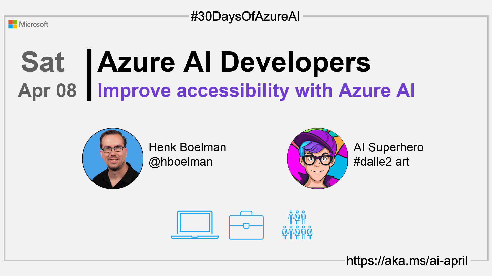

import Social from '@site/src/components/social';

<head>

  <meta name="twitter:url" content="https://azureaidevs.github.io/hub/2023-aia/day7" />
  <meta name="twitter:title" content="Improve accessibility with Azure AI" />
  <meta name="twitter:description" content="🏁Welcome to day 7 of #30DaysOfAzureAI. Join Microsoft's mission to break down barriers! Learn about the 6 ways to improve accessibility with Azure AI and empower the 1 billion ppl living with disabilities." />
  <meta name="twitter:image" content="https://raw.githubusercontent.com/AzureAiDevs/hub/main/website/static/img/2023-aia/banner-day7.png" />
  <meta name="twitter:card" content="summary_large_image" />

  <link rel="canonical" href="https://azure.microsoft.com/blog/6-ways-to-improve-accessibility-with-azure-ai?WT.mc_id=aiml-89446-dglover"  />
  </head>

- 👓 [View today's article](https://azure.microsoft.com/blog/6-ways-to-improve-accessibility-with-azure-ai?WT.mc_id=aiml-89446-dglover)
- 🍿 [Tune into the AI Show](https://aka.ms/ai-april-ai-show)
- 🧬 [Connect with Humans in AI](/hub/humans-in-ai)
- 🌤️ [Continue the Azure AI Cloud Skills Challenge](https://aka.ms/30-days-of-azure-ai-challenge)
- 🏫 [Bookmark the Azure AI Technical Community](https://aka.ms/ai-april-tech-community)
- ❤️ [Learn about the Microsoft MVP Program](https://aka.ms/ai-april-mvp-program)
- 💡 [Suggest a topic for a future post](https://github.com/AzureAiDevs/hub/discussions/categories/call-for-content)

### Please share

<Social
    page_url="https://azureaidevs.github.io/hub/2023-aia/day7"
    image_url="https://raw.githubusercontent.com/AzureAiDevs/hub/main/website/static/img/2023-aia/banner-day7.png"
    title="Improve accessibility with Azure AI"
    description= "🏁Welcome to day 7 of #30DaysOfAzureAI. Join Microsoft's mission to break down barriers! Learn about the 6 ways to improve accessibility with Azure AI and empower the 1 billion ppl living with disabilities."
    hashtags="Accessibility"
    hashtag="#30DaysOfAzureAi"
/>

## 🗓️ Day 7 of #30DaysOfAzureAI

<!-- Short description section -->

**Learn about the 6 ways to improve accessibility with Azure AI**

<!-- Intro section -->

Yesterday we talked about the importance of Responsible AI. Today is about 6 ways to improve accessibility with Azure AI for the billion people living with disabilities.

## 🎯 What we'll cover

<!-- What we'll cover section -->

- Microsoft's five-year initiative to improve the accessibility of technology.
- Azure AI accessibility solutions to create more inclusive experiences.

<!-- Reference section -->

## 📚 References

- [AI for Accessibility](https://www.microsoft.com/ai/ai-for-accessibility&WT.mc_id=aiml-89446-dglover)

<!-- Body section -->

## 🚌 6 ways to improve accessibility with Azure AI

<!-- Read [today's article](https://azure.microsoft.com/blog/6-ways-to-improve-accessibility-with-azure-ai?WT.mc_id=aiml-89446-dglover) -->

There are over one billion people living with disabilities, and many face barriers to employment, education, and societal inclusion.

Read [today's article](https://azure.microsoft.com/blog/6-ways-to-improve-accessibility-with-azure-ai?WT.mc_id=aiml-89446-dglover) to learn about [Microsoft's five-year initiative](https://blogs.microsoft.com/blog/2021/04/28/doubling-down-on-accessibility-microsofts-next-steps-to-expand-accessibility-in-technology-the-workforce-and-workplace) aimed at improving the accessibility of technology and creating opportunities for people with disabilities. 

The initiative focuses on three priorities: developing more accessible technology, using this technology to create job opportunities for people with disabilities, and building a more inclusive workplace. 

## 👓 View today's article

Today's [article](https://azure.microsoft.com/blog/6-ways-to-improve-accessibility-with-azure-ai?WT.mc_id=aiml-89446-dglover).

## 🙋🏾‍♂️ Questions?

[You can ask questions about this post on GitHub Discussions](https://github.com/AzureAiDevs/hub/discussions/categories/azure-ai-developers)

## 📍 30 days roadmap

What's next? View the [#30DaysOfAzureAI Roadmap](/hub/roadmap/30days)

## 🧲 Subscribe

- 📬 [Subscribe to the monthly Azure AI and Machine Learning Tech Newsletter](https://aka.ms/azure-ai-dev-newsletter)
- [ Subscribe to the blog RSS XML feed](https://azureaidevs.github.io/hub/2023-aia/rss.xml)