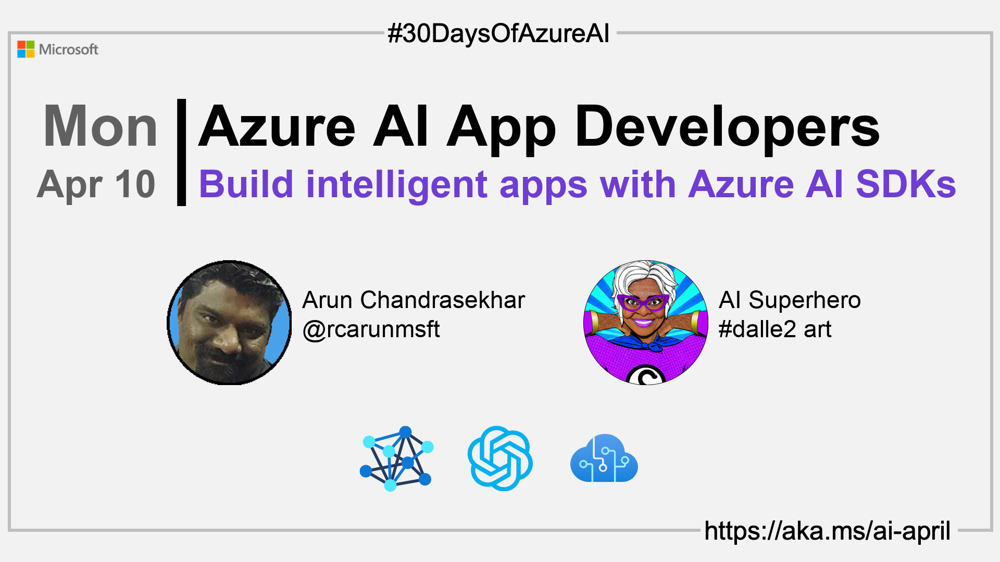

import Social from '@site/src/components/social';

<head>

  <link rel="canonical" href="https://github.com/Azure-Samples/azure-ai"  />

</head>

- 👓 [View today's article](https://github.com/Azure-Samples/azure-ai)
- 🌤️ [Continue the Azure AI Cloud Skills Challenge](https://aka.ms/30-days-of-azure-ai-challenge)
- 🏫 [Bookmark the Azure AI Technical Community](https://techcommunity.microsoft.com/t5/artificial-intelligence-and/ct-p/AI)
- 🙋🏾‍♂️ [Ask a question about this post on GitHub Discussions](https://github.com/AzureAiDevs/hub/discussions/categories/9-build-intelligent-apps-w-azure-ai-sdks)
- 💡 [Suggest a topic for a future post](https://github.com/AzureAiDevs/hub/discussions/categories/call-for-content)

### Please share

<Social
    page_url="https://azureaidevs.github.io/hub/2023-aia/day9"
    image_url="https://azureaidevs.github.io/hub/img/2023-aia/banner-day9.png"
    title="Build intelligent apps w/ Azure AI SDKs"
    description= "🧑‍💻Day 9 of #30DaysOfAzureAI. AI App developers don't miss out on exploring the Azure AI Hub for OpenAI and Cognitive Services SDK samples. Build intelligent apps with Azure AI Services."
    hashtags="AzureAiDevs,AI,AzureOpenAI,IntelligentApps"
    hashtag="#30DaysOfAzureAi"
/>

## 🗓️ Day 9 of #30DaysOfAzureAI

<!-- README
The following description is also used for the tweet. So it should be action oriented and grab attention 
If you update the description, please update the description: in the frontmatter as well.
-->

**Building intelligent apps? Then explore the Azure AI Hub for OpenAI and Cognitive Services SDK samples**

<!-- README
The following is the intro to the post. It should be a short teaser for the post.
-->

Last week was Azure AI fundamentals week, this week, we switch gears and focus on Azure AI App Developers. This week is for app developers building intelligent apps calling Azure AI Services or incorporating AI models directly into apps. 

So what better place to start than an introduction to the Azure AI Hub where you'll find loads of samples for using the Azure AI Services SDKs.

## 🎯 What we'll cover

<!-- README
The following list is the main points of the post. There should be 3-4 main points.
 -->

- The Azure AI Hub GitHub repo
- Code samples and discussion channels.
- Best practices for using the Azure AI SDKs.

<!-- 
- Main point 1
- Main point 2
- Main point 3 
- Main point 4
-->

<!-- README
Add or update a list relevant references here. These could be links to other blog posts, Microsoft Learn Module, videos, or other resources.
-->

## 📚 References

- [Learn Module: Introduction to Azure OpenAI Service](https://learn.microsoft.com/en-us/training/modules/explore-azure-openai/?WT.mc_id=aiml-89446-dglover)
- [Learn Module: Learn about Azure Cognitive Services](https://learn.microsoft.com/training/browse/?products=azure-cognitive-services&WT.mc_id=aiml-89446-dglover)
- [Case Study: CarMax uses car research tools powered by Azure OpenAI Service](https://customers.microsoft.com/en-us/story/1501304071775762777-carmax-retailer-azure-openai-service&WT.mc_id=aiml-89446-dglover)
- [Case Study: Captioning and Call Center Transcription using Speech AI](https://github.com/Azure-Samples/cognitive-services-speech-sdk/tree/master/scenarios)

<!-- README
The following is the body of the post. It should be an overview of the post that you are referencing.
See the Learn More section, if you supplied a canonical link, then will be displayed here.
-->

## 🚌 Introducing the Azure AI Hub

Read [today's article](https://github.com/Azure-Samples/azure-ai) to learn about the Azure AI Hub repository, a curated list of samples for AI app developers looking to use Azure AI services for common end-to-end scenarios. 

The repo includes sample code in different programming languages, as well as a forum for developers to communicate directly with Microsoft product teams and other developers using Azure AI. The sample code covers topics like OpenAI, Speech, Language, Applied AI/Decision, and more. The platform welcomes contributions, feedback, and suggestions from the developer community.

## 👓 View today's article

Today's [article](https://github.com/Azure-Samples/azure-ai).

## 🙋🏾‍♂️ Questions?

[Remember, you can ask a question about this post on GitHub Discussions](https://github.com/AzureAiDevs/hub/discussions/categories/9-build-intelligent-apps-w-azure-ai-sdks)

## 📍 30 days roadmap

What's next? View the [#30DaysOfAzureAI Roadmap](/hub/roadmap/30days)

[ Click to subscribe](https://azureaidevs.github.io/hub/2023-aia/rss.xml)