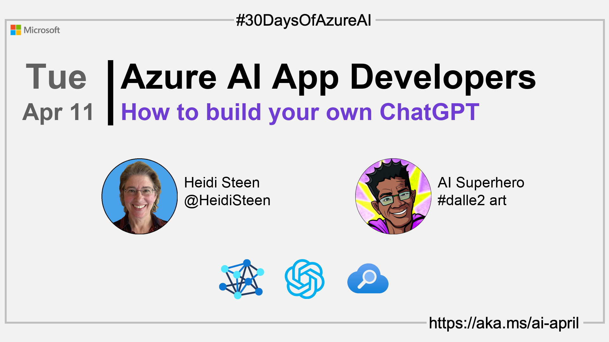
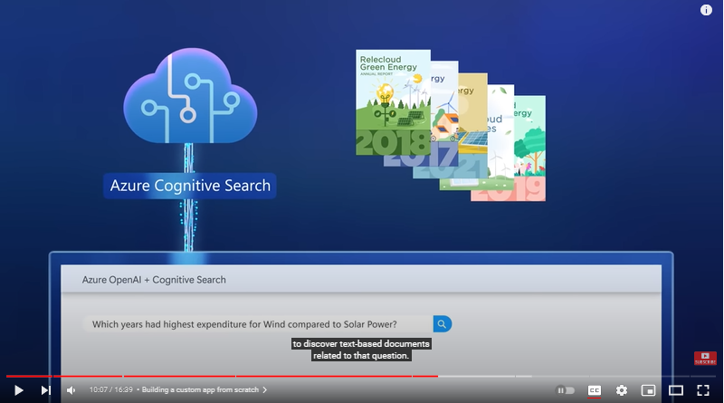
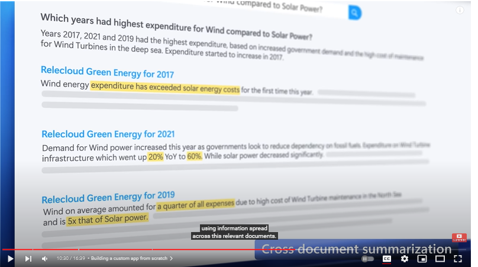

import Social from '@site/src/components/social';

<head>

  <link rel="canonical" href="https://techcommunity.microsoft.com/t5/ai-applied-ai-blog/revolutionize-your-enterprise-data-with-chatgpt-next-gen-apps-w/ba-p/3762087?WT.mc_id=aiml-89446-dglover"  />
  </head>

- 👓 [View today's article](https://techcommunity.microsoft.com/t5/ai-applied-ai-blog/revolutionize-your-enterprise-data-with-chatgpt-next-gen-apps-w/ba-p/3762087?WT.mc_id=aiml-89446-dglover)
- 🍿 [Tune into the AI Show](https://aka.ms/ai-april-ai-show)
- 🌤️ [Continue the Azure AI Cloud Skills Challenge](https://aka.ms/30-days-of-azure-ai-challenge)
- 🏫 [Bookmark the Azure AI Technical Community](https://aka.ms/ai-april-tech-community)
- ❤️ [Learn about the Microsoft MVP Program](https://aka.ms/ai-april-mvp-program)
- 💡 [Suggest a topic for a future post](https://github.com/AzureAiDevs/hub/discussions/categories/call-for-content)

### Please share

<Social
    page_url="https://azureaidevs.github.io/hub/2023-aia/day10"
    image_url="https://raw.githubusercontent.com/AzureAiDevs/hub/main/website/static/img/2023-aia/banner-day10.png"
    title="How to build your own ChatGPT"
    description= "🧑‍💻Day 10 of #30DaysOfAzureAI. Build your ChatGPT with the power of Azure Cognitive Search and Azure OpenAI Service! Distinguished engineer Pablo Castro will show you how to create a ChatGPT using your own data."
    hashtags="AI,AzureOpenAI,ChatGPT"
    hashtag="#30DaysOfAzureAi"
/>

## 🗓️ Day 10 of #30DaysOfAzureAI

<!-- README
The following description is also used for the tweet. So it should be action oriented and grab attention 
If you update the description, please update the description: in the frontmatter as well.
-->

**Build your own ChatGPT with Azure Cognitive Search + Azure OpenAI Service**

<!-- README
The following is the intro to the post. It should be a short teaser for the post.
-->

Yesterday was about the Azure AI Hub, a treasure trove of Azure AI SDK samples. 
Today, hear from distinguished engineer Pablo Castro about how to build your own ChatGPT with Azure OpenAI and 
Azure Cognitive Search and how to integrate Azure OpenAI Service into your apps.

<!-- as he walks us through a progression of short examples that show us how to build 
more dynamic, interactive, and differentiated experiences with the Azure OpenAI Service. -->

## 🎯 What we'll cover

<!-- README
The following list is the main points of the post. There should be 3-4 main points.
 -->

- How to build your own ChatGPT.
- How to integrate Azure OpenAI Service into your apps.
- How to sign up to Azure OpenAI Service.

<!-- 
- Main point 1
- Main point 2
- Main point 3 
- Main point 4
-->

<!-- README
Add or update a list relevant references here. These could be links to other blog posts, Microsoft Learn Module, videos, or other resources.
-->

## 📚 References

- [Quickstart: Get started generating text using Azure OpenAI Service](https://learn.microsoft.com/azure/cognitive-services/openai/quickstart?pivots=programming-language-studio&WT.mc_id=aiml-89446-dglover)
- [Learn Module: Introduction to Azure OpenAI Service](https://learn.microsoft.com/training/modules/explore-azure-openai?WT.mc_id=aiml-89446-dglover)
- [Learn Module: Azure Cognitive Search](https://learn.microsoft.com/training/browse/?expanded=azure&roles=ai-engineer&products=azure-cognitive-search&WT.mc_id=aiml-89446-dglover)

<!-- README
The following is the body of the post. It should be an overview of the post that you are referencing.
See the Learn More section, if you supplied a canonical link, then will be displayed here.
-->

## 🚌 Introduction

In today's post, distinguished engineer Pablo Castro covers two questions we hear most often:

1. How do I build my own ChatGPT that uses my own data as the basis for its responses?
1. How do I integrate Azure OpenAI Service into my application?

## Building your own ChatGPT

Read the full article that addresses the question [“How do I build something like ChatGPT that uses my own data as the basis for its responses?”](https://techcommunity.microsoft.com/t5/ai-applied-ai-blog/revolutionize-your-enterprise-data-with-chatgpt-next-gen-apps-w/ba-p/3762087?WT.mc_id=aiml-89446-dglover)

<!-- In summary, the combination of Azure Cognitive Search and Azure OpenAI Service yields an effective solution for this scenario. 
It integrates the enterprise-grade characteristics of Azure, the ability of Cognitive Search to index, understand and retrieve the right pieces of your own data across large knowledge bases, 
and ChatGPT’s impressive capability for interacting in natural language to answer questions or take turns in a conversation. -->

## Integrating Azure OpenAI Service into my apps

### Scenario One: Converse with Minecraft

Transforming the surface area of an app might be easier than you think!
In this video segment, Pablo shows us how he used Minecraft's extension
APIs to integrate a conversational user interaction model to build in
Minecraft.

The add-in module, named "conjure", collects a text input that's passed
to Codex, transforming user intent into actionable code that Minecraft
understands.

<iframe width="100%" height="420" src="https://www.youtube.com/embed/3t3qZu1Dy1k?start=341" title="YouTube video player" frameborder="0" allow="accelerometer; autoplay; clipboard-write; encrypted-media; gyroscope; picture-in-picture; web-share" allowfullscreen></iframe>

If your application supports plug-in or add-on modules, you can attach a
module that accepts text prompts as inputs, and then pass that input to
Codex to interpret the user intent. Codex returns native code that can
then be processed by your application.

### Scenario Two: Combine Content Discovery and Language Understanding to Create New Information

The next example combines the content discovery capabilities of Azure
Cognitive Search with the language understanding of the GPT-3 model.

The premise is an app for a green energy company that helps users find
the latest insights and developments by scanning content over large
volumes of unstructured content from various sources.

-   Cognitive Search accepts a user query and returns a set of matching
    documents in order of relevance. Instead of returning the results to
    the user, it sends them to GPT-3 for more analysis.

-   GPT-3 takes the documents and composes better answers and insights
    using content from all of them.

<iframe width="100%" height="420" src="https://www.youtube.com/embed/3t3qZu1Dy1k?start=576" title="YouTube video player" frameborder="0" allow="accelerometer; autoplay; clipboard-write; encrypted-media; gyroscope; picture-in-picture; web-share" allowfullscreen></iframe>

In this example, the app calls Azure Cognitive Search to discover
text-based documents related to the user's question. This step finds the
matches, ranks the documents, and returns the most relevant candidates.

But sometimes the best answer isn't in one document. By adding language
understanding, the app can use GPT-3 to derive a new answer using the
content from all of the matching documents. This isn't just a verbatim
answer from one document, but a new answer from multiple documents.

## Key Takeaways and Next Steps

Now that you've seen a few examples, here are some next steps:

See how Microsoft integrates OpenAI into applications. You can [catch
these examples in the video](https://youtu.be/3t3qZu1Dy1k?t=164).

-   Co-Pilot in the [Power
    Platform](https://learn.microsoft.com/power-platform/developer/)
    lets you author Power Fx commands and automation flow without having
    to know or type the syntax.

-   M365's [Microsoft Designer](https://designer.microsoft.com/) lets
    you use AI-generated images when creating visual content.

[Sign up for Azure
OpenAI](https://customervoice.microsoft.com/Pages/ResponsePage.aspx?id=v4j5cvGGr0GRqy180BHbR7en2Ais5pxKtso_Pz4b1_xUOFA5Qk1UWDRBMjg0WFhPMkIzTzhKQ1dWNyQlQCN0PWcu)
to get core building blocks for production-grade applications, including
hosting at scale, to enterprise-level security.

-   Call OpenAI from your code just like any other REST API.

-   Secure with strong authentication, role-based access control and the
    ability to configure virtual networks, private endpoints as you
    would for any Azure service.

[Sign up for Azure OpenAI Studio](https://oai.azure.com/portal) to
experiment and test your ideas before bringing them into your code.
[Watch this segment of the video](https://youtu.be/3t3qZu1Dy1k?t=721)
for a walkthrough.

## 👓 View today's article

Today's [article](https://techcommunity.microsoft.com/t5/ai-applied-ai-blog/revolutionize-your-enterprise-data-with-chatgpt-next-gen-apps-w/ba-p/3762087?WT.mc_id=aiml-89446-dglover).

## 🙋🏾‍♂️ Questions?

[Remember, you can ask a question about this post on GitHub Discussions](https://github.com/AzureAiDevs/hub/discussions/categories/azure-ai-app-developers)

## 📍 30 days roadmap

What's next? View the [#30DaysOfAzureAI Roadmap](/hub/roadmap/30days)

[ Click to subscribe to the RSS XML feed](https://azureaidevs.github.io/hub/2023-aia/rss.xml)