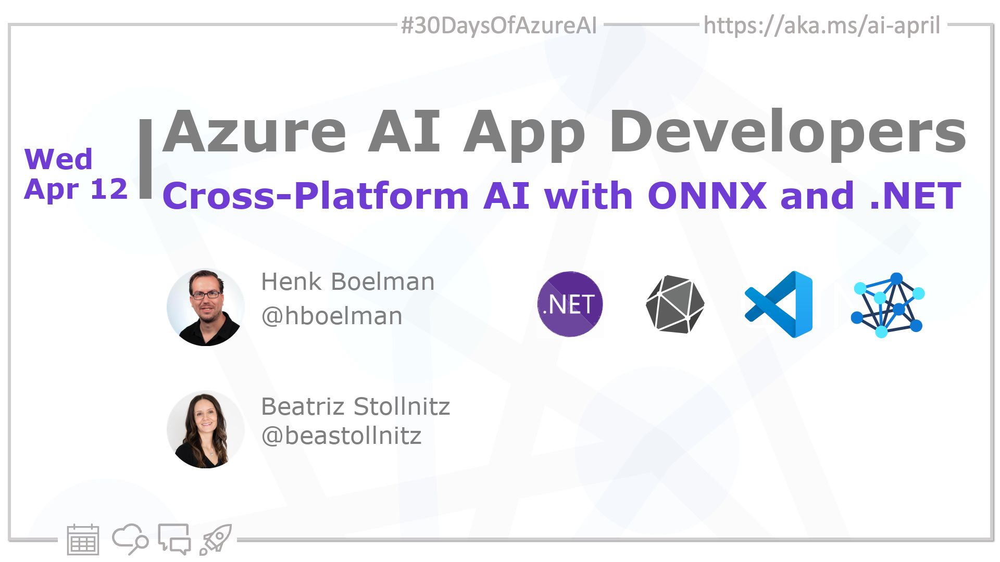

<head>  

  <link rel="canonical" href="https://youtu.be/h6HWP5jpA5s"  />

</head>

- 👓 [View today's article](https://youtu.be/h6HWP5jpA5s)
- 📬 [Monthly AI and Machine Learning Microsoft Tech News](https://developer.microsoft.com/en-us/Newsletter/)
<!-- - 📰 [Subscribe to the #30DaysOfAzureAI RSS feed](https://azureaidevs.github.io/hub/2023-aia/rss.xml) -->
- 🌤️ [Continue the Azure AI Cloud Skills Challenge](https://aka.ms/30-days-of-azure-ai-challenge)
- 🏫 [Bookmark the Azure AI Technical Community](https://techcommunity.microsoft.com/t5/artificial-intelligence-and/ct-p/AI)
- 🙋🏾‍♂️ [Ask a question about this post on GitHub Discussions](https://github.com/AzureAiDevs/hub/discussions/categories/11-cross-platform-ai-with-onnx-and-.net)
- 💡 [Suggest a topic for a future post](https://github.com/AzureAiDevs/hub/discussions/categories/call-for-content)

## 🗓️ Day 11 of #30DaysOfAzureAI

<!-- README
The following description is also used for the tweet. So it should be action oriented and grab attention 
If you update the description, please update the description: in the frontmatter as well.
-->

**Building Cross-Platform AI Solutions with ONNX and .NET**

<!-- README
The following is the intro to the post. It should be a short teaser for the post.
-->

Yesterday was all about the power of OpenAI to create intelligent dynamic apps. Today is for people looking to build cross-platform intelligent apps with .NET MAUI and ONNX.

## 🎯 What we'll cover

<!-- README
The following list is the main points of the post. There should be 3-4 main points.
 -->

- Machine learning models with ONNX and .NET.
- AI, machine learning, expert systems, and deep learning, and how they relate to traditional programming.

<!-- 
- Main point 1
- Main point 2
- Main point 3 
- Main point 4
-->

<!-- README
Add or update a list relevant references here. These could be links to other blog posts, Microsoft Learn Module, videos, or other resources.
-->

## 📚 References

- [Open Neural Network Exchange (ONNX) Open Standard](https://onnx.ai/index.html)
- [.NET Multi-platform App UI](https://dotnet.microsoft.com/apps/maui?WT.mc_id=aiml-89446-dglover)
- [ONNX and Azure Machine Learning: Create and accelerate ML models](https://learn.microsoft.com/azure/machine-learning/concept-onnx?WT.mc_id=aiml-89446-dglover)
- [Create a machine learning model for offline use on a Windows device](https://learn.microsoft.com/training/modules/add-machine-learning-to-uwp-app?WT.mc_id=aiml-89446-dglover)

<!-- README
The following is the body of the post. It should be an overview of the post that you are referencing.
See the Learn More section, if you supplied a canonical link, then will be displayed here.
-->

## 🚌 Build cross-platform intelligent apps with ONNX and .NET

Watch [today's video](https://youtu.be/h6HWP5jpA5s) about machine learning models using ONNX and .NET. The presenters, Bea and Henk, start with an overview of AI and machine learning, explaining that machine learning is a subset of AI that involves creating a model that can learn from data and make predictions without being explicitly programmed. They discuss deep learning, a subset of machine learning that uses artificial neural network and is well-suited to big data.

<iframe width="100%" height="420" src="https://www.youtube.com/embed/h6HWP5jpA5s" title="YouTube video player" frameborder="0" allow="accelerometer; autoplay; clipboard-write; encrypted-media; gyroscope; picture-in-picture; web-share" allowfullscreen></iframe>

## 👓 View today's article

Today's [article](https://youtu.be/h6HWP5jpA5s).

## 🙋🏾‍♂️ Questions?

[Remember, you can ask a question about this post on GitHub Discussions](https://github.com/AzureAiDevs/Discussions/discussions/categories/11-cross-platform-ai-with-onnx-and-.net)

## 📍 30 days roadmap

What's next? View the [#30DaysOfAzureAI Roadmap](/hub/roadmap/30days)

[ Click to subscribe](https://azureaidevs.github.io/hub/2023-aia/rss.xml)