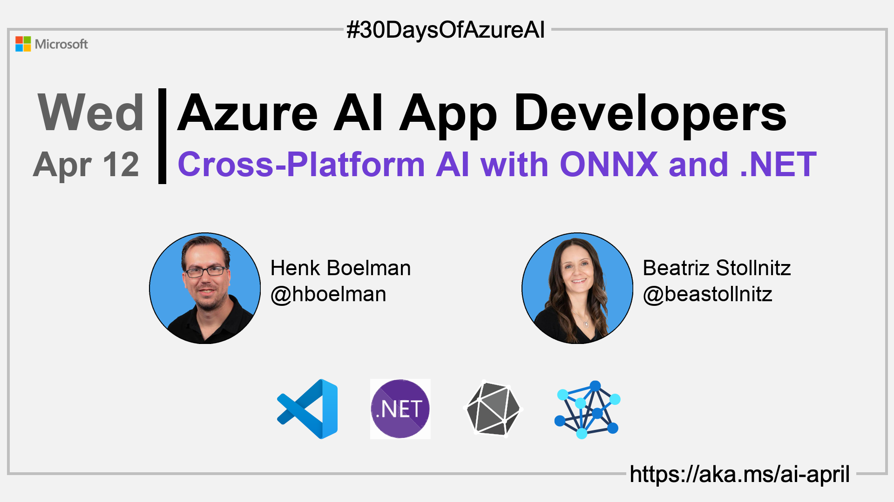

import Social from '@site/src/components/social';

<head>

  <meta name="twitter:url" content="https://azureaidevs.github.io/hub/2023-aia/day11" />
  <meta name="twitter:title" content="Cross-Platform AI with ONNX and .NET" />
  <meta name="twitter:description" content="🧑‍💻Welcome to day 11 of #30DaysOfAzureAI. Learn how to create ML models and embed them into intelligent cross platform apps with the ONNX runtime and .NET MAUI." />
  <meta name="twitter:image" content="https://raw.githubusercontent.com/AzureAiDevs/hub/main/website/static/img/2023-aia/banner-day11.png" />
  <meta name="twitter:card" content="summary_large_image" />

  </head>

- 🍿 [Tune into the AI Show](https://aka.ms/ai-april-ai-show)
<!-- - 🧬 [Connect with Humans in AI](/hub/humans-in-ai) -->
- 🗞️ [AiMonthly Newsletter](/hub/ai-update)
- 🌤️ [Continue the Azure AI Cloud Skills Challenge](https://aka.ms/30-days-of-azure-ai-challenge)
- 🏫 [Bookmark the Azure AI Technical Community](https://aka.ms/ai-april-tech-community)
- 🌏 [Join the Global AI Community](https://www.meetup.com/pro/the-global-ai-community)
- 💡 [Suggest a topic for a future post](https://forms.office.com/r/GhtwgHVP9L)

### Please share

<Social
    page_url="https://azureaidevs.github.io/hub/2023-aia/day11"
    image_url="https://raw.githubusercontent.com/AzureAiDevs/hub/main/website/static/img/2023-aia/banner-day11.png"
    title="Cross-Platform AI with ONNX and .NET"
    description= "🧑‍💻Welcome to day 11 of #30DaysOfAzureAI. Learn how to create ML models and embed them into intelligent cross platform apps with the ONNX runtime and .NET MAUI."
    hashtags="ONNXRuntime"
    hashtag="#30DaysOfAzureAi"
/>

## 🗓️ Day 11 of #30DaysOfAzureAI

<!-- Short description section -->

**Building Cross-Platform AI Solutions with ONNX and .NET**

<!-- Intro section -->

Yesterday was all about the power of OpenAI to create intelligent dynamic apps. Today is for people looking to build cross-platform intelligent apps with .NET MAUI and the ONNX Runtime.

## 🎯 What we'll cover

<!-- What we'll cover section -->

- Build intelligent apps with ONNX and .NET. 
- How AI is related to traditional programming.

<!-- Reference section -->

## 📚 References

- [Open Neural Network Exchange (ONNX) Open Standard](https://onnx.ai/index.html)
- [.NET Multi-platform App UI](https://dotnet.microsoft.com/apps/maui?WT.mc_id=aiml-89446-dglover)
- [Announcing the Azure OpenAI .NET SDK](https://devblogs.microsoft.com/dotnet/getting-started-azure-openai-dotnet?WT.mc_id=aiml-89446-dglover)
- [ONNX and Azure Machine Learning: Create and accelerate ML models](https://learn.microsoft.com/azure/machine-learning/concept-onnx?WT.mc_id=aiml-89446-dglover)
- [Create a machine learning model for offline use on a Windows device](https://learn.microsoft.com/training/modules/add-machine-learning-to-uwp-app?WT.mc_id=aiml-89446-dglover)

<!-- Body section -->

## 🚌 Build cross-platform intelligent apps with ONNX and .NET

Learn how to build an intelligent cross platform .NET MAUI app running a local ML model on the ONNX runtime. The presenters, Bea and Henk, overview AI and machine learning, how to create models that learn from data to makes predictions, and how to integrate a model into a cross platform .NET MAUI app.

## Accompanying source code

You'll find the accompanying source code on [GitHub](https://github.com/hnky/dotnet-maui-onnx-runtime). 

<iframe width="100%" height="420" src="https://www.youtube.com/embed/h6HWP5jpA5s" title="YouTube video player" frameborder="0" allow="accelerometer; autoplay; clipboard-write; encrypted-media; gyroscope; picture-in-picture; web-share" allowfullscreen></iframe>

## 🙋🏾‍♂️ Questions?

[You can ask questions about this post on GitHub Discussions](https://github.com/AzureAiDevs/hub/discussions/categories/azure-ai-app-developers)

## 📍 30 days roadmap

What's next? View the [#30DaysOfAzureAI Roadmap](/hub/roadmap/30days)

## 🧲 Subscribe

- [ Subscribe to the AiMonthly RSS XML feed](https://azureaidevs.github.io/hub/ai-update/rss.xml)
- [ Subscribe to the blog RSS XML feed](https://azureaidevs.github.io/hub/2023-aia/rss.xml)