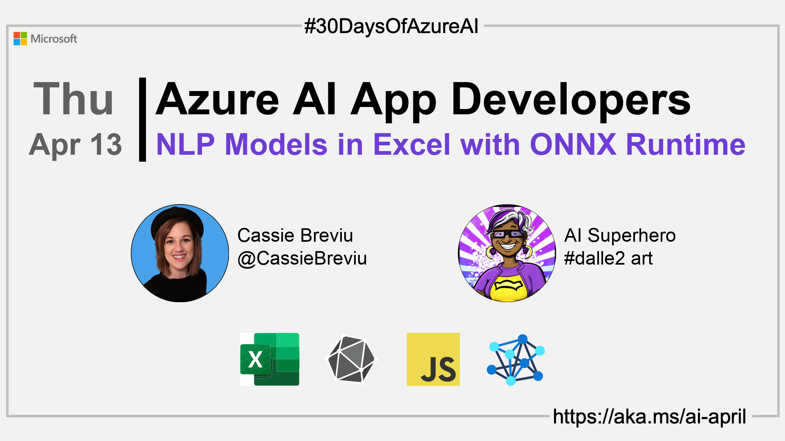

import Social from '@site/src/components/social';

<head>

  <meta name="twitter:url" content="https://azureaidevs.github.io/hub/2023-aia/day12" />
  <meta name="twitter:title" content="NLP Models in Excel w/ ONNX Runtime" />
  <meta name="twitter:description" content="🧑‍💻Welcome to day 12 of #30DaysOfAzureAI. Build an Excel Add-in with ONNX Runtime Web for NLP Tasks" />
  <meta name="twitter:image" content="https://azureaidevs.github.io/hub/img/2023-aia/banner-day12.png" />
  <meta name="twitter:card" content="summary_large_image" />

  <meta property="og:url" content="https://azureaidevs.github.io/hub/2023-aia/day12" />
  <meta property="og:title" content="Welcome to day 12 🧑‍💻NLP Models in Excel w/ ONNX Runtime" />
  <meta property="og:description" content="Build an Excel Add-in with ONNX Runtime Web for NLP Tasks https://azureaidevs.github.io/hub/2023-aia/day12 AzureAiDevs,AI ONNXRuntime" />
  <meta property="og:image" content="https://azureaidevs.github.io/hub/img/2023-aia/banner-day12.png" />
  <meta property="og:type" content="article" />
  <meta property="og:site_name" content="Azure AI Developer" />

  <link rel="canonical" href="https://onnxruntime.ai/docs/tutorials/web/excel-addin-bert-js.html"  />

</head>

- 👓 [View today's article](https://onnxruntime.ai/docs/tutorials/web/excel-addin-bert-js.html)
- 🌤️ [Continue the Azure AI Cloud Skills Challenge](https://aka.ms/30-days-of-azure-ai-challenge)
- 🏫 [Bookmark the Azure AI Technical Community](https://techcommunity.microsoft.com/t5/artificial-intelligence-and/ct-p/AI)
- 🙋🏾‍♂️ [Ask a question about this post on GitHub Discussions](https://github.com/AzureAiDevs/hub/discussions/categories/azure-ai-app-developers)
- 💡 [Suggest a topic for a future post](https://github.com/AzureAiDevs/hub/discussions/categories/call-for-content)

### Please share

<Social
    page_url="https://azureaidevs.github.io/hub/2023-aia/day12"
    image_url="https://azureaidevs.github.io/hub/img/2023-aia/banner-day12.png"
    title="NLP Models in Excel w/ ONNX Runtime"
    description= "🧑‍💻Day 12 of #30DaysOfAzureAI. Excel + NLP + ONNX = 🔥! Get ready to build a powerful Excel add-in with BERT NLP using the ONNX Runtime."
    hashtags="AzureAiDevs,AI,ONNXRuntime"
    hashtag="#30DaysOfAzureAi"
/>

## 🗓️ Day 12 of #30DaysOfAzureAI

<!-- README
The following description is also used for the tweet. So it should be action oriented and grab attention 
If you update the description, please update the description: in the frontmatter as well.
-->

**Build an Excel Add-in with ONNX Runtime Web for NLP Tasks**

<!-- README
The following is the intro to the post. It should be a short teaser for the post.
-->

Yesterday was all about building cross-platform intelligent apps with .NET MAUI and ONNX. Today is for people looking to extend Excel with BERT NLP tasks enabled by ONNX Runtime Web in JavaScript. Wait, was "Excel, BERT, JavaScript and ONNX" used in the same sentence?😄 Yup, they were, so follow along to learn more.

## 🎯 What we'll cover

<!-- README
The following list is the main points of the post. There should be 3-4 main points.
 -->

- Excel Add-ins with Natural Language Processing using BERT and the ONNX Runtime.
- Step-by-step instructions and code examples.

<!-- 
- Main point 1
- Main point 2
- Main point 3 
- Main point 4
-->

<!-- README
Add or update a list relevant references here. These could be links to other blog posts, Microsoft Learn Module, videos, or other resources.
-->

## 📚 References

- [Open Neural Network Exchange (ONNX) Open Standard](https://onnx.ai/index.html)

<!-- README
The following is the body of the post. It should be an overview of the post that you are referencing.
See the Learn More section, if you supplied a canonical link, then will be displayed here.
-->

## 🚌 Build an Excel Add-in with ONNX Runtime Web for Inferencing NLP models on Device

Read [today's article](https://onnxruntime.ai/docs/tutorials/web/excel-addin-bert-js.html) about building an Excel Add-in with ONNX Runtime and JavaScript with on device inferencing. You'll learn how ONNX Runtime enables the inference of ML models cross-platform even locally in an Excel add-in! 

The tasks in this example will show you how to perform the natural language processing tasks of sentiment analysis and question and answering all locally within a spreadsheet.  [Today's article](https://onnxruntime.ai/docs/tutorials/web/excel-addin-bert-js.html) provides step-by-step instructions and code examples to help readers follow along in building the add-in.

## 👓 View today's article

Today's [article](https://onnxruntime.ai/docs/tutorials/web/excel-addin-bert-js.html).

## 🙋🏾‍♂️ Questions?

[Remember, you can ask a question about this post on GitHub Discussions](https://github.com/AzureAiDevs/hub/discussions/categories/azure-ai-app-developers)

## 📍 30 days roadmap

What's next? View the [#30DaysOfAzureAI Roadmap](/hub/roadmap/30days)

[ Click to subscribe](https://azureaidevs.github.io/hub/2023-aia/rss.xml)