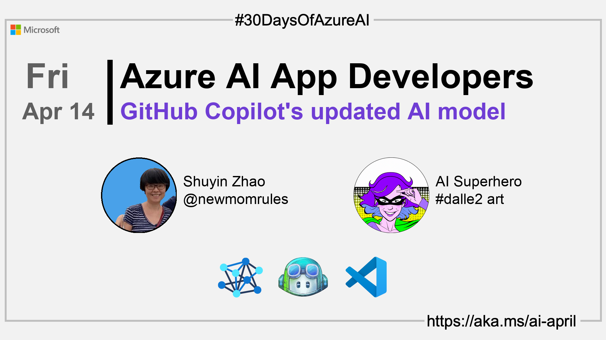

import Social from '@site/src/components/social';

<head>

  <meta name="twitter:url" content="https://azureaidevs.github.io/hub/2023-aia/day13" />
  <meta name="twitter:title" content="Copilot's updated AI model" />
  <meta name="twitter:description" content="🧑‍💻Welcome to day 13 of #30DaysOfAzureAI. GitHub Copilot Upgraded: Faster, More Accurate, and More Secure Code" />
  <meta name="twitter:image" content="https://azureaidevs.github.io/hub/img/2023-aia/banner-day13.png" />
  <meta name="twitter:card" content="summary_large_image" />

  <meta property="og:url" content="https://azureaidevs.github.io/hub/2023-aia/day13" />
  <meta property="og:title" content="Welcome to day 13 🧑‍💻Copilot's updated AI model" />
  <meta property="og:description" content="GitHub Copilot Upgraded: Faster, More Accurate, and More Secure Code https://azureaidevs.github.io/hub/2023-aia/day13 AzureAiDevs,AI GitHubCopilot,IntelligentCoding,CodeSynthesis" />
  <meta property="og:image" content="https://azureaidevs.github.io/hub/img/2023-aia/banner-day13.png" />
  <meta property="og:type" content="article" />
  <meta property="og:site_name" content="Azure AI Developer" />

  <link rel="canonical" href="https://github.blog/2023-02-14-github-copilot-now-has-a-better-ai-model-and-new-capabilities/"  />

</head>

- 👓 [View today's article](https://github.blog/2023-02-14-github-copilot-now-has-a-better-ai-model-and-new-capabilities/)
- 🌤️ [Continue the Azure AI Cloud Skills Challenge](https://aka.ms/30-days-of-azure-ai-challenge)
- 🏫 [Bookmark the Azure AI Technical Community](https://techcommunity.microsoft.com/t5/artificial-intelligence-and/ct-p/AI)
- 🙋🏾‍♂️ [Ask a question about this post on GitHub Discussions](https://github.com/AzureAiDevs/hub/discussions/categories/azure-ai-app-developers)
- 💡 [Suggest a topic for a future post](https://github.com/AzureAiDevs/hub/discussions/categories/call-for-content)

### Please share

<Social
    page_url="https://azureaidevs.github.io/hub/2023-aia/day13"
    image_url="https://azureaidevs.github.io/hub/img/2023-aia/banner-day13.png"
    title="Copilot's updated AI model"
    description= "🧑‍💻Day 13 of #30DaysOfAzureAI. Unlock the full potential of your code with GitHub Copilot's latest updates: faster, more accurate, and secure suggestions to boost productivity and build smarter, safer apps."
    hashtags="AzureAiDevs,AI,GitHubCopilot,IntelligentCoding,CodeSynthesis"
    hashtag="#30DaysOfAzureAi"
/>

## 🗓️ Day 13 of #30DaysOfAzureAI

<!-- README
The following description is also used for the tweet. So it should be action oriented and grab attention 
If you update the description, please update the description: in the frontmatter as well.
-->

**GitHub Copilot Upgraded: Faster, More Accurate, and More Secure Code**

<!-- README
The following is the intro to the post. It should be a short teaser for the post.
-->

Yesterday was all about creating intelligent Excel Add-ins. Today is a look at GitHub Copilot advances to boast productivity, and build better, smarter, safer intelligent apps.

## 🎯 What we'll cover

<!-- README
The following list is the main points of the post. There should be 3-4 main points.
 -->

- Copilot's improved suggestions and the new Fill-In-the-Middle paradigm.
- VS Code extension with a lightweight model and improved acceptance rate.
- AI-based vulnerability prevention system to provide alternative suggestions. 

<!-- 
- Main point 1
- Main point 2
- Main point 3 
- Main point 4
-->

<!-- README
Add or update a list relevant references here. These could be links to other blog posts, Microsoft Learn Module, videos, or other resources.
-->

## 📚 References

- [Introducing GitHub Copilot: your AI pair programmer](https://github.blog/2021-06-29-introducing-github-copilot-ai-pair-programmer?WT.mc_id=aiml-89446-dglover)

<!-- README
The following is the body of the post. It should be an overview of the post that you are referencing.
See the Learn More section, if you supplied a canonical link, then will be displayed here.
-->

## 🚌 Advances in GitHub's Copilot code generative models

[Today's article](https://github.blog/2023-02-14-github-copilot-now-has-a-better-ai-model-and-new-capabilities/) looks at the updates to GitHub's Copilot with the goal of improving code suggestions and responsiveness for developers. The underlying Codex model has been updated to deliver better results for code synthesis and the Fill-In-the-Middle paradigm has been introduced for better prompts for code suggestions. 

Additionally, an AI-based vulnerability prevention system has been introduced to identify and block insecure coding patterns in real-time. The system uses language models to quickly detect vulnerable patterns, including hardcoded credentials and SQL injections, even in incomplete code fragments. Vulnerable code suggestions are replaced with alternative suggestions.

## 👓 View today's article

Today's [article](https://github.blog/2023-02-14-github-copilot-now-has-a-better-ai-model-and-new-capabilities/).

## 🙋🏾‍♂️ Questions?

[Remember, you can ask a question about this post on GitHub Discussions](https://github.com/AzureAiDevs/hub/discussions/categories/azure-ai-app-developers)

## 📍 30 days roadmap

What's next? View the [#30DaysOfAzureAI Roadmap](/hub/roadmap/30days)

[ Click to subscribe](https://azureaidevs.github.io/hub/2023-aia/rss.xml)