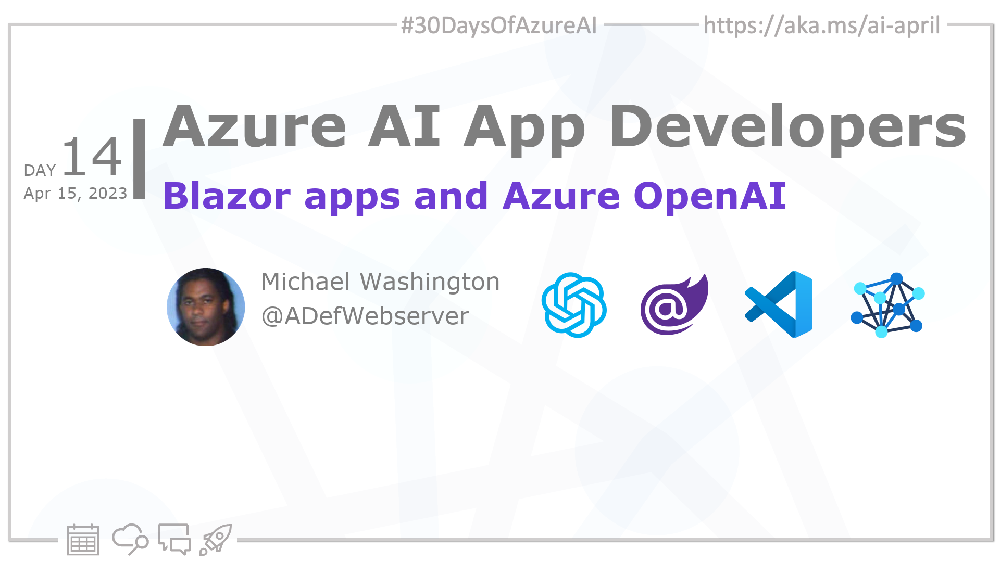

<head>  

  <link rel="canonical" href="https://blazorhelpwebsite.com/ViewBlogPost/2065"  />

</head>

- 👓 [Read today's article](https://blazorhelpwebsite.com/ViewBlogPost/2065)
- 📬 [Sign up for the Microsoft AI and Machine Learning Newsletter](https://aka.ms/azure-ai-dev-newsletter)
<!-- - 📰 [Subscribe to the #30DaysOfAzureAI RSS feed](https://azureaidevs.github.io/hub/2023-aia/rss.xml) -->
- 🙋🏾‍♂️ [Ask a question about this post on GitHub Discussions](https://github.com/AzureAiDevs/hub/discussions/categories/14-blazor-apps-and-azure-openai)
- 💡 [Suggest a topic for a future post](https://github.com/AzureAiDevs/hub/discussions/categories/call-for-content)

## 🗓️ Day _14_ of #30DaysOfAzureAI

<!-- README
The following description is also used for the tweet. So it should be action oriented and grab attention 
If you update the description, please update the description: in the frontmatter as well.
-->

**Build Interactive Web Applications with Microsoft Blazor and Azure OpenAI**

<!-- README
The following is the intro to the post. It should be a short teaser for the post.
-->

Yesterday we learned about some of the advances with GitHub Copilot. Today is all about building web assemblies with Microsoft Blazor and how you can call upon the Azure OpenAI service to create a rich, interactive, and intelligent web app. 

## 🎯 What we'll cover

<!-- README
The following list is the main points of the post. There should be 3-4 main points.
 -->

- Microsoft Blazor and Azure OpenAI consumption.
- Set up guide for Azure OpenAI service.
- Code for wrapping the OpenAIClient class and creating a UI.

<!-- 
- Main point 1
- Main point 2
- Main point 3 
- Main point 4
-->

<!-- README
Add or update a list relevant references here. These could be links to other blog posts, Microsoft Learn Module, videos, or other resources.
-->

## 📚 References

- [Build beautiful, web apps with Blazor](https://dotnet.microsoft.com/apps/aspnet/web-apps/blazor)
- [Azure OpenAI Service](https://azure.microsoft.com/products/cognitive-services/openai-service?WT.mc_id=aiml-89446-dglover)
- [Learn Module: Introduction to Azure OpenAI Service](https://learn.microsoft.com/training/modules/explore-azure-openai?WT.mc_id=aiml-89446-dglover)

<!-- README
The following is the body of the post. It should be an overview of the post that you are referencing.
See the Learn More section, if you supplied a canonical link, then will be displayed here.
-->

## 🚌 Build and intelligent web apps with Blazor and Azure OpenAI

Read [today's article](https://blazorhelpwebsite.com/ViewBlogPost/2065) about Blazor, a new web framework for building single-page applications (SPAs) using .NET and C#. It allows developers to create client-side web applications with the same language and tools used to build server-side applications. You'll also find an extensive library of code samples and demos. These code samples will provide you with practical examples of how to use Blazor and Azure OpenAI to build real-world applications.

## 👓 Read today's article

Today's [article](https://blazorhelpwebsite.com/ViewBlogPost/2065).

## 🙋🏾‍♂️ Questions?

[Remember, you can ask a question about this post on GitHub Discussions](https://github.com/AzureAiDevs/Discussions/discussions/categories/14-blazor-apps-and-azure-openai)

## 📍 30 days roadmap

What's next? View the [#30DaysOfAzureAI Roadmap](/hub/roadmap/30days)

[ Click to subscribe](https://azureaidevs.github.io/hub/2023-aia/rss.xml)