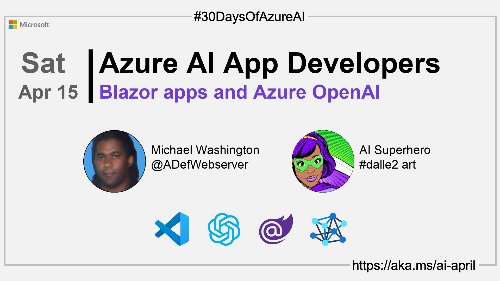

import Social from '@site/src/components/social';

<head>

  <meta name="twitter:url" content="https://azureaidevs.github.io/hub/2023-aia/day14" />
  <meta name="twitter:title" content="Blazor apps and Azure OpenAI" />
  <meta name="twitter:description" content="🧑‍💻Welcome to day 14 of #30DaysOfAzureAI. Learn how to build interactive web apps with Microsoft Blazor and Azure OpenAI. Create intelligent intuitive experiences. Take your web development to the next level!" />
  <meta name="twitter:image" content="https://raw.githubusercontent.com/AzureAiDevs/hub/main/website/static/img/2023-aia/banner-day14.png" />
  <meta name="twitter:card" content="summary_large_image" />

  <link rel="canonical" href="https://blazorhelpwebsite.com/ViewBlogPost/2065"  />
  </head>

- 👓 [View today's article](https://blazorhelpwebsite.com/ViewBlogPost/2065)
- 🍿 [Tune into the AI Show](https://aka.ms/ai-april-ai-show)
- 🧬 [Connect with Humans in AI](/hub/humans-in-ai)
- 🌤️ [Continue the Azure AI Cloud Skills Challenge](https://aka.ms/30-days-of-azure-ai-challenge)
- 🏫 [Bookmark the Azure AI Technical Community](https://aka.ms/ai-april-tech-community)
- 🌏 [Join the Global AI Community](https://www.meetup.com/pro/the-global-ai-community)
- 💡 [Suggest a topic for a future post](https://forms.office.com/r/GhtwgHVP9L)

### Please share

<Social
    page_url="https://azureaidevs.github.io/hub/2023-aia/day14"
    image_url="https://raw.githubusercontent.com/AzureAiDevs/hub/main/website/static/img/2023-aia/banner-day14.png"
    title="Blazor apps and Azure OpenAI"
    description= "🧑‍💻Welcome to day 14 of #30DaysOfAzureAI. Learn how to build interactive web apps with Microsoft Blazor and Azure OpenAI. Create intelligent intuitive experiences. Take your web development to the next level!"
    hashtags="AzureOpenAI,Blazor"
    hashtag="#30DaysOfAzureAi"
/>

## 🗓️ Day 14 of #30DaysOfAzureAI

<!-- Short description section -->

**Build Interactive Web Applications with Microsoft Blazor and Azure OpenAI**

<!-- Intro section -->

Yesterday we learned about some of the advances with GitHub Copilot. Today is all about building web assemblies with Microsoft Blazor and how you can call upon the Azure OpenAI service to create a rich, interactive, and intelligent web app. 

## 🎯 What we'll cover

<!-- What we'll cover section -->

- Microsoft Blazor and Azure OpenAI integration.
- Set up guide for Azure OpenAI service.
- Code for wrapping the OpenAIClient class and creating a UI.

<!-- Reference section -->

## 📚 References

- [Build beautiful, web apps with Blazor](https://dotnet.microsoft.com/apps/aspnet/web-apps/blazor)
- [Announcing the Azure OpenAI .NET SDK](https://devblogs.microsoft.com/dotnet/getting-started-azure-openai-dotnet?WT.mc_id=aiml-89446-dglover)
- [Introduction to prompt engineering](https://learn.microsoft.com/en-us/azure/cognitive-services/openai/concepts/prompt-engineering?WT.mc_id=aiml-89446-dglover)
- [Azure OpenAI Service](https://azure.microsoft.com/products/cognitive-services/openai-service?WT.mc_id=aiml-89446-dglover)
- [Learn Module: Introduction to Azure OpenAI Service](https://learn.microsoft.com/training/modules/explore-azure-openai?WT.mc_id=aiml-89446-dglover)

<!-- Body section -->

## 🚌 Build and intelligent web apps with Blazor and Azure OpenAI

Read [today's article](https://blazorhelpwebsite.com/ViewBlogPost/2065) about Blazor, a new web framework for building single-page applications (SPAs) using .NET and C#. It allows developers to create client-side web applications with the same language and tools used to build server-side applications. You'll also find an extensive library of code samples and demos. These code samples will provide you with practical examples of how to use Blazor and Azure OpenAI to build real-world applications.

## 👓 View today's article

Today's [article](https://blazorhelpwebsite.com/ViewBlogPost/2065).

## 🙋🏾‍♂️ Questions?

[You can ask questions about this post on GitHub Discussions](https://github.com/AzureAiDevs/hub/discussions/categories/azure-ai-app-developers)

## 📍 30 days roadmap

What's next? View the [#30DaysOfAzureAI Roadmap](/hub/roadmap/30days)

## 🧲 Subscribe

- 📬 [Subscribe to the monthly Azure AI and Machine Learning Tech Newsletter](https://aka.ms/azure-ai-dev-newsletter)
- [ Subscribe to the blog RSS XML feed](https://azureaidevs.github.io/hub/2023-aia/rss.xml)