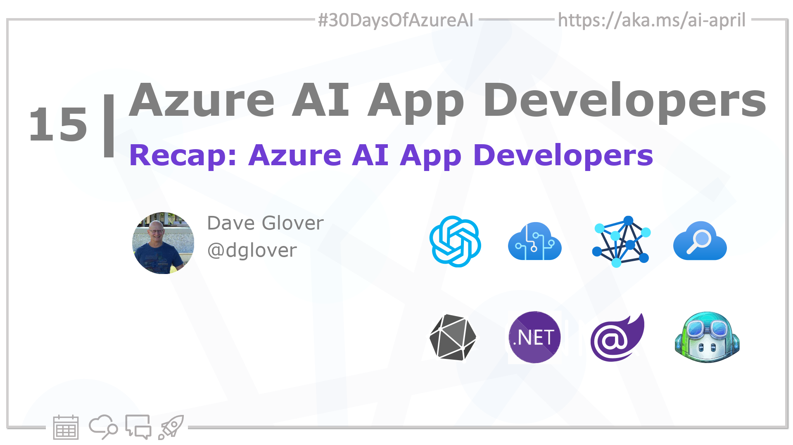

import Social from '@site/src/components/social';

<head>

  <meta property="og:url" content="https://azureaidevs.github.io/hub/2023-aia/day15" />
  <meta property="og:title" content="Recap: Azure AI App Developers✨" />
  <meta property="og:description" content="🧑‍💻Welcome to day 15 of #30DaysOfAzureAI. 30DaysOfAzureAI Recap for Azure AI App Developers Week" />
  <meta property="og:image" content="https://raw.githubusercontent.com/AzureAiDevs/hub/main/website/static/img/2023-aia/banner-day15.png" />
  <meta property="og:type" content="article" />
  <meta property="og:site_name" content="Azure AI Developer" />

  <link rel="canonical"  href="https://azureaidevs.github.io/hub/2023-aia/day15"  />

</head>

- 🍿 [Tune into the AI Show](https://aka.ms/ai-april-ai-show)
- 🌤️ [Continue the Azure AI Cloud Skills Challenge](https://aka.ms/30-days-of-azure-ai-challenge)
- 🏫 [Bookmark the Azure AI Technical Community](https://aka.ms/ai-april-tech-community)
- ❤️ [Learn about the Microsoft MVP Program](https://aka.ms/ai-april-mvp-program)
- 💡 [Suggest a topic for a future post](https://github.com/AzureAiDevs/hub/discussions/categories/call-for-content)

### Please share

<Social
    page_url="https://azureaidevs.github.io/hub/2023-aia/day15"
    image_url="https://raw.githubusercontent.com/AzureAiDevs/hub/main/website/static/img/2023-aia/banner-day15.png"
    title="Recap: Azure AI App Developers✨"
    description= "🧑‍💻Welcome to day 15 of #30DaysOfAzureAI. 30DaysOfAzureAI Recap for Azure AI App Developers Week"
    hashtags="AI"
    hashtag="#30DaysOfAzureAi"
/>

## 🗓️ Day 15 of #30DaysOfAzureAI

<!-- README
The following description is also used for the tweet. So it should be action oriented and grab attention 
If you update the description, please update the description: in the frontmatter as well.
-->

**30DaysOfAzureAI Recap for Azure AI App Developers Week**

<!-- README
The following is the intro to the post. It should be a short teaser for the post.
-->

## 🎯 What we'll cover

<!-- README
The following list is the main points of the post. There should be 3-4 main points.
 -->

<!-- 
- Main point 1
- Main point 2
- Main point 3 
- Main point 4
-->

<!-- README
Add or update a list relevant references here. These could be links to other blog posts, Microsoft Learn Module, videos, or other resources.
-->

## 📚 References

- [Learn Module: Introduction to Azure Machine Learning](https://learn.microsoft.com/training/modules/intro-to-azure-ml?WT.mc_id=aiml-89446-dglover)
- [Quickstart: Get started generating text using Azure OpenAI Service](https://learn.microsoft.com/azure/cognitive-services/openai/quickstart?pivots=programming-language-studio&WT.mc_id=aiml-89446-dglover)
- [Azure Cognitive Services APIs](https://azure.microsoft.com/products/cognitive-services/api?WT.mc_id=aiml-89446-dglover)
- [Azure OpenAI Service](https://azure.microsoft.com/products/cognitive-services/openai-service?WT.mc_id=aiml-89446-dglover)
- [ONNX and Azure Machine Learning: Create and accelerate ML models](https://learn.microsoft.com/azure/machine-learning/concept-onnx?WT.mc_id=aiml-89446-dglover)
- [Open Neural Network Exchange (ONNX) Open Standard](https://onnx.ai/index.html)
- [Introducing GitHub Copilot: your AI pair programmer](https://github.blog/2021-06-29-introducing-github-copilot-ai-pair-programmer?WT.mc_id=aiml-89446-dglover)
- [.NET Multi-platform App UI](https://dotnet.microsoft.com/apps/maui?WT.mc_id=aiml-89446-dglover)
- [Build beautiful, web apps with Blazor](https://dotnet.microsoft.com/apps/aspnet/web-apps/blazor)
- [Create a machine learning model for offline use on a Windows device](https://learn.microsoft.com/training/modules/add-machine-learning-to-uwp-app?WT.mc_id=aiml-89446-dglover)

<!-- README
The following is the body of the post. It should be an overview of the post that you are referencing.
See the Learn More section, if you supplied a canonical link, then will be displayed here.
-->

## 🙋🏾‍♂️ Questions?

[Remember, you can ask a question about this post on GitHub Discussions](https://github.com/AzureAiDevs/hub/discussions/categories/azure-ai-app-developers)

## 📍 30 days roadmap

What's next? View the [#30DaysOfAzureAI Roadmap](/hub/roadmap/30days)

[ Click to subscribe](https://azureaidevs.github.io/hub/2023-aia/rss.xml)