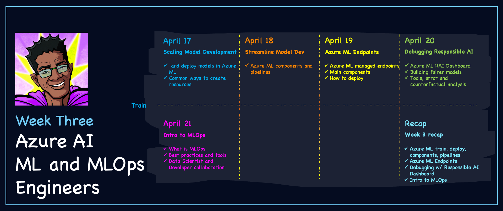

import Social from '@site/src/components/social';

<head>

  <meta name="twitter:url" content="https://azureaidevs.github.io/hub/2023-aia/day15" />
  <meta name="twitter:title" content="Recap: Azure AI for App Developers" />
  <meta name="twitter:description" content="🧑‍💻Welcome to day 15 of #30DaysOfAzureAI. Week 2 Recap - Azure AI App Developers Week" />
  <meta name="twitter:image" content="https://raw.githubusercontent.com/AzureAiDevs/hub/main/website/static/img/2023-aia/banner-day15.png" />
  <meta name="twitter:card" content="summary_large_image" />

  </head>

- 🍿 [Tune into the AI Show](https://aka.ms/ai-april-ai-show)
- 🧬 [Connect with Humans in AI](/hub/humans-in-ai)
- 🌤️ [Continue the Azure AI Cloud Skills Challenge](https://aka.ms/30-days-of-azure-ai-challenge)
- 🏫 [Bookmark the Azure AI Technical Community](https://aka.ms/ai-april-tech-community)
- ❤️ [Learn about the Microsoft MVP Program](https://aka.ms/ai-april-mvp-program)
- 💡 [Suggest a topic for a future post](https://forms.office.com/r/GhtwgHVP9L)

### Please share

<Social
    page_url="https://azureaidevs.github.io/hub/2023-aia/day15"
    image_url="https://raw.githubusercontent.com/AzureAiDevs/hub/main/website/static/img/2023-aia/banner-day15.png"
    title="Recap: Azure AI for App Developers"
    description= "🧑‍💻Welcome to day 15 of #30DaysOfAzureAI. Week 2 Recap - Azure AI App Developers Week"
    hashtags=""
    hashtag="#30DaysOfAzureAi"
/>

## 🗓️ Day 15 of #30DaysOfAzureAI

<!-- Short description section -->

**Week 2 Recap - Azure AI App Developers Week**

<!-- Intro section -->

## 🎯 What we'll cover

<!-- What we'll cover section -->

- Look Back: Recap Fundamentals Week
- Azure AI Skills Challenge
- Microsoft for Startups
- Look Ahead: It's Intelligent App Developers Week!

<!-- Reference section -->

<!-- Body section -->

## Look Back: Week 2 Recap

Week two is complete 🎉 and thank you ❤️ for joining us on this journey. We hope you've enjoyed the second week of #30DaysOfAzureAI and have learned a lot about Azure AI.

Here are the highlights for week 2. If you're just joining us, welcome!! It's not too late to get started learning and skilling up.

## Week 2: Azure AI for App Developers

:::info Azure AI Everyone

* [April 10 – 👩‍💻 Build intelligent apps with Azure AI SDKs](/2023-aia/day9)
* [April 11 – 👩‍💻 How to build your own ChatGPT](/2023-aia/day10)
* [April 12 – 👩‍💻 Cross-Platform AI with ONNX and .NET](/2023-aia/day11)
* [April 13 – 👩‍💻 Run BERT NLP models locally in Excel](/2023-aia/day12)
* [April 14 – 👩‍💻 GitHub Copilot's updated AI model](/2023-aia/day13)
* [April 15 – 👩‍💻 Blazor apps and Azure OpenAI](/2023-aia/day14)

:::

## Azure AI Skills Challenge

The [skills challenge](https://aka.ms/30-days-of-azure-ai-challenge) started March 29th and is a self-guided learning experience to help you build your skills in Azure AI. Join now, and see how you rank against other participants on the leaderboard.

:::tip AZURE ACCOUNT

To complete the Azure AI Skills challenge, you’ll need access to Azure. For students, sign up for an [Azure for Students](https://aka.ms/ai-april-azure-student-acct) free account, no credit card is required. Otherwise, create an [Azure](https://aka.ms/ai-april-azure-acct) free account.

:::

## Microsoft for Startups

If you are a startup, then you'll want to learn how other startups are using Azure AI to build their businesses. Visit the [Launch with AI](https://aka.ms/ai-april-launch-with-ai) case studies website to learn more.

## Look Ahead: Azure ML Developer Week!

Week three is for Data Scientists, AI, ML, or MLOps engineers building models or managing models through to production. Be sure to review the [Week Three Roadmap](/hub/roadmap/30days#week-3-azure-ai-for-data-scientists-ai-ml-and-mlops-engineers), don't forget to bookmark the #30DaysOfAzureAI site, and come back tomorrow. 

## Week 2: Azure AI for App Developers

_Welcome to the Week 3 of your learning journey into Azure AI Development._

:::info Azure AI for App Developers

_Posts will be available on the day of publishing._

* [April 17 – 🧑🏽‍🔬 Scaling Model Dev with Azure ML](/2023-aia/day16)
* [April 18 – 🧑🏽‍🔬 Streamline Model Dev with Azure ML](/2023-aia/day17)
* [April 19 – 🧑🏽‍🔬 Azure ML Managed Online Endpoints](/2023-aia/day18)
* [April 20 – 🧑🏽‍🔬 Debug models with Responsible AI](/2023-aia/day19)
* [April 21 - 🧑🏽‍🔬 Streamline Ops with Azure MLOps](/2023-aia/day20)
* [April 22 – 🧑🏽‍🔬 Recap: Azure ML Week✨](/2023-aia/day21)

:::

## 🙋🏾‍♂️ Questions?

[You can ask questions about this post on GitHub Discussions](https://github.com/AzureAiDevs/hub/discussions/categories/azure-ai-app-developers)

## 📍 30 days roadmap

What's next? View the [#30DaysOfAzureAI Roadmap](/hub/roadmap/30days)

## 🧲 Subscribe

- 📬 [Subscribe to the monthly Azure AI and Machine Learning Tech Newsletter](https://aka.ms/azure-ai-dev-newsletter)
- [ Subscribe to the blog RSS XML feed](https://azureaidevs.github.io/hub/2023-aia/rss.xml)