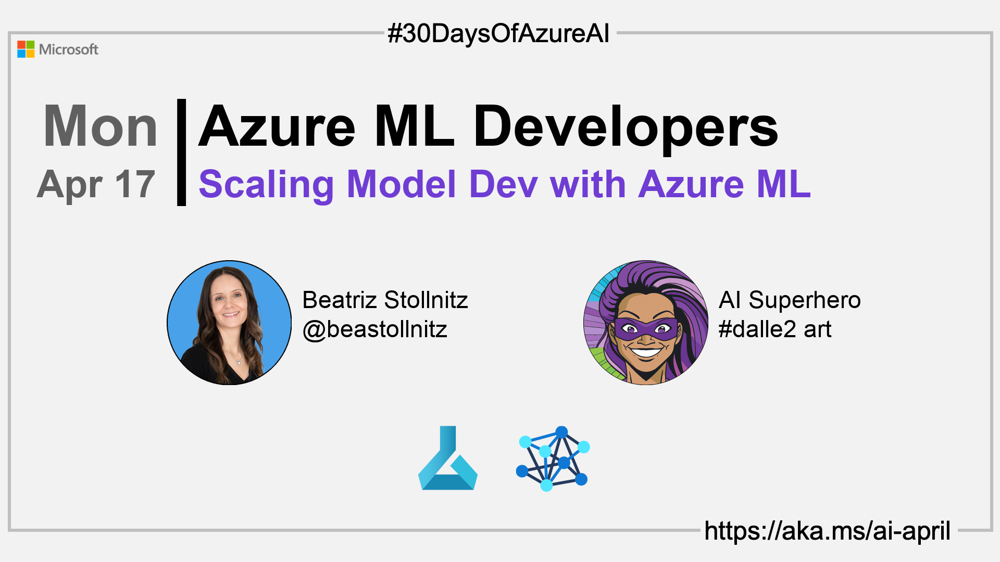

<head>  

  <link rel="canonical" href="https://bea.stollnitz.com/blog/aml-command"  />

</head>

- 👓 [Read today's article](https://bea.stollnitz.com/blog/aml-command)
- 📬 [Sign up for the Microsoft AI and Machine Learning Newsletter](https://aka.ms/azure-ai-dev-newsletter)
<!-- - 📰 [Subscribe to the #30DaysOfAzureAI RSS feed](https://azureaidevs.github.io/hub/2023-aia/rss.xml) -->
- 🙋🏾‍♂️ [Ask a question about this post on GitHub Discussions](https://github.com/AzureAiDevs/hub/discussions/categories/16-scaling-model-dev-with-azure-ml)
- 💡 [Suggest a topic for a future post](https://github.com/AzureAiDevs/hub/discussions/categories/call-for-content)
- 🌤️ [Azure AI Cloud Skills Challenge](https://aka.ms/30-days-of-azure-ai-challenge)
- 🏫 [Azure AI Technical Community](https://techcommunity.microsoft.com/t5/artificial-intelligence-and/ct-p/AI)

## 🗓️ Day _16_ of #30DaysOfAzureAI

<!-- README
The following description is also used for the tweet. So it should be action oriented and grab attention 
If you update the description, please update the description: in the frontmatter as well.
-->

**Azure ML: Train and Deploy ML Models at Scale**

<!-- README
The following is the intro to the post. It should be a short teaser for the post.
-->

Last week was for Azure AI App developers. This week, we switch gears and focus on Azure Machine Learning services for people building, deploying, and "productionalizing" ML models. If you're a Data Scientist, or an ML or MLOps engineer, then this week is for you. 

Today, learn about training and deploying machine learning models using Azure ML.

## 🎯 What we'll cover

<!-- README
The following list is the main points of the post. There should be 3-4 main points.
 -->

- How to train and deploy a machine learning model using Azure ML
- The three most common methods of creating resources: Azure ML CLI, Python SDK, and Studio UI

<!-- 
- Main point 1
- Main point 2
- Main point 3 
- Main point 4
-->

<!-- README
Add or update a list relevant references here. These could be links to other blog posts, Microsoft Learn Module, videos, or other resources.
-->

## 📚 References

- [Learn Module: Introduction to Azure Machine Learning](https://learn.microsoft.com/training/modules/intro-to-azure-ml?WT.mc_id=aiml-89446-dglover)
- [What is Azure Machine Learning?](https://learn.microsoft.com/azure/machine-learning/overview-what-is-azure-machine-learning?WT.mc_id=aiml-89446-dglover)

<!-- README
The following is the body of the post. It should be an overview of the post that you are referencing.
See the Learn More section, if you supplied a canonical link, then will be displayed here.
-->

## 🚌 How to train and deploy in Azure ML

Read [today's article](https://bea.stollnitz.com/blog/aml-command) is perfect if you have a basic understanding of how to train a machine learning model, but you've never used Azure ML before, then you're in the right place. [Today's article](https://bea.stollnitz.com/blog/aml-command) is a hands-on introduction to the most fundamental operations of Azure ML: training and deploying a machine learning model in the cloud. It discusses which resources you need to create, and the three main methods of creating them: the Azure ML CLI, the Python SDK, and the Studio UI.

The goal for today is for you to have a deep technical understanding of the basics of Azure ML. The article demonstrates how to train and deploy a simple model, but you'll be able to apply the same concepts to your own ML projects, regardless of their complexity.ß

## 👓 Read today's article

Today's [article](https://bea.stollnitz.com/blog/aml-command).

## 🙋🏾‍♂️ Questions?

[Remember, you can ask a question about this post on GitHub Discussions](https://github.com/AzureAiDevs/Discussions/discussions/categories/16-scaling-model-dev-with-azure-ml)

## 📍 30 days roadmap

What's next? View the [#30DaysOfAzureAI Roadmap](/hub/roadmap/30days)

[ Click to subscribe](https://azureaidevs.github.io/hub/2023-aia/rss.xml)