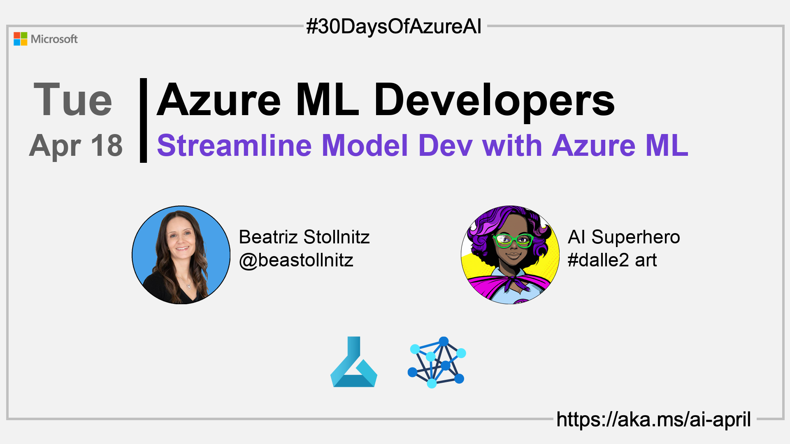

import Social from '@site/src/components/social';

<head>

  <meta name="twitter:url" content="https://azureaidevs.github.io/hub/2023-aia/day17" />
  <meta name="twitter:title" content="Streamline Model Dev with Azure ML" />
  <meta name="twitter:description" content="🧑🏽‍🔬Welcome to day 17 of #30DaysOfAzureAI. Streamlining ML Development with Azure ML Components & Pipelines" />
  <meta name="twitter:image" content="https://azureaidevs.github.io/hub/img/2023-aia/banner-day17.png" />
  <meta name="twitter:card" content="summary_large_image" />

  <meta property="og:url" content="https://azureaidevs.github.io/hub/2023-aia/day17" />
  <meta property="og:title" content="Streamline Model Dev with Azure ML" />
  <meta property="og:description" content="🧑🏽‍🔬Welcome to day 17 of #30DaysOfAzureAI. Streamlining ML Development with Azure ML Components & Pipelines" />
  <meta property="og:image" content="https://azureaidevs.github.io/hub/img/2023-aia/banner-day17.png" />
  <meta property="og:type" content="article" />
  <meta property="og:site_name" content="Azure AI Developer" />

  <link rel="canonical" href="https://bea.stollnitz.com/blog/aml-pipeline/"  />

</head>

- 👓 [View today's article](https://bea.stollnitz.com/blog/aml-pipeline/)
- 🌤️ [Continue the Azure AI Cloud Skills Challenge](https://aka.ms/30-days-of-azure-ai-challenge)
- 🏫 [Bookmark the Azure AI Technical Community](https://techcommunity.microsoft.com/t5/artificial-intelligence-and/ct-p/AI)
- 🙋🏾‍♂️ [Ask a question about this post on GitHub Discussions](https://github.com/AzureAiDevs/hub/discussions/categories/azure-ml-developers)
- 💡 [Suggest a topic for a future post](https://github.com/AzureAiDevs/hub/discussions/categories/call-for-content)

### Please share

<Social
    page_url="https://azureaidevs.github.io/hub/2023-aia/day17"
    image_url="https://azureaidevs.github.io/hub/img/2023-aia/banner-day17.png"
    title="Streamline Model Dev with Azure ML"
    description= "🧑🏽‍🔬Day 17 of #30DaysOfAzureAI. Unlock the potential of your ML projects with Azure ML Components & Pipelines. Streamline your development, boost productivity and take your hardwork to new heights. Begin with Azure ML today!"
    hashtags="AzureAiDevs,AI,AzureML"
    hashtag="#30DaysOfAzureAi"
/>

## 🗓️ Day 17 of #30DaysOfAzureAI

<!-- README
The following description is also used for the tweet. So it should be action oriented and grab attention 
If you update the description, please update the description: in the frontmatter as well.
-->

**Streamlining ML Development with Azure ML Components & Pipelines**

<!-- README
The following is the intro to the post. It should be a short teaser for the post.
-->

Yesterday we learned about training and deploying machine learning models using Azure ML. Today is all about streamlining ML Development with Azure ML Components & Pipelines.

## 🎯 What we'll cover

<!-- README
The following list is the main points of the post. There should be 3-4 main points.
 -->

- Azure ML components and pipelines

<!-- 
- Main point 1
- Main point 2
- Main point 3 
- Main point 4
-->

<!-- README
Add or update a list relevant references here. These could be links to other blog posts, Microsoft Learn Module, videos, or other resources.
-->

## 📚 References

- [Learn Module: Introduction to Azure Machine Learning](https://learn.microsoft.com/training/modules/intro-to-azure-ml?WT.mc_id=aiml-89446-dglover)
- [What is Azure Machine Learning?](https://learn.microsoft.com/azure/machine-learning/overview-what-is-azure-machine-learning?WT.mc_id=aiml-89446-dglover)

<!-- README
The following is the body of the post. It should be an overview of the post that you are referencing.
See the Learn More section, if you supplied a canonical link, then will be displayed here.
-->

## 🚌 How to train using pipelines and components in Azure ML

Check out [today's article](https://bea.stollnitz.com/blog/aml-pipeline/) to take your machine leaning projects to new heights with Azure ML components and pipelines! Learn how to break down your training code into components, and how to connect those components into a pipeline. Organizing your work into steps with components and pipelines will boost your productivity, especially as the complexity of your project increases.

The goal for today is for you to be able to evaluate the benefits of components and pipelines for your own project, and to understand the technical aspects of implementing them.

## 👓 View today's article

Today's [article](https://bea.stollnitz.com/blog/aml-pipeline/).

## 🙋🏾‍♂️ Questions?

[Remember, you can ask a question about this post on GitHub Discussions](https://github.com/AzureAiDevs/hub/discussions/categories/azure-ml-developers)

## 📍 30 days roadmap

What's next? View the [#30DaysOfAzureAI Roadmap](/hub/roadmap/30days)

[ Click to subscribe](https://azureaidevs.github.io/hub/2023-aia/rss.xml)