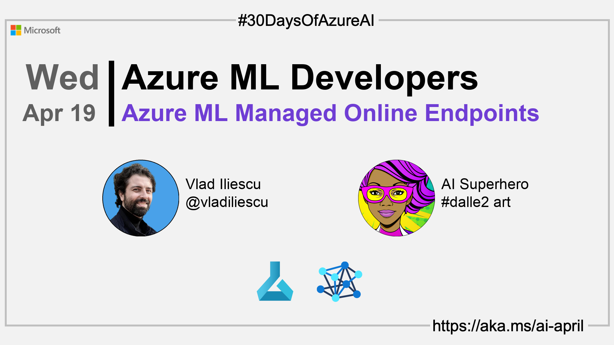

import Social from '@site/src/components/social';

<head>

  <meta name="twitter:url" content="https://azureaidevs.github.io/hub/2023-aia/day18" />
  <meta name="twitter:title" content="Azure ML Managed Online Endpoints" />
  <meta name="twitter:description" content="🧑🏽‍🔬Welcome to day 18 of #30DaysOfAzureAI. Check out Azure Machine Learning's managed online endpoints feature! With built-in security, blue/green deployments, and auto-scaling, it's the perfect way to deploy and scale your models. 🚀" />
  <meta name="twitter:image" content="https://raw.githubusercontent.com/AzureAiDevs/hub/main/website/static/img/2023-aia/banner-day18.png" />
  <meta name="twitter:card" content="summary_large_image" />

  <link rel="canonical" href="https://vladiliescu.net/aml-managed-endpoints-quickstart/"  />
  </head>

- 👓 [View today's article](https://vladiliescu.net/aml-managed-endpoints-quickstart/)
- 🍿 [Tune into the AI Show](https://aka.ms/ai-april-ai-show)
- 🧬 [Connect with Humans in AI](/hub/humans-in-ai)
- 🌤️ [Continue the Azure AI Cloud Skills Challenge](https://aka.ms/30-days-of-azure-ai-challenge)
- 🏫 [Bookmark the Azure AI Technical Community](https://aka.ms/ai-april-tech-community)
- ❤️ [Learn about the Microsoft MVP Program](https://aka.ms/ai-april-mvp-program)
- 💡 [Suggest a topic for a future post](https://github.com/AzureAiDevs/hub/discussions/categories/call-for-content)

### Please share

<Social
    page_url="https://azureaidevs.github.io/hub/2023-aia/day18"
    image_url="https://raw.githubusercontent.com/AzureAiDevs/hub/main/website/static/img/2023-aia/banner-day18.png"
    title="Azure ML Managed Online Endpoints"
    description= "🧑🏽‍🔬Welcome to day 18 of #30DaysOfAzureAI. Check out Azure Machine Learning's managed online endpoints feature! With built-in security, blue/green deployments, and auto-scaling, it's the perfect way to deploy and scale your models. 🚀"
    hashtags="AzureML"
    hashtag="#30DaysOfAzureAi"
/>

## 🗓️ Day 18 of #30DaysOfAzureAI

<!-- Short description section -->

**Azure ML Managed Online Endpoints - A Quickstart**

<!-- Intro section -->

Yesterday we learned how to streamline ML Development with Azure ML. Today, we'll learn how to deploy ML models using Azure ML managed online endpoints.

## 🎯 What we'll cover

<!-- What we'll cover section -->

1. What are Azure ML managed online endpoints.
2. The three main components of an online endpoint.
3. How to deploy one or more models under the same endpoint.

<!-- Reference section -->

## 📚 References

- [Learn Module: Introduction to Azure Machine Learning](https://learn.microsoft.com/training/modules/intro-to-azure-ml?WT.mc_id=aiml-89446-dglover)
- [What is Azure Machine Learning?](https://learn.microsoft.com/azure/machine-learning/overview-what-is-azure-machine-learning?WT.mc_id=aiml-89446-dglover)

<!-- Body section -->

## 🚌 Get started with Azure ML's managed online endpoints

[Today's article](https://vladiliescu.net/aml-managed-endpoints-quickstart/) discusses the benefits of using Azure Machine Learning's managed online endpoints and compares them to Azure Container Instances. The author outlines three main reasons why they prefer managed online endpoints: built-in security, native blue/green deployments, and auto-scaling with Azure Monitor.

Step-by-step instructions are provided for for deploying an online endpoint that translates API inputs to something a machine learning model can handle, invokes the model, and returns formatted results.

## 👓 View today's article

Today's [article](https://vladiliescu.net/aml-managed-endpoints-quickstart/).

## 🙋🏾‍♂️ Questions?

[You can ask questions about this post on GitHub Discussions](https://github.com/AzureAiDevs/hub/discussions/categories/azure-ml-developers)

## 📍 30 days roadmap

What's next? View the [#30DaysOfAzureAI Roadmap](/hub/roadmap/30days)

## 🧲 Subscribe

- 📬 [Subscribe to the monthly Azure AI and Machine Learning Tech Newsletter](https://aka.ms/azure-ai-dev-newsletter)
- [ Subscribe to the blog RSS XML feed](https://azureaidevs.github.io/hub/2023-aia/rss.xml)