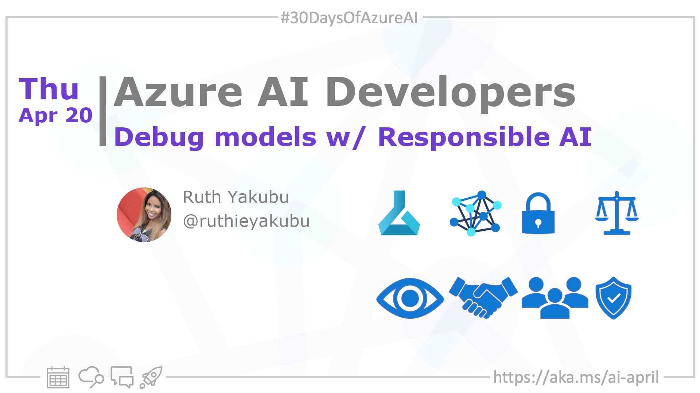

import Social from '@site/src/components/social';

<head>

  <meta name="twitter:url" content="https://azureaidevs.github.io/hub/2023-aia/day19" />
  <meta name="twitter:title" content="Debug models w/ Responsible AI" />
  <meta name="twitter:description" content="🧑🏽‍🔬Welcome to day 19 of #30DaysOfAzureAI. Guide to analyzing ML models for Responsible AI issues (Part 1)" />
  <meta name="twitter:image" content="https://azureaidevs.github.io/hub/img/2023-aia/banner-day19.png" />
  <meta name="twitter:card" content="summary_large_image" />

  <meta property="og:url" content="https://azureaidevs.github.io/hub/2023-aia/day19" />
  <meta property="og:title" content="Debug models w/ Responsible AI" />
  <meta property="og:description" content="🧑🏽‍🔬Welcome to day 19 of #30DaysOfAzureAI. Guide to analyzing ML models for Responsible AI issues (Part 1)" />
  <meta property="og:image" content="https://azureaidevs.github.io/hub/img/2023-aia/banner-day19.png" />
  <meta property="og:type" content="article" />
  <meta property="og:site_name" content="Azure AI Developer" />

  <link rel="canonical" href="https://techcommunity.microsoft.com/t5/ai-machine-learning-blog/getting-started-with-azure-machine-learning-responsible-ai/ba-p/3746948?WT.mc_id=aiml-89446-dglover"  />

</head>

- 👓 [View today's article](https://techcommunity.microsoft.com/t5/ai-machine-learning-blog/getting-started-with-azure-machine-learning-responsible-ai/ba-p/3746948?WT.mc_id=aiml-89446-dglover)
- 🍿 [Tune into the AI Show](https://aka.ms/ai-april-ai-show)
- 🌤️ [Continue the Azure AI Cloud Skills Challenge](https://aka.ms/30-days-of-azure-ai-challenge)
- 🏫 [Bookmark the Azure AI Technical Community](https://techcommunity.microsoft.com/t5/artificial-intelligence-and/ct-p/AI)
- ❤️ [Learn about the Microsoft MVP Program](https://aka.ms/ai-april-mvp-program)
- 💡 [Suggest a topic for a future post](https://github.com/AzureAiDevs/hub/discussions/categories/call-for-content)

### Please share

<Social
    page_url="https://azureaidevs.github.io/hub/2023-aia/day19"
    image_url="https://azureaidevs.github.io/hub/img/2023-aia/banner-day19.png"
    title="Debug models w/ Responsible AI"
    description= "🧑🏽‍🔬Day 19 of #30DaysOfAzureAI. Unlock the power of Responsible AI with the RAI Dashboard, a suite of open-source tools for model debugging, fairness assessment, and more, now available on Azure Machine Learning."
    hashtags="AI,AIforAll"
    hashtag="#30DaysOfAzureAi"
/>

## 🗓️ Day 19 of #30DaysOfAzureAI

<!-- README
The following description is also used for the tweet. So it should be action oriented and grab attention 
If you update the description, please update the description: in the frontmatter as well.
-->

**Guide to analyzing ML models for Responsible AI issues (Part 1)**

<!-- README
The following is the intro to the post. It should be a short teaser for the post.
-->

Yesterday we learned how to deploy ML models using Azure ML managed online endpoints. In the "Fundamentals" week we learned about the importance of Responsible AI. Today, we get practical, you'll learn about the Azure ML Responsible AI Dashboard and how it can help you build fairer ML models.

## 🎯 What we'll cover

<!-- README
The following list is the main points of the post. There should be 3-4 main points.
 -->

- The Azure ML RAI Dashboard.
- Build fairer and responsible AI models.
- Tools for responsible AI development, including model interoperability, error analysis, and counterfactual analysis.

<!-- 
- Main point 1
- Main point 2
- Main point 3 
- Main point 4
-->

<!-- README
Add or update a list relevant references here. These could be links to other blog posts, Microsoft Learn Module, videos, or other resources.
-->

## 📚 References

- [Microsoft's approach to using AI responsibly](https://news.microsoft.com/source/features/ai/microsoft-approach-to-ai/#using-ai-responsibly?WT.mc_id=aiml-89446-dglover)
- [Meeting the AI moment: advancing the future through responsible AI](https://blogs.microsoft.com/on-the-issues/2023/02/02/responsible-ai-chatgpt-artificial-intelligence?WT.mc_id=aiml-89446-dglover)

<!-- README
The following is the body of the post. It should be an overview of the post that you are referencing.
See the Learn More section, if you supplied a canonical link, then will be displayed here.
-->

## 🚌 What is Responsible AI Dashboard?

[Today's article](https://techcommunity.microsoft.com/t5/ai-machine-learning-blog/getting-started-with-azure-machine-learning-responsible-ai/ba-p/3746948?WT.mc_id=aiml-89446-dglover) is about the Responsible AI (RAI) Dashboard is a suite of open-source tools that help developers create responsible AI models with features such as model statistics, data explorer, error analysis, model interpretability, counterfactual analysis, and causal inference. The dashboard is built on leading open-source tools such as ErrorAnalysis, InterpretML, Fairlearn, DiCE, and EconML, and it can be accessed through the Azure Machine Learning platform. The RAI components allow developers to troubleshoot and analyze models and make better decisions to produce more responsible AI systems.

## 👓 View today's article

Today's [article](https://techcommunity.microsoft.com/t5/ai-machine-learning-blog/getting-started-with-azure-machine-learning-responsible-ai/ba-p/3746948?WT.mc_id=aiml-89446-dglover).

## 🙋🏾‍♂️ Questions?

[Remember, you can ask a question about this post on GitHub Discussions](https://github.com/AzureAiDevs/hub/discussions/categories/azure-ai-developers)

## 📍 30 days roadmap

What's next? View the [#30DaysOfAzureAI Roadmap](/hub/roadmap/30days)

[ Click to subscribe](https://azureaidevs.github.io/hub/2023-aia/rss.xml)