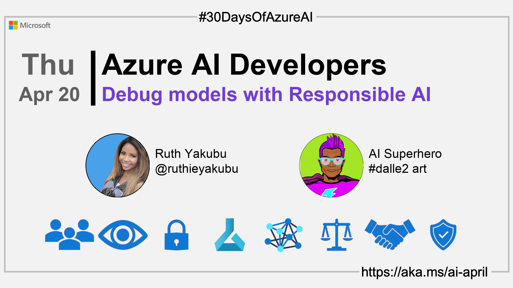

import Social from '@site/src/components/social';

<head>

  <link rel="canonical" href="https://techcommunity.microsoft.com/t5/ai-machine-learning-blog/getting-started-with-azure-machine-learning-responsible-ai/ba-p/3746948?WT.mc_id=aiml-89446-dglover"  />
  </head>

- 👓 [View today's article](https://techcommunity.microsoft.com/t5/ai-machine-learning-blog/getting-started-with-azure-machine-learning-responsible-ai/ba-p/3746948?WT.mc_id=aiml-89446-dglover)
- 🍿 [Tune into the AI Show](https://aka.ms/ai-april-ai-show)
- 🌤️ [Continue the Azure AI Cloud Skills Challenge](https://aka.ms/30-days-of-azure-ai-challenge)
- 🏫 [Bookmark the Azure AI Technical Community](https://aka.ms/ai-april-tech-community)
- ❤️ [Learn about the Microsoft MVP Program](https://aka.ms/ai-april-mvp-program)
- 💡 [Suggest a topic for a future post](https://github.com/AzureAiDevs/hub/discussions/categories/call-for-content)

### Please share

<Social
    page_url="https://azureaidevs.github.io/hub/2023-aia/day19"
    image_url="https://raw.githubusercontent.com/AzureAiDevs/hub/main/website/static/img/2023-aia/banner-day19.png"
    title="Debug models with Responsible AI"
    description= "🧑🏽‍🔬Day 19 of #30DaysOfAzureAI. Unlock the power of Responsible AI with the RAI Dashboard, a suite of open-source tools for model debugging, fairness assessment, and more, now available on Azure Machine Learning."
    hashtags="AIforAll"
    hashtag="#30DaysOfAzureAi"
/>

## 🗓️ Day 19 of #30DaysOfAzureAI

<!-- Short description section -->

**Guide to analyzing ML models for Responsible AI issues (Part 1)**

<!-- Intro section -->

Yesterday we learned how to deploy ML models using Azure ML managed online endpoints. In the "Fundamentals" week we learned about the importance of Responsible AI. Today, we get practical, you'll learn about the Azure ML Responsible AI Dashboard and how it can help you build fairer ML models.

## 🎯 What we'll cover

<!-- What we'll cover section -->

- The Azure ML RAI Dashboard.
- Build fairer and responsible AI models.
- Tools for responsible AI development, including model interoperability, error analysis, and counterfactual analysis.

<!-- Reference section -->

## 📚 References

- [Microsoft's approach to using AI responsibly](https://news.microsoft.com/source/features/ai/microsoft-approach-to-ai/#using-ai-responsibly?WT.mc_id=aiml-89446-dglover)
- [Meeting the AI moment: advancing the future through responsible AI](https://blogs.microsoft.com/on-the-issues/2023/02/02/responsible-ai-chatgpt-artificial-intelligence?WT.mc_id=aiml-89446-dglover)

<!-- Body section -->

## 🚌 What is Responsible AI Dashboard?

[Today's article](https://techcommunity.microsoft.com/t5/ai-machine-learning-blog/getting-started-with-azure-machine-learning-responsible-ai/ba-p/3746948?WT.mc_id=aiml-89446-dglover) is about the Responsible AI (RAI) Dashboard is a suite of open-source tools that help developers create responsible AI models with features such as model statistics, data explorer, error analysis, model interpretability, counterfactual analysis, and causal inference. The dashboard is built on leading open-source tools such as ErrorAnalysis, InterpretML, Fairlearn, DiCE, and EconML, and it can be accessed through the Azure Machine Learning platform. The RAI components allow developers to troubleshoot and analyze models and make better decisions to produce more responsible AI systems.

## 👓 View today's article

Today's [article](https://techcommunity.microsoft.com/t5/ai-machine-learning-blog/getting-started-with-azure-machine-learning-responsible-ai/ba-p/3746948?WT.mc_id=aiml-89446-dglover).

## 🙋🏾‍♂️ Questions?

[You can ask questions about this post on GitHub Discussions](https://github.com/AzureAiDevs/hub/discussions/categories/azure-ai-developers)

## 📍 30 days roadmap

What's next? View the [#30DaysOfAzureAI Roadmap](/hub/roadmap/30days)

## 🧲 Subscribe

- 📬 [Subscribe to the monthly Azure AI and Machine Learning Tech Newsletter](https://aka.ms/azure-ai-dev-newsletter)
- [ Subscribe to the blog RSS XML feed](https://azureaidevs.github.io/hub/2023-aia/rss.xml)