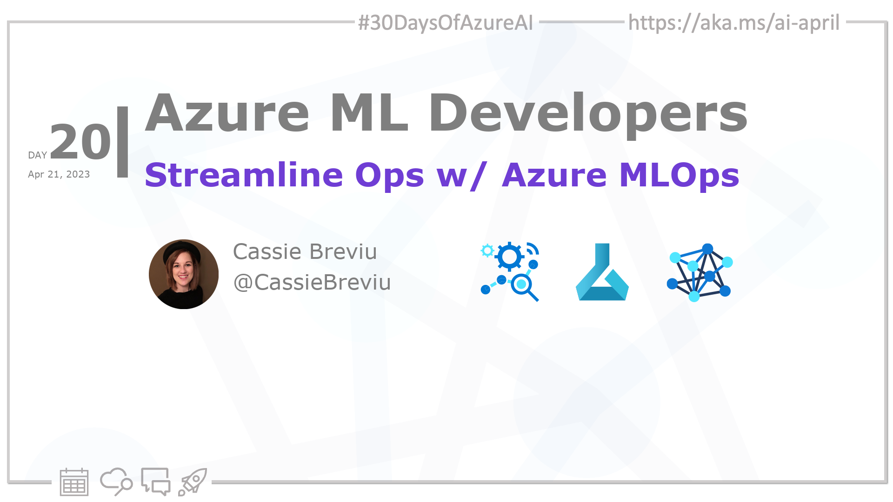

import Social from '@site/src/components/social';

<head>

  <link rel="canonical" href="https://learn.microsoft.com/events/ignite-2022/cll99-learn-live-start-machine-learning-lifecycle-with-mlops?WT.mc_id=aiml-89446-dglover"  />
  </head>

- 👓 [View today's article](https://learn.microsoft.com/events/ignite-2022/cll99-learn-live-start-machine-learning-lifecycle-with-mlops?WT.mc_id=aiml-89446-dglover)
- 🍿 [Tune into the AI Show](https://aka.ms/ai-april-ai-show)
- 🌤️ [Continue the Azure AI Cloud Skills Challenge](https://aka.ms/30-days-of-azure-ai-challenge)
- 🏫 [Bookmark the Azure AI Technical Community](https://aka.ms/ai-april-tech-community)
- ❤️ [Learn about the Microsoft MVP Program](https://aka.ms/ai-april-mvp-program)
- 💡 [Suggest a topic for a future post](https://github.com/AzureAiDevs/hub/discussions/categories/call-for-content)

### Please share

<Social
    page_url="https://azureaidevs.github.io/hub/2023-aia/day20"
    image_url="https://raw.githubusercontent.com/AzureAiDevs/hub/main/website/static/img/2023-aia/banner-day20.png"
    title="Streamline Ops with Azure MLOps"
    description= "🧑🏽‍🔬Day 20 of #30DaysOfAzureAI. Unleash your #MachineLearning potential! Join Cassie and Korey in today's #LearnLive and discover #Azure MLOps. Streamline your ML lifecycle with open source tooling, and take your models to the next level!"
    hashtags="AI,AzureMLOps"
    hashtag="#30DaysOfAzureAi"
/>

## 🗓️ Day 20 of #30DaysOfAzureAI

<!-- README
The following description is also used for the tweet. So it should be action oriented and grab attention 
If you update the description, please update the description: in the frontmatter as well.
-->

**Learn about Azure Machine Learning lifecycle and open source tooling to start building MLOps**

<!-- README
The following is the intro to the post. It should be a short teaser for the post.
-->

Yesterday we learned about the Azure ML Responsible AI Dashboard. Today is an introduction to Azure MLOps, where you'll learn how to "productionalize" ML models with Azure ML.

## 🎯 What we'll cover

<!-- README
The following list is the main points of the post. There should be 3-4 main points.
 -->

- Azure ML MLOps
- Practices and tools for managing the machine learning lifecycle.
- Improving data scientists and developer collaboration.

<!-- 
- Main point 1
- Main point 2
- Main point 3 
- Main point 4
-->

<!-- README
Add or update a list relevant references here. These could be links to other blog posts, Microsoft Learn Module, videos, or other resources.
-->

## 📚 References

- [Machine learning operations (MLOps)](https://azure.microsoft.com/products/machine-learning/mlops/#features?WT.mc_id=aiml-89446-dglover)
- [Learn Module: Introduction to machine learning operations (MLOps)](https://learn.microsoft.com/training/paths/introduction-machine-learn-operations?WT.mc_id=aiml-89446-dglover)
- [Learn Module: Start the machine learning lifecycle with MLOps](https://learn.microsoft.com/training/modules/start-ml-lifecycle-mlops?WT.mc_id=aiml-89446-dglover)

<!-- README
The following is the body of the post. It should be an overview of the post that you are referencing.
See the Learn More section, if you supplied a canonical link, then will be displayed here.
-->

## 🚌 Learn Live MLOps to streamline the ML Lifecycle

[Watch today's video](https://learn.microsoft.com/events/ignite-2022/cll99-learn-live-start-machine-learning-lifecycle-with-mlops?WT.mc_id=aiml-89446-dglover) about MLOps for the ML Lifecycle. The presenters, Cassie and Korey, start with an overview of MLOps, explaining that it is a set of practices and tools that help data scientists and developers work together to build and deploy machine learning models.

Cassie and Korey discuss the benefits of MLOps, including faster time to value, improved collaboration, and increased model quality. They also discuss the challenges of MLOps, including the need for a common language, the need for a common platform, and the need for a common process.

<iframe width="100%" height="420" src="https://www.youtube.com/embed/MYP3Bmsncq4" title="YouTube video player" frameborder="0" allow="accelerometer; autoplay; clipboard-write; encrypted-media; gyroscope; picture-in-picture; web-share" allowfullscreen></iframe>

## 👓 View today's article

Today's [article](https://learn.microsoft.com/events/ignite-2022/cll99-learn-live-start-machine-learning-lifecycle-with-mlops?WT.mc_id=aiml-89446-dglover).

## 🙋🏾‍♂️ Questions?

[Remember, you can ask a question about this post on GitHub Discussions](https://github.com/AzureAiDevs/hub/discussions/categories/azure-ml-developers)

## 📍 30 days roadmap

What's next? View the [#30DaysOfAzureAI Roadmap](/hub/roadmap/30days)

[ Click to subscribe to the RSS XML feed](https://azureaidevs.github.io/hub/2023-aia/rss.xml)