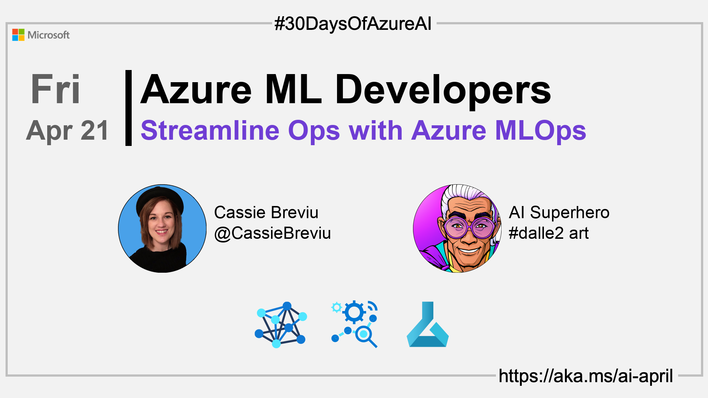

import Social from '@site/src/components/social';

<head>

  <meta name="twitter:url" content="https://azureaidevs.github.io/hub/2023-aia/day20" />
  <meta name="twitter:title" content="Streamline Ops with Azure MLOps" />
  <meta name="twitter:description" content="🧑🏽‍🔬Welcome to day 20 of #30DaysOfAzureAI. Unleash your MachineLearning potential! Join Cassie and Korey in today's LearnLive and discover Azure MLOps. Streamline your ML lifecycle with open source tooling, and take your models to the next level!" />
  <meta name="twitter:image" content="https://raw.githubusercontent.com/AzureAiDevs/hub/main/website/static/img/2023-aia/banner-day20.png" />
  <meta name="twitter:card" content="summary_large_image" />

  <link rel="canonical" href="https://learn.microsoft.com/events/ignite-2022/cll99-learn-live-start-machine-learning-lifecycle-with-mlops?WT.mc_id=aiml-89446-dglover"  />
  </head>

- 👓 [View today's article](https://learn.microsoft.com/events/ignite-2022/cll99-learn-live-start-machine-learning-lifecycle-with-mlops?WT.mc_id=aiml-89446-dglover)
- 🍿 [Tune into the AI Show](https://aka.ms/ai-april-ai-show)
- 🧬 [Connect with Humans in AI](/hub/humans-in-ai)
- 🌤️ [Continue the Azure AI Cloud Skills Challenge](https://aka.ms/30-days-of-azure-ai-challenge)
- 🏫 [Bookmark the Azure AI Technical Community](https://aka.ms/ai-april-tech-community)
- 🌏 [Join the Global AI Community](https://www.meetup.com/pro/the-global-ai-community)
- 💡 [Suggest a topic for a future post](https://forms.office.com/r/GhtwgHVP9L)

### Please share

<Social
    page_url="https://azureaidevs.github.io/hub/2023-aia/day20"
    image_url="https://raw.githubusercontent.com/AzureAiDevs/hub/main/website/static/img/2023-aia/banner-day20.png"
    title="Streamline Ops with Azure MLOps"
    description= "🧑🏽‍🔬Welcome to day 20 of #30DaysOfAzureAI. Unleash your MachineLearning potential! Join Cassie and Korey in today's LearnLive and discover Azure MLOps. Streamline your ML lifecycle with open source tooling, and take your models to the next level!"
    hashtags="AzureMLOps"
    hashtag="#30DaysOfAzureAi"
/>

## 🗓️ Day 20 of #30DaysOfAzureAI

<!-- Short description section -->

**Learn about Azure Machine Learning lifecycle and open source tooling to start building MLOps**

<!-- Intro section -->

Yesterday we learned about the Azure ML Responsible AI Dashboard. Today is an introduction to Azure MLOps, where you'll learn how to "productionalize" ML models with Azure ML.

## 🎯 What we'll cover

<!-- What we'll cover section -->

- Azure ML MLOps
- Practices and tools for managing the machine learning lifecycle.
- Improving data scientists and developer collaboration.

<!-- Reference section -->

## 📚 References

- [Machine learning operations (MLOps)](https://azure.microsoft.com/products/machine-learning/mlops/#features?WT.mc_id=aiml-89446-dglover)
- [Learn Module: Introduction to machine learning operations (MLOps)](https://learn.microsoft.com/training/paths/introduction-machine-learn-operations?WT.mc_id=aiml-89446-dglover)
- [Learn Module: Start the machine learning lifecycle with MLOps](https://learn.microsoft.com/training/modules/start-ml-lifecycle-mlops?WT.mc_id=aiml-89446-dglover)

<!-- Body section -->

## 🚌 Learn Live MLOps to streamline the ML Lifecycle

[Watch today's video](https://learn.microsoft.com/events/ignite-2022/cll99-learn-live-start-machine-learning-lifecycle-with-mlops?WT.mc_id=aiml-89446-dglover) about MLOps for the ML Lifecycle. The presenters, Cassie and Korey, start with an overview of MLOps, explaining that it is a set of practices and tools that help data scientists and developers work together to build and deploy machine learning models.

Cassie and Korey discuss the benefits of MLOps, including faster time to value, improved collaboration, and increased model quality. They also discuss the challenges of MLOps, including the need for a common language, the need for a common platform, and the need for a common process.

<iframe width="100%" height="420" src="https://www.youtube.com/embed/MYP3Bmsncq4" title="YouTube video player" frameborder="0" allow="accelerometer; autoplay; clipboard-write; encrypted-media; gyroscope; picture-in-picture; web-share" allowfullscreen></iframe>

## 👓 View today's article

Today's [article](https://learn.microsoft.com/events/ignite-2022/cll99-learn-live-start-machine-learning-lifecycle-with-mlops?WT.mc_id=aiml-89446-dglover).

## 🙋🏾‍♂️ Questions?

[You can ask questions about this post on GitHub Discussions](https://github.com/AzureAiDevs/hub/discussions/categories/azure-ml-developers)

## 📍 30 days roadmap

What's next? View the [#30DaysOfAzureAI Roadmap](/hub/roadmap/30days)

## 🧲 Subscribe

- 📬 [Subscribe to the monthly Azure AI and Machine Learning Tech Newsletter](https://aka.ms/azure-ai-dev-newsletter)
- [ Subscribe to the blog RSS XML feed](https://azureaidevs.github.io/hub/2023-aia/rss.xml)