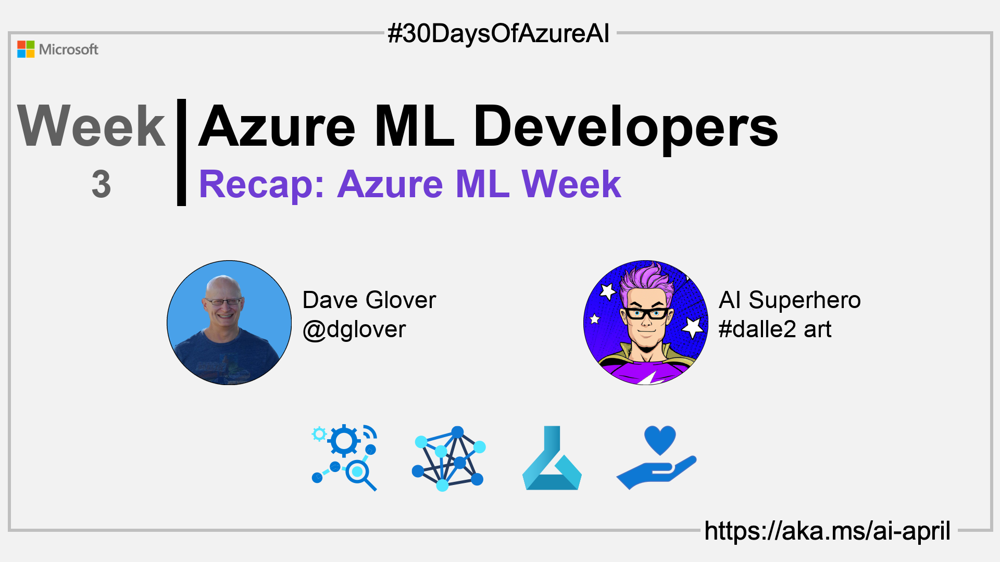

<head>  

  <link rel="canonical"  href="https://azureaidevs.github.io/hub/2023-aia/day21"  />

</head>

- 📬 [Sign up for the Microsoft Tech News and select AI Machine Learning](https://developer.microsoft.com/en-us/Newsletter/)
<!-- - 📰 [Subscribe to the #30DaysOfAzureAI RSS feed](https://azureaidevs.github.io/hub/2023-aia/rss.xml) -->
- 🌤️ [Continue the Azure AI Cloud Skills Challenge](https://aka.ms/30-days-of-azure-ai-challenge)
- 🏫 [Bookmark the Azure AI Technical Community](https://techcommunity.microsoft.com/t5/artificial-intelligence-and/ct-p/AI)
- 🙋🏾‍♂️ [Ask a question about this post on GitHub Discussions](https://github.com/AzureAiDevs/hub/discussions/categories/21-recap-azure-ml-week✨)
- 💡 [Suggest a topic for a future post](https://github.com/AzureAiDevs/hub/discussions/categories/call-for-content)

## 🗓️ Day 21 of #30DaysOfAzureAI

<!-- README
The following description is also used for the tweet. So it should be action oriented and grab attention 
If you update the description, please update the description: in the frontmatter as well.
-->

**30DaysOfAzureAI Recap for Azure Machine Learning Week**

<!-- README
The following is the intro to the post. It should be a short teaser for the post.
-->

## 🎯 What we'll cover

<!-- README
The following list is the main points of the post. There should be 3-4 main points.
 -->

<!-- 
- Main point 1
- Main point 2
- Main point 3 
- Main point 4
-->

<!-- README
Add or update a list relevant references here. These could be links to other blog posts, Microsoft Learn Module, videos, or other resources.
-->

## 📚 References

- [Learn Module: Introduction to Azure Machine Learning](https://learn.microsoft.com/training/modules/intro-to-azure-ml?WT.mc_id=aiml-89446-dglover)
- [Learn Module: Introduction to machine learning operations (MLOps)](https://learn.microsoft.com/training/paths/introduction-machine-learn-operations?WT.mc_id=aiml-89446-dglover)
- [What is Azure Machine Learning?](https://learn.microsoft.com/azure/machine-learning/overview-what-is-azure-machine-learning?WT.mc_id=aiml-89446-dglover)
- [Learn Module: Start the machine learning lifecycle with MLOps](https://learn.microsoft.com/training/modules/start-ml-lifecycle-mlops?WT.mc_id=aiml-89446-dglover)
- [Machine learning operations (MLOps)](https://azure.microsoft.com/products/machine-learning/mlops/#features?WT.mc_id=aiml-89446-dglover)
- [Meeting the AI moment: advancing the future through responsible AI](https://blogs.microsoft.com/on-the-issues/2023/02/02/responsible-ai-chatgpt-artificial-intelligence?WT.mc_id=aiml-89446-dglover)
- [Microsoft's approach to using AI responsibly](https://news.microsoft.com/source/features/ai/microsoft-approach-to-ai/#using-ai-responsibly?WT.mc_id=aiml-89446-dglover)

<!-- README
The following is the body of the post. It should be an overview of the post that you are referencing.
See the Learn More section, if you supplied a canonical link, then will be displayed here.
-->

## 🙋🏾‍♂️ Questions?

[Remember, you can ask a question about this post on GitHub Discussions](https://github.com/AzureAiDevs/Discussions/discussions/categories/21-recap-azure-ml-week✨)

## 📍 30 days roadmap

What's next? View the [#30DaysOfAzureAI Roadmap](/hub/roadmap/30days)

[ Click to subscribe](https://azureaidevs.github.io/hub/2023-aia/rss.xml)