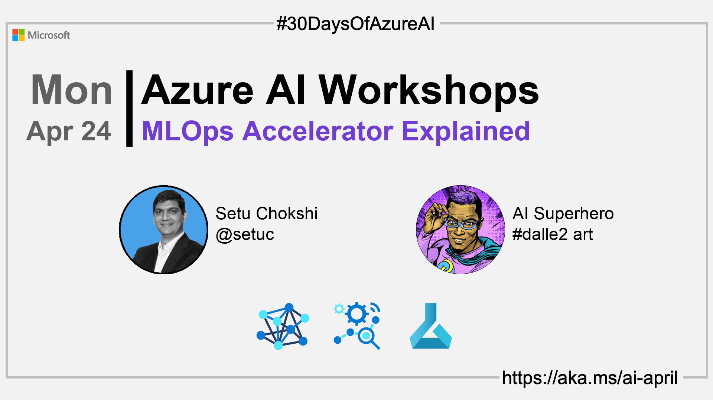

import Social from '@site/src/components/social';

<head>

  <meta name="twitter:url" content="https://azureaidevs.github.io/hub/2023-aia/day22" />
  <meta name="twitter:title" content="MLOps Accelerator Explained" />
  <meta name="twitter:description" content="🏭Welcome to day 22 of #30DaysOfAzureAI. Accelerating MLOps with the v2 Solution Accelerator" />
  <meta name="twitter:image" content="https://raw.githubusercontent.com/AzureAiDevs/hub/main/website/static/img/2023-aia/banner-day22.png" />
  <meta name="twitter:card" content="summary_large_image" />

  <meta property="og:url" content="https://azureaidevs.github.io/hub/2023-aia/day22" />
  <meta property="og:title" content="MLOps Accelerator Explained" />
  <meta property="og:description" content="🏭Welcome to day 22 of #30DaysOfAzureAI. Accelerating MLOps with the v2 Solution Accelerator" />
  <meta property="og:image" content="https://raw.githubusercontent.com/AzureAiDevs/hub/main/website/static/img/2023-aia/banner-day22.png" />
  <meta property="og:type" content="article" />
  <meta property="og:site_name" content="Azure AI Developer" />

  <link rel="canonical" href="https://github.com/Azure/mlops-v2"  />

</head>

- 👓 [View today's article](https://github.com/Azure/mlops-v2)
- 🍿 [Tune into the AI Show](https://aka.ms/ai-april-ai-show)
- 🌤️ [Continue the Azure AI Cloud Skills Challenge](https://aka.ms/30-days-of-azure-ai-challenge)
- 🏫 [Bookmark the Azure AI Technical Community](https://aka.ms/ai-april-tech-community)
- ❤️ [Learn about the Microsoft MVP Program](https://aka.ms/ai-april-mvp-program)
- 💡 [Suggest a topic for a future post](https://github.com/AzureAiDevs/hub/discussions/categories/call-for-content)

### Please share

<Social
    page_url="https://azureaidevs.github.io/hub/2023-aia/day22"
    image_url="https://raw.githubusercontent.com/AzureAiDevs/hub/main/website/static/img/2023-aia/banner-day22.png"
    title="MLOps Accelerator Explained"
    description= "🏭Day 22 of #30DaysOfAzureAI. We're taking MLOps to the next level with the v2 Solution Accelerator! 🤖 Learn how to supercharge your machine learning workflows with a simplified, customizable enterprise-ready approach."
    hashtags="AI,AzureMLOps"
    hashtag="#30DaysOfAzureAi"
/>

## 🗓️ Day 22 of #30DaysOfAzureAI

<!-- README
The following description is also used for the tweet. So it should be action oriented and grab attention 
If you update the description, please update the description: in the frontmatter as well.
-->

**Accelerating MLOps with the v2 Solution Accelerator**

<!-- README
The following is the intro to the post. It should be a short teaser for the post.
-->

Last week was for Azure ML developers. This week is "Workshop" week; the content is for everyone. You might be a student starting your AI or Data Science journey, wanting to learn more about MLOps, or an AI app Developer wanting to work through practical examples.

Today, we look at the Azure MLOps (v2) Solution Accelerator and learn how it can help you streamline and automate your machine learning workflows.

## 🎯 What we'll cover

<!-- README
The following list is the main points of the post. There should be 3-4 main points.
 -->

- The Azure ML MLOps Solution Accelerator.
- Simplified, end-to-end, and modular approach to MLOps.
- Template-based approach to data science.

<!-- 
- Main point 1
- Main point 2
- Main point 3 
- Main point 4
-->

<!-- README
Add or update a list relevant references here. These could be links to other blog posts, Microsoft Learn Module, videos, or other resources.
-->

## 📚 References

- [Machine learning operations (MLOps)](https://azure.microsoft.com/products/machine-learning/mlops/#features?WT.mc_id=aiml-89446-dglover)
- [Learn Module: Introduction to machine learning operations (MLOps)](https://learn.microsoft.com/training/paths/introduction-machine-learn-operations?WT.mc_id=aiml-89446-dglover)
- [Learn Module: Start the machine learning lifecycle with MLOps](https://learn.microsoft.com/training/modules/start-ml-lifecycle-mlops?WT.mc_id=aiml-89446-dglover)

<!-- README
The following is the body of the post. It should be an overview of the post that you are referencing.
See the Learn More section, if you supplied a canonical link, then will be displayed here.
-->

## 🚌 The Azure MLOps (v2) Solution Accelerator

[Today's article](https://github.com/Azure/mlops-v2) introduces you to the Azure MLOps (v2) Solution Accelerator. The Azure MLOps (v2) Solution Accelerator is a project designed to simplify the implementation of MLOps in Azure. 

MLOps is a set of automated and collaborative workflows that allow teams of machine learning professionals to quickly and easily deploy their models into production. 

The solution accelerator provides a modular end-to-end approach based on pattern architectures, with the goals of simplicity, modularity, repeatability, security, collaboration, and enterprise readiness. It achieves these goals with a template-based approach for end-to-end data science, driving operational efficiency at each stage. The solution accelerator is designed to be customizable to fit each organization's unique needs and can be up and running in just a few hours.

## Watch the Azure MLOps (v2) Solution Accelerator Overview Video

<iframe width="100%" height="420" src="https://www.youtube.com/embed/5yPDkWCMmtk" title="YouTube video player" frameborder="0" allow="accelerometer; autoplay; clipboard-write; encrypted-media; gyroscope; picture-in-picture; web-share" allowfullscreen></iframe>

## 👓 View today's article

Today's [article](https://github.com/Azure/mlops-v2).

## 🙋🏾‍♂️ Questions?

[Remember, you can ask a question about this post on GitHub Discussions](https://github.com/AzureAiDevs/hub/discussions/categories/azure-ai-workshops)

## 📍 30 days roadmap

What's next? View the [#30DaysOfAzureAI Roadmap](/hub/roadmap/30days)

[ Click to subscribe](https://azureaidevs.github.io/hub/2023-aia/rss.xml)