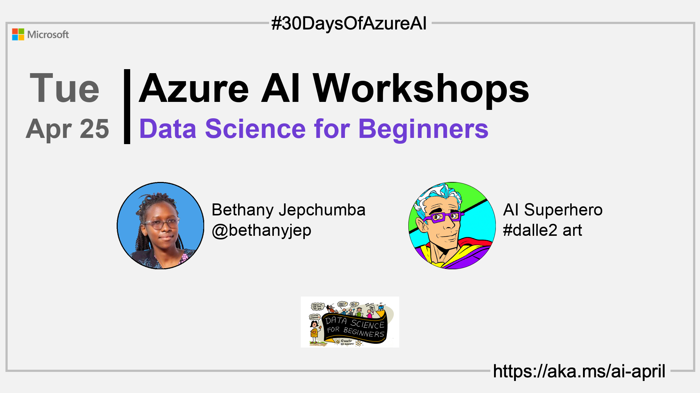

import Social from '@site/src/components/social';

<head>

  <meta name="twitter:url" content="https://azureaidevs.github.io/hub/2023-aia/day23" />
  <meta name="twitter:title" content="Data Science for Beginners" />
  <meta name="twitter:description" content="🏭Welcome to day 23 of #30DaysOfAzureAI. Just starting your #DataScience journey? Check out Microsoft's free 10-week, 20-lesson course for beginners! Learn about ethics, preparation, visualization, and more. Dive in and extract insights from data today!" />
  <meta name="twitter:image" content="https://raw.githubusercontent.com/AzureAiDevs/hub/main/website/static/img/2023-aia/banner-day23.png" />
  <meta name="twitter:card" content="summary_large_image" />

  <link rel="canonical" href="https://microsoft.github.io/Data-Science-For-Beginners?WT.mc_id=aiml-89446-dglover"  />
  </head>

- 👓 [View today's article](https://microsoft.github.io/Data-Science-For-Beginners?WT.mc_id=aiml-89446-dglover)
- 🍿 [Tune into the AI Show](https://aka.ms/ai-april-ai-show)
- 🧬 [Connect with Humans in AI](/hub/humans-in-ai)
- 🌤️ [Continue the Azure AI Cloud Skills Challenge](https://aka.ms/30-days-of-azure-ai-challenge)
- 🏫 [Bookmark the Azure AI Technical Community](https://aka.ms/ai-april-tech-community)
- 🌏 [Join the Global AI Community](https://www.meetup.com/pro/the-global-ai-community)
- 💡 [Suggest a topic for a future post](https://forms.office.com/r/GhtwgHVP9L)

### Please share

<Social
    page_url="https://azureaidevs.github.io/hub/2023-aia/day23"
    image_url="https://raw.githubusercontent.com/AzureAiDevs/hub/main/website/static/img/2023-aia/banner-day23.png"
    title="Data Science for Beginners"
    description= "🏭Welcome to day 23 of #30DaysOfAzureAI. Just starting your #DataScience journey? Check out Microsoft's free 10-week, 20-lesson course for beginners! Learn about ethics, preparation, visualization, and more. Dive in and extract insights from data today!"
    hashtags="DataScience"
    hashtag="#30DaysOfAzureAi"
/>

## 🗓️ Day 23 of #30DaysOfAzureAI

<!-- Short description section -->

**Foundations of Data Science: Workshops for Beginners**

<!-- Intro section -->

Yesterday we learned about the Azure MLOps (v2) Solution Accelerator. Today is for folk starting on their Data Science journey. Data Science for Beginners Curriculum is a 10-week, 20-lesson course, so dive in!

## 🎯 What we'll cover

<!-- What we'll cover section -->

- Data Science for Beginners curriculum.
- Data science principles, including ethics, preparation and visualization.

<!-- Reference section -->

## 📚 References

- [learn Module: Understand data science for machine learning](https://learn.microsoft.com/training/paths/understand-machine-learning?WT.mc_id=aiml-89446-dglover)

<!-- Body section -->

## 🚌 Introducing Data Science for Beginners

[Today's article](https://microsoft.github.io/Data-Science-For-Beginners?WT.mc_id=aiml-89446-dglover) introduces the free Microsoft Data Science for Beginners, a 10-week, 20-lesson course, which includes pre-lesson and post-lesson quizzes, written instructions to complete each lesson, a solution, and an assignment. The course is designed for beginners and assumes no prior knowledge of data science.

The course covers basic principles of data science, including ethical concepts, data preparation, data visualization, data analysis, real-world use cases of data science, and more.

## Data Science for Beginners Curriculum

According to Wikipedia, Data Science is a scientific field that uses scientific methods to extract knowledge and insights from structured and unstructured data and apply knowledge and actionable insights from data across a broad range of application domains. Data surrounds us in everything we do, from the clicks we make on different websites to the physical notes we possess. Using Data Science, you can extract insights from this data and apply it to actionable steps such as in decision making.

The Data Science for Beginners Curriculum is a gentle introduction to the world of data and how you can manipulate it to extract insights. The curriculum spans over 10 weeks (about 2 and a half months) covering 20 topics including Data Science ethics, Data Science in the Cloud, Data analysis, preparation, and visualization.

In addition to hands-on projects, the curriculum includes quizzes and a postscript on real world application of Data Science. In this blog, I will cover a brief overview of ethics in Data Science as well as preparing and visualizing your data linking the concepts back to specific curriculum lessons for self-study.

##Data Science Principles explained

### Ethics in Data Science

Data surrounds us in everything we do. In our online interactions, most of our actions and activities are recorded. How the data collected is used is key in ensuring potential harms and unintended consequences arise from data-driven actions.

Under ethics we consider Microsoft’s six ethics principles including: accountability, transparency, fairness, inclusiveness, reliability & safety, and privacy & security. For example, when designing solutions how do we adapt them to meet a broad range of human needs and capabilities? [Read more on data ethics in our curriculum](https://microsoft.github.io/Data-Science-For-Beginners/#/1-Introduction/02-ethics/README).

### Data Preparation

The Data Science process begins with getting your data. Real world data is often messy. You might encounter some missing values, duplicated data, or data not in the right format. For example, if someone fills in the same form twice, how do you mitigate this? [In the data preparation lesson](https://microsoft.github.io/Data-Science-For-Beginners/#/2-Working-With-Data/README), you will learn how to import your data, the different libraries needed, how to locally install the libraries and finally how to use the libraries.

### Data Visualization

After analyzing your data and you might want to share your findings with the world. The first thing is understanding what charts you can use where and how to create meaningful charts. For example, using either seaborne or matplotlib libraries, you can create bar graphs and pie charts to show how various categories in your data relate. Alternatively, you can create a line chart to show data changes over time. To create meaningful charts, you need to factor in readability in terms of colours used and ensure your charts are free of deception. [Learn more on data visualization by using Minnesota’s birds dataset](https://microsoft.github.io/Data-Science-For-Beginners/#/3-Data-Visualization/README).

## Conclusion

For a deep dive into the different Data Science concepts, building hands-on-projects, head over to the [Data Science for Beginners curriculum](https://microsoft.github.io/Data-Science-For-Beginners?WT.mc_id=aiml-89446-dglover). At the end of the lessons, you will understand how you can clean, prepare, and visualize your data ready for modelling. In tomorrow’s article, we cover Machine Learning, which covers the next step after understanding your data.

## 👓 View today's article

Today's [article](https://microsoft.github.io/Data-Science-For-Beginners?WT.mc_id=aiml-89446-dglover).

## 🙋🏾‍♂️ Questions?

[You can ask questions about this post on GitHub Discussions](https://github.com/AzureAiDevs/hub/discussions/categories/azure-ai-workshops)

## 📍 30 days roadmap

What's next? View the [#30DaysOfAzureAI Roadmap](/hub/roadmap/30days)

## 🧲 Subscribe

- 📬 [Subscribe to the monthly Azure AI and Machine Learning Tech Newsletter](https://aka.ms/azure-ai-dev-newsletter)
- [ Subscribe to the blog RSS XML feed](https://azureaidevs.github.io/hub/2023-aia/rss.xml)