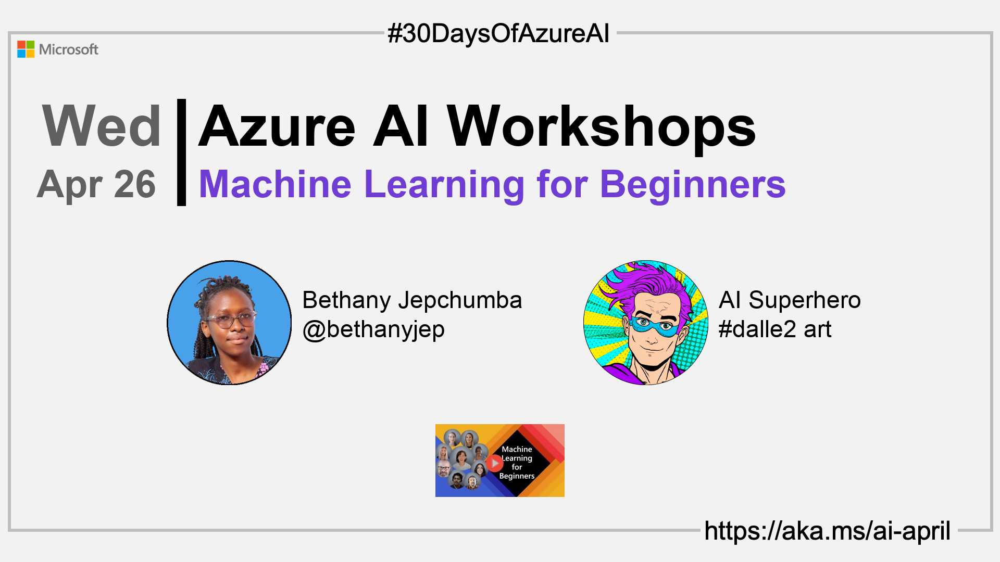

<head>  

  <link rel="canonical" href="https://microsoft.github.io/ML-For-Beginners/"  />

</head>

- 👓 [Read today's article](https://microsoft.github.io/ML-For-Beginners/)
- 📬 [Sign up for the Microsoft AI and Machine Learning Newsletter](https://aka.ms/azure-ai-dev-newsletter)
<!-- - 📰 [Subscribe to the #30DaysOfAzureAI RSS feed](https://azureaidevs.github.io/hub/2023-aia/rss.xml) -->
- 🙋🏾‍♂️ [Ask a question about this post on GitHub Discussions](https://github.com/AzureAiDevs/hub/discussions/categories/24-machine-learning-for-beginners)
- 💡 [Suggest a topic for a future post](https://github.com/AzureAiDevs/hub/discussions/categories/call-for-content)
- 🌤️ [Azure AI Cloud Skills Challenge](https://aka.ms/30-days-of-azure-ai-challenge)
- 🏫 [Azure AI Technical Community](https://techcommunity.microsoft.com/t5/artificial-intelligence-and/ct-p/AI)

## 🗓️ Day _24_ of #30DaysOfAzureAI

<!-- README
The following description is also used for the tweet. So it should be action oriented and grab attention 
If you update the description, please update the description: in the frontmatter as well.
-->

**Learn about the Microsoft Machine Learning for Beginners Curriculum**

<!-- README
The following is the intro to the post. It should be a short teaser for the post.
-->

Yesterday we learned about Data Science for Beginners Curriculum. Today is for folk starting their ML journey. The Machine Learning for Beginners Curriculum is a 12-week, 26-lesson course, so let's dive in!

## 🎯 What we'll cover

<!-- README
The following list is the main points of the post. There should be 3-4 main points.
 -->

- Machine Learning for Beginners curriculum.
- Classic Machine Learning with the Scikit-learn Python library.
- Introduction to Natural Language Processing and Time Series analysis.

<!-- 
- Main point 1
- Main point 2
- Main point 3 
- Main point 4
-->

<!-- README
Add or update a list relevant references here. These could be links to other blog posts, Microsoft Learn Module, videos, or other resources.
-->

## 📚 References

- [Learn Module: Introduction to AI technology](https://learn.microsoft.com/training/modules/introduction-to-ai-technology?WT.mc_id=aiml-89446-dglover)

<!-- README
The following is the body of the post. It should be an overview of the post that you are referencing.
See the Learn More section, if you supplied a canonical link, then will be displayed here.
-->

## 🚌 Get started with Machine Learning for Beginners

[Today's article](https://microsoft.github.io/ML-For-Beginners/) is about the Microsoft Machine Learning for Beginners curriculum, a free 12-week, 26-lesson curriculum all about Machine Learning. 

In this curriculum, you will learn about what is sometimes called classic machine learning, using primarily Scikit-learn as a library and avoiding deep learning, which is covered in the [Artificial Intelligence for Beginners](https://microsoft.github.io/AI-For-Beginners/) curriculum. Pair these lessons with our [Data Science for Beginners](https://microsoft.github.io/ML-For-Beginners/) curriculum, as well!

What are you waiting for? Get started today!

## 👓 Read today's article

Today's [article](https://microsoft.github.io/ML-For-Beginners/).

## 🙋🏾‍♂️ Questions?

[Remember, you can ask a question about this post on GitHub Discussions](https://github.com/AzureAiDevs/Discussions/discussions/categories/24-machine-learning-for-beginners)

## 📍 30 days roadmap

What's next? View the [#30DaysOfAzureAI Roadmap](/hub/roadmap/30days)

[ Click to subscribe](https://azureaidevs.github.io/hub/2023-aia/rss.xml)