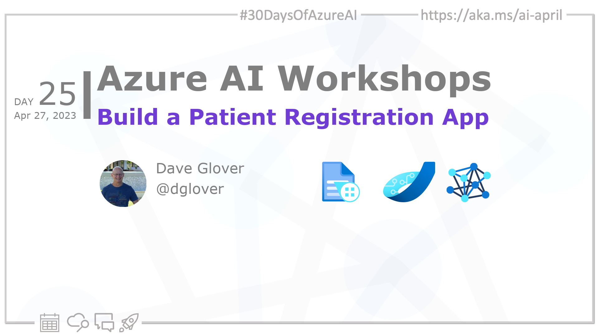
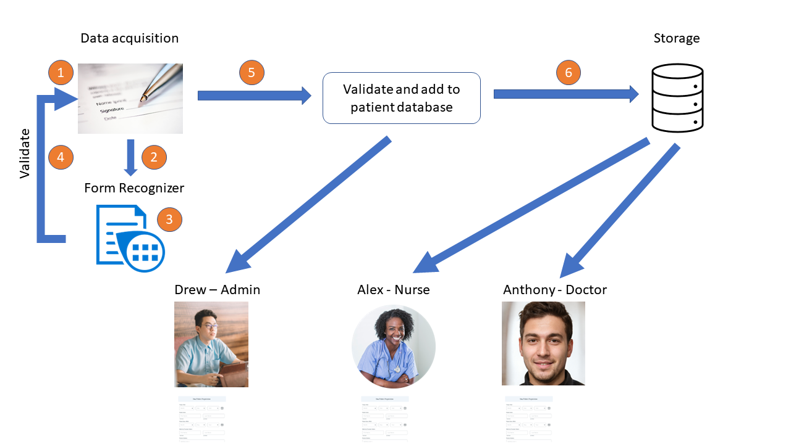

<head>  

  <link rel="canonical" href="https://newpatiente2e.github.io/docs/"  />

</head>

- 👓 [Read today's article](https://newpatiente2e.github.io/docs/)
- 📬 [Sign up for the Microsoft AI and Machine Learning Newsletter](https://aka.ms/azure-ai-dev-newsletter)
<!-- - 📰 [Subscribe to the #30DaysOfAzureAI RSS feed](https://azureaidevs.github.io/hub/2023-aia/rss.xml) -->
- 🙋🏾‍♂️ [Ask a question about this post on GitHub Discussions](https://github.com/AzureAiDevs/hub/discussions/categories/25-build-a-patient-registration-app)
- 💡 [Suggest a topic for a future post](https://github.com/AzureAiDevs/hub/discussions/categories/call-for-content)

## 🗓️ Day _25_ of #30DaysOfAzureAI

<!-- README
The following description is also used for the tweet. So it should be action oriented and grab attention 
If you update the description, please update the description: in the frontmatter as well.
-->

**Building a Patient Registration Web App with Azure Form Recognizer**

<!-- README
The following is the intro to the post. It should be a short teaser for the post.
-->

Yesterday we learned about the Machine Learning for Beginners Curriculum. Today is for AI app Developers and introduces the New Patient Registration workshop. It's a one-hour hands-on lab, and you'll learn how to build an Azure Static Web App that uses the Azure Form Recognizer service.

## 🎯 What we'll cover

<!-- README
The following list is the main points of the post. There should be 3-4 main points.
 -->

- Automated form filling with Azure Form Recognizer
- Integrating Azure Form Recognizer with an Azure Static Web App.

<!-- 
- Main point 1
- Main point 2
- Main point 3 
- Main point 4
-->

<!-- README
Add or update a list relevant references here. These could be links to other blog posts, Microsoft Learn Module, videos, or other resources.
-->

## 📚 References

- [Learn Module: Azure Form Recognizer Service](https://learn.microsoft.com/training/browse/?expanded=azure&roles=ai-engineer&products=azure-form-recognizer&WT.mc_id=aiml-89446-dglover)
- [What is Azure Form Recognizer?](https://learn.microsoft.com/azure/applied-ai-services/form-recognizer/overview?view=form-recog-3.0.0&WT.mc_id=aiml-89446-dglover)
- [Case Study: Powering Speech-to-Text AI that iterates at the speed of business](https://startups.microsoft.com/blog/powering-speech-to-text-ai?WT.mc_id=aiml-89446-dglover)
- [Case study: Duolingo makes learning language fun with help from AI](https://startups.microsoft.com/blog/duolingo-makes-learning-language-fun-with-help-from-ai?WT.mc_id=aiml-89446-dglover)

<!-- README
The following is the body of the post. It should be an overview of the post that you are referencing.
See the Learn More section, if you supplied a canonical link, then will be displayed here.
-->

## 🚌 New Patient Registration workshop

[Today's article](https://newpatiente2e.github.io/docs/) introduces the "New Patient Registration" hands-on lab. The lab is designed to help you learn how to use Azure Form Recognizer to automate the patient registration process at a doctor's surgery. You'll learn how to create a custom Azure Form Recognizer model, integrate it with a web app, and define application roles that map to workshop personas such as surgery admin, nurse, and doctor. By the end of the workshop, you'll have a working solution that allows new patients to complete the registration form online, the web app to extract the data, and the surgery admin to verify and add the registration to the doctor's surgery system. Say goodbye to manual form filling and hello to the power of AI technologies with Azure Form Recognizer!

## 👓 Read today's article

Today's [article](https://newpatiente2e.github.io/docs/).

## 🙋🏾‍♂️ Questions?

[Remember, you can ask a question about this post on GitHub Discussions](https://github.com/AzureAiDevs/Discussions/discussions/categories/25-build-a-patient-registration-app)

## 📍 30 days roadmap

What's next? View the [#30DaysOfAzureAI Roadmap](/hub/roadmap/30days)

[ Click to subscribe](/hub/2023-aia/rss.xml)