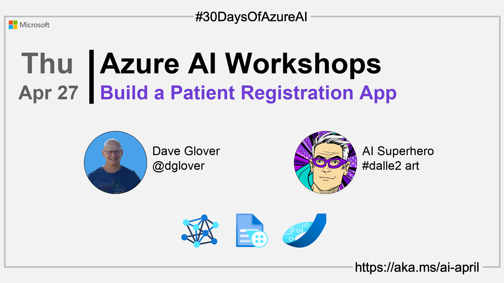

import Social from '@site/src/components/social';

<head>

  <meta name="twitter:url" content="https://azureaidevs.github.io/hub/2023-aia/day25" />
  <meta name="twitter:title" content="Build a Patient Registration App" />
  <meta name="twitter:description" content="🏭Welcome to day 25 of #30DaysOfAzureAI. Build a patient registration app using Azure Form Recognizer with our one-hour hands-on lab. Develop a custom model, integrate it with a web app, and define application roles." />
  <meta name="twitter:image" content="https://raw.githubusercontent.com/AzureAiDevs/hub/main/website/static/img/2023-aia/banner-day25.png" />
  <meta name="twitter:card" content="summary_large_image" />

  <link rel="canonical" href="https://newpatiente2e.github.io/docs/"  />
  </head>

- 👓 [View today's article](https://newpatiente2e.github.io/docs/)
- 🍿 [Tune into the AI Show](https://aka.ms/ai-april-ai-show)
- 🧬 [Connect with Humans in AI](/hub/humans-in-ai)
- 🌤️ [Continue the Azure AI Cloud Skills Challenge](https://aka.ms/30-days-of-azure-ai-challenge)
- 🏫 [Bookmark the Azure AI Technical Community](https://aka.ms/ai-april-tech-community)
- 🌏 [Join the Global AI Community](https://www.meetup.com/pro/the-global-ai-community)
- 💡 [Suggest a topic for a future post](https://forms.office.com/r/GhtwgHVP9L)

### Please share

<Social
    page_url="https://azureaidevs.github.io/hub/2023-aia/day25"
    image_url="https://raw.githubusercontent.com/AzureAiDevs/hub/main/website/static/img/2023-aia/banner-day25.png"
    title="Build a Patient Registration App"
    description= "🏭Welcome to day 25 of #30DaysOfAzureAI. Build a patient registration app using Azure Form Recognizer with our one-hour hands-on lab. Develop a custom model, integrate it with a web app, and define application roles."
    hashtags="AzureFormRecognizer"
    hashtag="#30DaysOfAzureAi"
/>

## 🗓️ Day 25 of #30DaysOfAzureAI

<!-- Short description section -->

**Building a Patient Registration Web App with Azure Form Recognizer**

<!-- Intro section -->

Yesterday we learned about the Machine Learning for Beginners Curriculum. Today is for AI app Developers and introduces the New Patient Registration workshop. It's a one-hour hands-on lab, and you'll learn how to build an Azure Static Web App that uses the Azure Form Recognizer service.

## 🎯 What we'll cover

<!-- What we'll cover section -->

- Automated form filling with Azure Form Recognizer
- Integrating Azure Form Recognizer with an Azure Static Web App.

<!-- Reference section -->

## 📚 References

- [Learn Module: Azure Form Recognizer Service](https://learn.microsoft.com/training/browse/?expanded=azure&roles=ai-engineer&products=azure-form-recognizer&WT.mc_id=aiml-89446-dglover)
- [What is Azure Form Recognizer?](https://learn.microsoft.com/azure/applied-ai-services/form-recognizer/overview?view=form-recog-3.0.0&WT.mc_id=aiml-89446-dglover)
- [Case Study: Powering Speech-to-Text AI that iterates at the speed of business](https://startups.microsoft.com/blog/powering-speech-to-text-ai?WT.mc_id=aiml-89446-dglover)
- [Case study: Duolingo makes learning language fun with help from AI](https://startups.microsoft.com/blog/duolingo-makes-learning-language-fun-with-help-from-ai?WT.mc_id=aiml-89446-dglover)

<!-- Body section -->

## 🚌 New Patient Registration workshop

[Today's article](https://newpatiente2e.github.io/docs/) introduces the "New Patient Registration" hands-on lab. The lab is designed to help you learn how to use Azure Form Recognizer to automate the patient registration process at a doctor's surgery. You'll learn how to create a custom Azure Form Recognizer model, integrate it with a web app, and define application roles that map to workshop personas such as surgery admin, nurse, and doctor. By the end of the workshop, you'll have a working solution that allows new patients to complete the registration form online, the web app to extract the data, and the surgery admin to verify and add the registration to the doctor's surgery system. Say goodbye to manual form filling and hello to the power of AI technologies with Azure Form Recognizer!

## 👓 View today's article

Today's [article](https://newpatiente2e.github.io/docs/).

## 🙋🏾‍♂️ Questions?

[You can ask questions about this post on GitHub Discussions](https://github.com/AzureAiDevs/hub/discussions/categories/azure-ai-workshops)

## 📍 30 days roadmap

What's next? View the [#30DaysOfAzureAI Roadmap](/hub/roadmap/30days)

## 🧲 Subscribe

- 📬 [Subscribe to the monthly Azure AI and Machine Learning Tech Newsletter](https://aka.ms/azure-ai-dev-newsletter)
- [ Subscribe to the blog RSS XML feed](https://azureaidevs.github.io/hub/2023-aia/rss.xml)