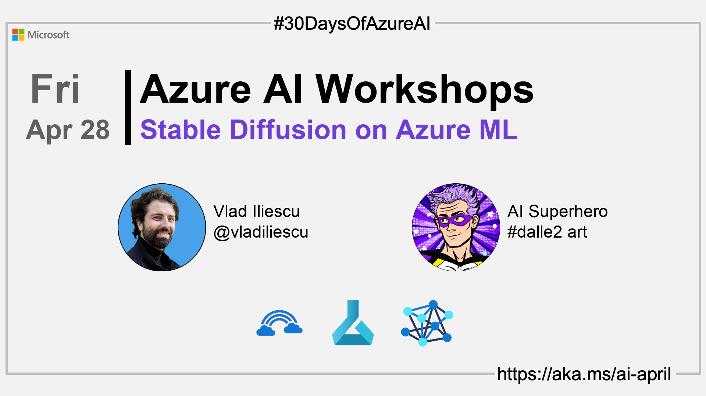

import Social from '@site/src/components/social';

<head>

  <link rel="canonical" href="https://vladiliescu.net/stable-diffusion-web-ui-on-azure-ml/"  />
  </head>

- 👓 [View today's article](https://vladiliescu.net/stable-diffusion-web-ui-on-azure-ml/)
- 🍿 [Tune into the AI Show](https://aka.ms/ai-april-ai-show)
- 🌤️ [Continue the Azure AI Cloud Skills Challenge](https://aka.ms/30-days-of-azure-ai-challenge)
- 🏫 [Bookmark the Azure AI Technical Community](https://aka.ms/ai-april-tech-community)
- ❤️ [Learn about the Microsoft MVP Program](https://aka.ms/ai-april-mvp-program)
- 💡 [Suggest a topic for a future post](https://github.com/AzureAiDevs/hub/discussions/categories/call-for-content)

### Please share

<Social
    page_url="https://azureaidevs.github.io/hub/2023-aia/day26"
    image_url="https://raw.githubusercontent.com/AzureAiDevs/hub/main/website/static/img/2023-aia/banner-day26.png"
    title="Stable Diffusion on Azure ML"
    description= "🏭Day 26 of #30DaysOfAzureAI. Ready to explore Stable Diffusion's image generative model on Azure ML? Learn how to install and configure the web UI on GPU compute instances, and improve performance and security with our tips and tricks."
    hashtags="AI,AzureML"
    hashtag="#30DaysOfAzureAi"
/>

## 🗓️ Day 26 of #30DaysOfAzureAI

<!-- README
The following description is also used for the tweet. So it should be action oriented and grab attention 
If you update the description, please update the description: in the frontmatter as well.
-->

**How to run Stable Diffusion Web UI on Azure ML compute instances**

<!-- README
The following is the intro to the post. It should be a short teaser for the post.
-->

Yesterday we learned about how to build a Patient Registration app with Azure Form Recognizer. Today's your opportunity to be "wowed" by the power of image generative models and run Stable Diffusion on Azure ML. Let's go!

## 🎯 What we'll cover

<!-- README
The following list is the main points of the post. There should be 3-4 main points.
 -->

- The Azure ML resources necessary for running Stable Diffusion.
- Installing and configuring Stable Diffusion Web UI on Azure ML GPU Compute Instances.
- Tips and tricks for improving the performance and security of your installation.

<!-- 
- Main point 1
- Main point 2
- Main point 3 
- Main point 4
-->

<!-- README
Add or update a list relevant references here. These could be links to other blog posts, Microsoft Learn Module, videos, or other resources.
-->

## 📚 References

- [Learn Module: Introduction to Azure Machine Learning](https://learn.microsoft.com/training/modules/intro-to-azure-ml?WT.mc_id=aiml-89446-dglover)
- [What is Azure Machine Learning?](https://learn.microsoft.com/azur
e/machine-learning/overview-what-is-azure-machine-learning?WT.mc_id=aiml-89446-dglover)

<!-- README
The following is the body of the post. It should be an overview of the post that you are referencing.
See the Learn More section, if you supplied a canonical link, then will be displayed here.
-->

## 🚌 Get creative with Stable Diffusion on Azure ML

[Today's article](https://vladiliescu.net/stable-diffusion-web-ui-on-azure-ml/) takes you into the fascinating world of Stable Diffusion's image generative model - a model that can generate images of faces, animals, anything really. It's a lot of fun to play with, so let your imagination run wild.

You'll learn about the prerequisites required to run Stable Diffusion Web UI in Azure ML, and get access to custom code snippets that will help you get started. You'll also find out how to configure the Web UI to run on a GPU compute instance, and how to optimize your installation for prolonged usage.

## Watch the Stable Diffusion session on the AI Show

## 👓 View today's article

Today's [article](https://vladiliescu.net/stable-diffusion-web-ui-on-azure-ml/).

## 🙋🏾‍♂️ Questions?

[Remember, you can ask a question about this post on GitHub Discussions](https://github.com/AzureAiDevs/hub/discussions/categories/azure-ai-workshops)

## 📍 30 days roadmap

What's next? View the [#30DaysOfAzureAI Roadmap](/hub/roadmap/30days)

[ Click to subscribe to the RSS XML feed](https://azureaidevs.github.io/hub/2023-aia/rss.xml)