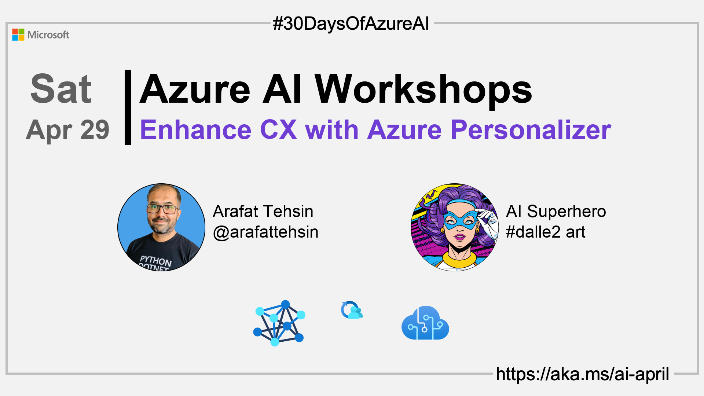
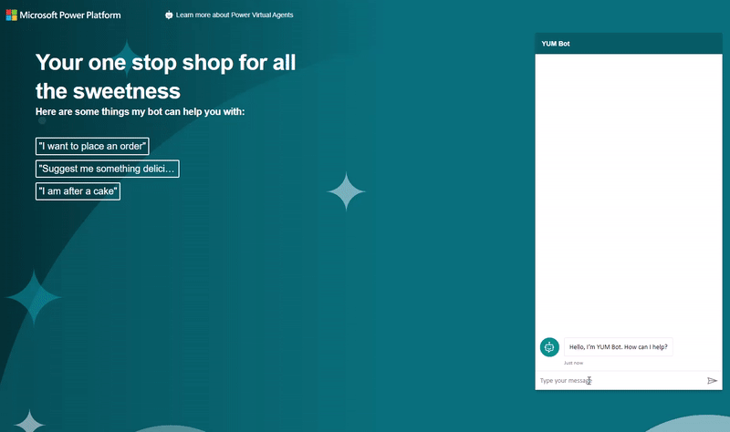

import Social from '@site/src/components/social';

<head>

  <meta name="twitter:url" content="https://azureaidevs.github.io/hub/2023-aia/day27" />
  <meta name="twitter:title" content="Enhance CX with Azure Personalizer" />
  <meta name="twitter:description" content="🏭Welcome to day 27 of #30DaysOfAzureAI. Maximizing Business Results with Azure Personalizer: A Machine Learning-Based Service for Personalized Customer Experiences" />
  <meta name="twitter:image" content="https://raw.githubusercontent.com/AzureAiDevs/hub/main/website/static/img/2023-aia/banner-day27.png" />
  <meta name="twitter:card" content="summary_large_image" />

  <link rel="canonical" href="https://www.arafattehsin.com/reinforcement-learning-in-apps-bots-websites-with-azure-personalizer-part-1"  />
  </head>

- 👓 [View today's article](https://www.arafattehsin.com/reinforcement-learning-in-apps-bots-websites-with-azure-personalizer-part-1)
- 🍿 [Tune into the AI Show](https://aka.ms/ai-april-ai-show)
- 🧬 [Connect with Humans in AI](/hub/humans-in-ai)
- 🌤️ [Continue the Azure AI Cloud Skills Challenge](https://aka.ms/30-days-of-azure-ai-challenge)
- 🏫 [Bookmark the Azure AI Technical Community](https://aka.ms/ai-april-tech-community)
- ❤️ [Learn about the Microsoft MVP Program](https://aka.ms/ai-april-mvp-program)
- 💡 [Suggest a topic for a future post](https://github.com/AzureAiDevs/hub/discussions/categories/call-for-content)

### Please share

<Social
    page_url="https://azureaidevs.github.io/hub/2023-aia/day27"
    image_url="https://raw.githubusercontent.com/AzureAiDevs/hub/main/website/static/img/2023-aia/banner-day27.png"
    title="Enhance CX with Azure Personalizer"
    description= "🏭Day 27 of #30DaysOfAzureAI. Maximize your business results with Azure Personalizer - a machine learning-based service that creates personalized experiences for your customers based on their preferences and behavior. Learn how to build and integrate this powerful tool to provide tailored content and actions to a large user base."
    hashtags="AzurePersonalizer"
    hashtag="#30DaysOfAzureAi"
/>

## 🗓️ Day 27 of #30DaysOfAzureAI

<!-- Short description section -->

**Maximizing Business Results with Azure Personalizer: A Machine Learning-Based Service for Personalized Customer Experiences**

<!-- Intro section -->

Yesterday we learned about the power of Stable Diffusion and Azure ML. Today, you're going to learn how to build personalized experiences for your customers with reinforcement learning using Azure Personalizer.

## 🎯 What we'll cover

<!-- What we'll cover section -->

- Azure Personalizer Cognitive Service.
- Build a personalized experience for your users.
- How to create the resources for Azure Personalizer.

<!-- Reference section -->

## 📚 References

- [Azure Personalizer Cognitive Service](https://azure.microsoft.com/products/cognitive-services/personalizer?WT.mc_id=aiml-89446-dglover)
- [Azure Cognitive Services](https://azure.microsoft.com/en-au/products/cognitive-services/#overview?WT.mc_id=aiml-89446-dglover)
- [Azure Cognitive Services APIs](https://azure.microsoft.com/products/cognitive-services/#api?WT.mc_id=aiml-89446-dglover)
- [Case Study: VideoKen is improving video discovery and engagement using AI](https://startups.microsoft.com/blog/launchwithai-videoken?WT.mc_id=aiml-89446-dglover)

<!-- Body section -->

## 🚌 Personalized user experiences at scale

Azure Personalizer is a cloud-based service offered by Microsoft Azure that enables developers to create personalized experiences for customers / users based on their preferences and behavior. By leveraging machine learning algorithms, Azure Personalizer can optimize personalized recommendations and actions to achieve the goals of the application, such as maximizing engagement or revenue. With its scalability and easy integration, it can be used to deliver tailored content and actions to a large number of users, providing a more engaging and satisfying user experience.

All in all, Azure Personalizer helps developers create personalized experiences for their users at scale, which can lead to increased user satisfaction and retention.

This [Azure Personalizer Workshop](https://www.arafattehsin.com/tag/azure-personalizer/) provides a comprehensive guide on how to create a personalized user experience using Azure Personalizer. The [first](https://www.arafattehsin.com/reinforcement-learning-in-apps-bots-websites-with-azure-personalizer-part-1/) part of the series introduces the necessary concepts of Azure Personalizer, including how it uses machine learning algorithms to optimize personalized recommendations and actions.

The [second](https://www.arafattehsin.com/reinforcement-learning-in-apps-bots-websites-with-azure-personalizer-part-2/) part of the series focuses on creating a simulator to create and improve a Personalizer model before deploying it to production. This allows developers to test and refine their model before launching it to a large number of users.

The [final](https://www.arafattehsin.com/reinforcement-learning-in-apps-bots-websites-with-azure-personalizer-part-3/) part of the series demonstrates how to use the Personalizer model in a Power Virtual Agents bot with the Power Automate custom connector.

By following the steps outlined in the workshop, developers can create a more engaging and personalized user experience that can lead to increased user satisfaction and retention.

## 👓 View today's article

Today's [article](https://www.arafattehsin.com/reinforcement-learning-in-apps-bots-websites-with-azure-personalizer-part-1).

## 🙋🏾‍♂️ Questions?

[You can ask questions about this post on GitHub Discussions](https://github.com/AzureAiDevs/hub/discussions/categories/azure-ai-workshops)

## 📍 30 days roadmap

What's next? View the [#30DaysOfAzureAI Roadmap](/hub/roadmap/30days)

## 🧲 Subscribe

- 📬 [Subscribe to the monthly Azure AI and Machine Learning Tech Newsletter](https://aka.ms/azure-ai-dev-newsletter)
- [ Subscribe to the blog RSS XML feed](https://azureaidevs.github.io/hub/2023-aia/rss.xml)