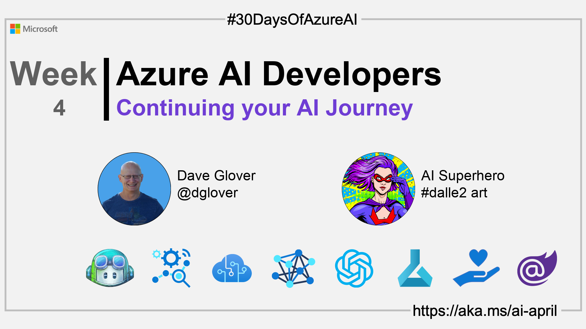

import Social from '@site/src/components/social';

<head>

  <meta name="twitter:url" content="https://azureaidevs.github.io/hub/2023-aia/day28" />
  <meta name="twitter:title" content="Continuing your AI Journey✨" />
  <meta name="twitter:description" content="🏭Welcome to day 28 of #30DaysOfAzureAI. Continuing your Azure AI Journey" />
  <meta name="twitter:image" content="https://raw.githubusercontent.com/AzureAiDevs/hub/main/website/static/img/2023-aia/banner-day28.png" />
  <meta name="twitter:card" content="summary_large_image" />

  </head>

- 🍿 [Tune into the AI Show](https://aka.ms/ai-april-ai-show)
- 🧬 [Connect with Humans in AI](/hub/humans-in-ai)
- 🌤️ [Continue the Azure AI Cloud Skills Challenge](https://aka.ms/30-days-of-azure-ai-challenge)
- 🏫 [Bookmark the Azure AI Technical Community](https://aka.ms/ai-april-tech-community)
- ❤️ [Learn about the Microsoft MVP Program](https://aka.ms/ai-april-mvp-program)
- 💡 [Suggest a topic for a future post](https://github.com/AzureAiDevs/hub/discussions/categories/call-for-content)

### Please share

<Social
    page_url="https://azureaidevs.github.io/hub/2023-aia/day28"
    image_url="https://raw.githubusercontent.com/AzureAiDevs/hub/main/website/static/img/2023-aia/banner-day28.png"
    title="Continuing your AI Journey✨"
    description= "🏭Welcome to day 28 of #30DaysOfAzureAI. Continuing your Azure AI Journey"
    hashtags=""
    hashtag="#30DaysOfAzureAi"
/>

## 🗓️ Day 28 of #30DaysOfAzureAI

<!-- Short description section -->

**Continuing your Azure AI Journey**

<!-- Intro section -->

## 🎯 What we'll cover

<!-- What we'll cover section -->

<!-- Reference section -->

## 📚 References

- [Azure Personalizer Cognitive Service](https://azure.microsoft.com/products/cognitive-services/personalizer?WT.mc_id=aiml-89446-dglover)
- [Azure Cognitive Services](https://azure.microsoft.com/en-au/products/cognitive-services/#overview?WT.mc_id=aiml-89446-dglover)
- [Azure Cognitive Services APIs](https://azure.microsoft.com/products/cognitive-services/#api?WT.mc_id=aiml-89446-dglover)
- [Case Study: VideoKen is improving video discovery and engagement using AI](https://startups.microsoft.com/blog/launchwithai-videoken?WT.mc_id=aiml-89446-dglover)

<!-- Body section -->

## 🙋🏾‍♂️ Questions?

[You can ask questions about this post on GitHub Discussions](https://github.com/AzureAiDevs/hub/discussions/categories/azure-ai-developers)

## 📍 30 days roadmap

What's next? View the [#30DaysOfAzureAI Roadmap](/hub/roadmap/30days)

## 🧲 Subscribe

- 📬 [Subscribe to the monthly Azure AI and Machine Learning Tech Newsletter](https://aka.ms/azure-ai-dev-newsletter)
- [ Subscribe to the blog RSS XML feed](https://azureaidevs.github.io/hub/2023-aia/rss.xml)