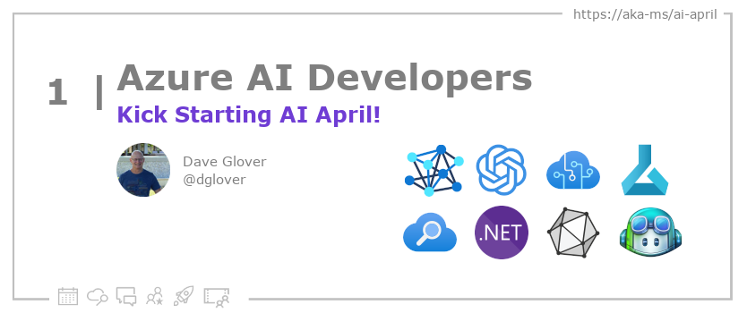

<head>

  <meta name="twitter:url" content="https://azureaidevs.github.io/hub/blog/2023-day1" />
  <meta name="twitter:title" content="Kick Starting AI April!" />
  <meta name="twitter:description" content="Welcome to #AiApril! Join us for #30DaysOfAzureAI learning, skilling and discussions at [AI April](https://aka.ms/ai-april) https://azureaidevs.github.io/hub/blog/2023-day1 #30DaysOfAzureAI #AzureAiDevs #AI " />
  <meta name="twitter:image" content="https://azureaidevs.github.io/hub/img/2023/banner-day1.png" />
  <meta name="twitter:card" content="summary_large_image" />

  

  <link rel="canonical"  href="https://azureaidevs.github.io/hub/blog/2023-day1"  />

</head>

- 📧 [Sign up for the Azure AI Developer Newsletter](https://aka.ms/azure-ai-dev-newsletter)
- 📰 [Subscribe to the #30DaysOfAzureAI RSS feed](https://azureaidevs.github.io/hub/blog/rss.xml)
- 📌 [Ask a question about this post on GitHub Discussions](https://github.com/AzureAiDevs/hub/discussions/categories/1-kick-starting-ai-april!)
- 💡 [Suggest a topic for a future post](https://github.com/AzureAiDevs/hub/discussions/categories/call-for-content)

## Day _1_ of #30DaysOfAzureAI

<!-- README
The following description is also used for the tweet. So it should be action oriented and grab attention 
If you update the description, please update the description: in the frontmatter as well.
-->

**Welcome to #AiApril! Join us for #30DaysOfAzureAI learning, skilling and discussions at [AI April](https://aka.ms/ai-april)**

<!-- README
The following is the intro to the post. It should be a short teaser for the post.
-->

## What we'll cover

<!-- README
The following list is the main points of the post. There should be 3-4 main points.
 -->

<!-- 
- Main point 1
- Main point 2
- Main point 3 
- Main point 4
-->

<!-- README
Add or update a list relevant references here. These could be links to other blog posts, Microsoft Learn Module, videos, or other resources.
-->

<!-- README
The following is the body of the post. It should be an overview of the post that you are referencing.
See the Learn More section, if you supplied a canonical link, then will be displayed here.
-->

## Questions?

[Remember, you can ask a question about this post on GitHub Discussions](https://github.com/AzureAiDevs/Discussions/discussions/categories/1-kick-starting-ai-april!)