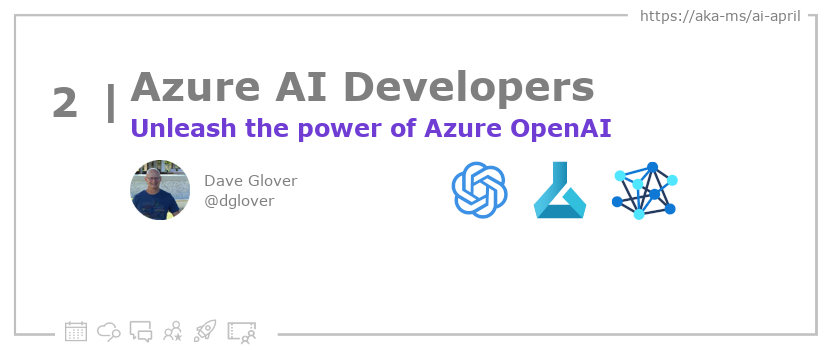
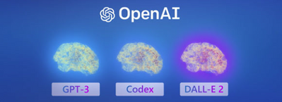

<head>

  <meta property="og:url" content="https://azureaidevs.github.io/hub/blog/2023-day2" />
  <meta property="og:title" content="Unleash the power of Azure OpenAI" />
  <meta property="og:description" content="Unleashing the power of AI with Azure OpenAI: A simple guide to get started https://azureaidevs.github.io/hub/blog/2023-day2 #30DaysOfAzureAI #AzureAiDevs #AI #OpenAI" />
  <meta property="og:image" content="https://azureaidevs.github.io/hub/img/2023/banner-day2.png" />
  <meta property="og:type" content="article" />
  <meta property="og:site_name" content="Azure AI Developer" />
  

  <link rel="canonical" href="https://techcommunity.microsoft.com/t5/fasttrack-for-azure/unleashing-the-power-of-ai-with-azure-openai-a-simple-guide-to/ba-p/3725706"  />

</head>

- 📧 [Sign up for the Azure AI Developer Newsletter](https://aka.ms/azure-ai-dev-newsletter)
- 📰 [Subscribe to the #30DaysOfAzureAI RSS feed](https://azureaidevs.github.io/hub/blog/rss.xml)
- 📌 [Ask a question about this post on GitHub Discussions](https://github.com/AzureAiDevs/hub/discussions/categories/2-unleash-the-power-of-azure-openai)
- 💡 [Suggest a topic for a future post](https://github.com/AzureAiDevs/hub/discussions/categories/call-for-content)

## Day _2_ of #30DaysOfAzureAI

<!-- README
The following description is also used for the tweet. So it should be action oriented and grab attention 
If you update the description, please update the description: in the frontmatter as well.
-->

**Unleashing the power of AI with Azure OpenAI: A simple guide to get started**

<!-- README
The following is the intro to the post. It should be a short teaser for the post.
-->

Microsoft and OpenAI have partnered to bring OpenAI's advanced natural language processing tools, including GPT-3, to Microsoft's Azure cloud. The Azure OpenAI Service, now in general availability, offers REST API access, security, compliance, and regional availability. The goal is democratize AI and use it to address global challenges. Start by learning about OpenAI's language models and familiarizing with key API concepts.

## What we'll cover

<!-- README
The following list is the main points of the post. There should be 3-4 main points.
 -->

The main points of Azure OpenAI Service are:
1. Access to language models for NLP and deep learning.
2. Enterprise security and regional availability for business use.
3. Understanding the language models, naming, and API for maximum benefit. 

<!-- 
- Main point 1
- Main point 2
- Main point 3 
- Main point 4
-->

<!-- README
Add or update a list relevant references here. These could be links to other blog posts, Microsoft Learn Module, videos, or other resources.
-->

### References

- [Azure OpenAI Service](https://azure.microsoft.com/products/cognitive-services/openai-service?WT.mc_id=aiml-89446-dglover)
- [Learn Module: Introduction to Azure OpenAI Service](https://learn.microsoft.com/training/modules/explore-azure-openai?WT.mc_id=aiml-89446-dglover)
- [Case Study: Making generative AI training simple and cost-efficient with PeriFlow and Azure](https://startups.microsoft.com/blog/making-generative-ai-training-simple?WT.mc_id=aiml-89446-dglover)

<!-- README
The following is the body of the post. It should be an overview of the post that you are referencing.
See the Learn More section, if you supplied a canonical link, then will be displayed here.
-->

## Azure OpenAI Service Learning Module

Get to know the connection between artificial intelligence (AI), Responsible AI, and text, code, and image generation. Understand how you can use Azure OpenAI to build solutions against AI models within Azure.

You'll learn how to:

- Describe Azure OpenAI workloads and access the Azure OpenAI Service
- Understand generative AI models
- Understand Azure OpenAI's language, code, and image capabilities
- Understand Azure OpenAI's responsible AI practices and limited access policies

Be sure to check out the [Introduction to Azure OpenAI Service](ttps://learn.microsoft.com/en-us/training/modules/explore-azure-openai) Learn Module to get started.

## What is Azure OpenAI Service?

Microsoft and OpenAI have released Azure OpenAI Service, which brings OpenAI's advanced natural language processing tools, including Generative Pre-trained Transformer 3 (GPT-3), to Microsoft's Azure cloud. Azure OpenAI Service is now in general availability and offers REST API access to OpenAI's models, with features such as security, compliance and regional availability. The large-scale generative AI models developed by OpenAI can be used in areas such as code generation and reasoning over data, while the DALL-E 2 model can create images from a written description. The service also offers the Codex model, which is capable of generating code from natural language.

The goal is to democratise artificial intelligence, as well as using it to help solve global challenges such as climate change, healthcare and education. Satya Nadella, CEO of Microsoft, said: "By bringing together OpenAI's breakthrough technology with new Azure AI supercomputing technologies, our ambition is to democratise AI, while always keeping AI safety front and centre, so everyone can benefit." To get started with the Azure OpenAI Service, users are advised to learn about OpenAI's language models, which include GPT-3, Code and DALL-E 2, and understand key API concepts such as prompts, completions, tokens and models.

## Learn More

To learn more, check out this [article](https://techcommunity.microsoft.com/t5/fasttrack-for-azure/unleashing-the-power-of-ai-with-azure-openai-a-simple-guide-to/ba-p/3725706).

## Questions?

[Remember, you can ask a question about this post on GitHub Discussions](https://github.com/AzureAiDevs/Discussions/discussions/categories/2-unleash-the-power-of-azure-openai)