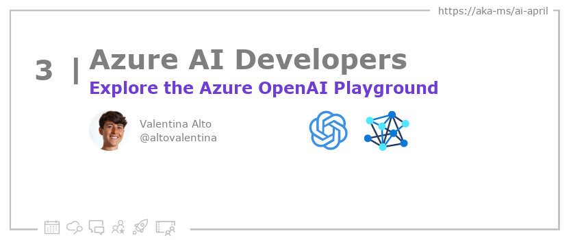

<head>

  <meta property="og:url" content="https://azureaidevs.github.io/hub/blog/2023-day3" />
  <meta property="og:title" content="Explore the Azure OpenAI Playground" />
  <meta property="og:description" content="Explore Conversational AI with the Azure OpenAI Service Playground https://azureaidevs.github.io/hub/blog/2023-day3 #30DaysOfAzureAI #AzureAiDevs #AI #OpenAI" />
  <meta property="og:image" content="https://azureaidevs.github.io/hub/img/2023/banner-day3.png" />
  <meta property="og:type" content="article" />
  <meta property="og:site_name" content="Azure AI Developer" />
  

  <link rel="canonical" href="https://medium.com/microsoftazure/azure-openai-playground-279f1f3da562"  />

</head>

- 📧 [Sign up for the Azure AI Developer Newsletter](https://aka.ms/azure-ai-dev-newsletter)
- 📰 [Subscribe to the #30DaysOfAzureAI RSS feed](https://azureaidevs.github.io/hub/blog/rss.xml)
- 📌 [Ask a question about this post on GitHub Discussions](https://github.com/AzureAiDevs/hub/discussions/categories/3-explore-the-azure-openai-playground)
- 💡 [Suggest a topic for a future post](https://github.com/AzureAiDevs/hub/discussions/categories/call-for-content)

## Day _3_ of #30DaysOfAzureAI

<!-- README
The following description is also used for the tweet. So it should be action oriented and grab attention 
If you update the description, please update the description: in the frontmatter as well.
-->

**Explore Conversational AI with the Azure OpenAI Service Playground**

<!-- README
The following is the intro to the post. It should be a short teaser for the post.
-->

Yesterday we talked was an introduction to the Azure OpenAI Service. Today we'll dig deeper into the Azure OpenAI Service Playground, so come along, it'll be fun.

## What we'll cover

<!-- README
The following list is the main points of the post. There should be 3-4 main points.
 -->

- Azure OpenAI Playground: a user-friendly interface for machine learning models.
- Features: custom data sets, experiment management, and model visualization.
- Scalable, flexible, and available at different price points.

<!-- 
- Main point 1
- Main point 2
- Main point 3 
- Main point 4
-->

<!-- README
Add or update a list relevant references here. These could be links to other blog posts, Microsoft Learn Module, videos, or other resources.
-->

### References

- [Azure OpenAI Service](https://azure.microsoft.com/products/cognitive-services/openai-service?WT.mc_id=aiml-89446-dglover)
- [Learn Module: Introduction to Azure OpenAI Service](https://learn.microsoft.com/training/modules/explore-azure-openai?WT.mc_id=aiml-89446-dglover)
- [Case Study: Azure OpenAI Service powers the next generation of startups](https://startups.microsoft.com/blog/azure-openai-service-for-startups?WT.mc_id=aiml-89446-dglover)

<!-- README
The following is the body of the post. It should be an overview of the post that you are referencing.
See the Learn More section, if you supplied a canonical link, then will be displayed here.
-->

## Getting started with the Azure OpenAI Service Playground

This article provides an overview of language models and hyperparameters, with a focus on conversational AI models from OpenAI. The article covers how to consume these models via API directly from OpenAI, as well as how to tune hyperparameters to tailor the models to specific use cases and needs. The author also provides a step-by-step guide to setting up an Azure OpenAI instance to access the OpenAI Playground for experimentation. The article examines the (hyper)parameters to be tuned, such as temperature, max length, stop sequences, top probabilities, frequency penalty, presence penalty, and best of. The article concludes by highlighting the three main categories of models offered by OpenAI: GPT-3, Codex, and Embeddings, and the different models available within each category.

## Today's reference article

Read today's [article](https://medium.com/microsoftazure/azure-openai-playground-279f1f3da562).

## Questions?

[Remember, you can ask a question about this post on GitHub Discussions](https://github.com/AzureAiDevs/Discussions/discussions/categories/3-explore-the-azure-openai-playground)