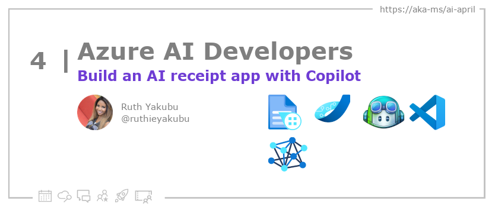

<head>

  <meta property="og:url" content="https://azureaidevs.github.io/hub/blog/2023-day4" />
  <meta property="og:title" content="Build an AI Receipt App with Copilot" />
  <meta property="og:description" content="Learn how to use Copilot to build an intelligent Receipt Recognition App powered by Azure Form Recognizer https://azureaidevs.github.io/hub/blog/2023-day4 #30DaysOfAzureAI #AzureAiDevs #AI #AzureCognitiveServices" />
  <meta property="og:image" content="https://azureaidevs.github.io/hub/img/2023/banner-day4.png" />
  <meta property="og:type" content="article" />
  <meta property="og:site_name" content="Azure AI Developer" />
  

  <link rel="canonical" href="https://techcommunity.microsoft.com/t5/ai-cognitive-services-blog/how-copilot-helps-developers-generate-code-for-a-form-recognizer/ba-p/3753813"  />

</head>

- 📧 [Sign up for the Azure AI Developer Newsletter](https://aka.ms/azure-ai-dev-newsletter)
- 📰 [Subscribe to the #30DaysOfAzureAI RSS feed](https://azureaidevs.github.io/hub/blog/rss.xml)
- 📌 [Ask a question about this post on GitHub Discussions](https://github.com/AzureAiDevs/hub/discussions/categories/4-build-an-ai-receipt-app-with-copilot)
- 💡 [Suggest a topic for a future post](https://github.com/AzureAiDevs/hub/discussions/categories/call-for-content)

## 🗓️ Day _4_ of #30DaysOfAzureAI

<!-- README
The following description is also used for the tweet. So it should be action oriented and grab attention 
If you update the description, please update the description: in the frontmatter as well.
-->

**Learn how to use Copilot to build an intelligent Receipt Recognition App powered by Azure Form Recognizer**

<!-- README
The following is the intro to the post. It should be a short teaser for the post.
-->

Yesterday we talked about using Azure OpenAI Service playground to explore conversational AI. Today we'll explore how you can use GitHub Copilot as your programming buddy to build an intelligent Receipt processing App.

## 🎯 What we'll cover

<!-- README
The following list is the main points of the post. There should be 3-4 main points.
 -->

1. GitHub Copilot uses AI to revolutionize programming.
2. CoPilot increase efficiency and productivity for developers.
3. A tutorial is provided on how to integrate Python with the Azure Form Recognizer API using GitHub Copilot

<!-- 
- Main point 1
- Main point 2
- Main point 3 
- Main point 4
-->

<!-- README
Add or update a list relevant references here. These could be links to other blog posts, Microsoft Learn Module, videos, or other resources.
-->

### 📚 References

- [What is Azure Form Recognizer?](https://learn.microsoft.com/azure/applied-ai-services/form-recognizer/overview?view=form-recog-3.0.0&WT.mc_id=aiml-89446-dglover)
- [Learn Module: Learn about Azure Cognitive Services](https://learn.microsoft.com/training/browse/?products=azure-cognitive-services&WT.mc_id=aiml-89446-dglover)
- [Learn Module: Introduction to Form Recognizer](https://learn.microsoft.com/training/modules/intro-to-form-recognizer?WT.mc_id=aiml-89446-dglover)
- [Introducing GitHub Copilot: your AI pair programmer](https://github.blog/2021-06-29-introducing-github-copilot-ai-pair-programmer?WT.mc_id=aiml-89446-dglover)
- [Case Study: How Qard went from idea to MVP](https://startups.microsoft.com/blog/qard-idea-to-mvp?WT.mc_id=aiml-89446-dglover)

<!-- README
The following is the body of the post. It should be an overview of the post that you are referencing.
See the Learn More section, if you supplied a canonical link, then will be displayed here.
-->

## How Copilot helps developers generate code for a Form Recognizer application

This is a excellent tutorial on how you can use Copilot to help build an app that recognizers printed receipts using the Azure Form Recognizer Cognitive Service. It is a great example of how Copilot can help you to generate code for your AI applications.

Be sure to check it out here: [How Copilot helps developers generate code for a Form Recognizer application](https://techcommunity.microsoft.com/t5/ai-cognitive-services-blog/how-copilot-helps-developers-generate-code-for-a-form-recognizer/ba-p/3753813)

<!-- The article is about Azure Cognitive Services, which are cloud-based AI services that can be integrated into applications to provide many intelligent features. The services are provided through REST APIs and client library SDKs in different programming languages, and they are divided into five main categories: Vision, Speech, Language, Decision, and Azure OpenAI Service. The article outlines the various services available within each category, and how they can be used to add cognitive features to applications. It also covers topics such as regional availability, language support, security, certifications and compliance, and help and support options. Additionally, the article provides a comprehensive overview of how the services can be used in different development environments. In short, Azure Cognitive Services is a powerful tool for developers to add intelligent features to their applications. -->

## 👓 Read today's reference article

Read today's [article](https://techcommunity.microsoft.com/t5/ai-cognitive-services-blog/how-copilot-helps-developers-generate-code-for-a-form-recognizer/ba-p/3753813).

## 🙋🏾‍♂️ Questions?

[Remember, you can ask a question about this post on GitHub Discussions](https://github.com/AzureAiDevs/Discussions/discussions/categories/4-build-an-ai-receipt-app-with-copilot)