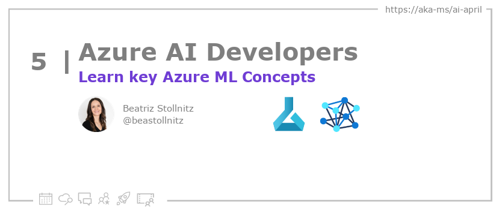

<head>

  <link rel="canonical" href="https://bea.stollnitz.com/blog/aml-introduction/"  />

</head>

- 📧 [Sign up for the Azure AI Developer Newsletter](https://aka.ms/azure-ai-dev-newsletter)
- 📰 [Subscribe to the #30DaysOfAzureAI RSS feed](https://azureaidevs.github.io/hub/blog/rss.xml)
- 📌 [Ask a question about this post on GitHub Discussions](https://github.com/AzureAiDevs/hub/discussions/categories/5-learn-key-azure-ml-concepts)
- 💡 [Suggest a topic for a future post](https://github.com/AzureAiDevs/hub/discussions/categories/call-for-content)

## Day _5_ of #30DaysOfAzureAI

<!-- README
The following description is also used for the tweet. So it should be action oriented and grab attention 
If you update the description, please update the description: in the frontmatter as well.
-->

**Learn key Azure ML Concepts with this primer**

<!-- README
The following is the intro to the post. It should be a short teaser for the post.
-->

If you’re used to training machine learning models on your local hardware, you may have experienced frustration as you hit the limits of what it can do. Maybe you’ve trained a model overnight or over several days for a school project, preventing you from using your laptop for other homework. Or maybe you’ve deployed a model in your company’s hardware, only to find out that your product went viral unexpectedly and your hardware couldn’t scale to meet demand. Or maybe as your team grows, you need a better way to manage the workflow of your machine learning project. These are a few common scenarios that are easily solved by moving your training and deployment to the cloud.

There are currently three major offerings in the AI cloud space: AWS Sagemaker from Amazon, Google Cloud Vertex AI from Google, and Azure ML from Microsoft. This article is the first in a series that will cover Azure ML in detail.

## What we'll cover

<!-- README
The following list is the main points of the post. There should be 3-4 main points.
 -->

- This post provides an overview of the main concepts in Azure ML to help the reader become effective at using the platform. 
- Understanding these concepts will make following code samples easier and provide a good foundation for writing your own code. 
- The goal is to make the reader proficient in using Azure ML.

<!-- 
- Main point 1
- Main point 2
- Main point 3 
- Main point 4
-->

<!-- README
Add or update a list relevant references here. These could be links to other blog posts, Microsoft Learn Module, videos, or other resources.
-->

### References

- [Learn Module: Introduction to Azure Machine Learning](https://learn.microsoft.com/training/modules/intro-to-azure-ml?WT.mc_id=aiml-89446-dglover)
- [What is Azure Machine Learning?](https://learn.microsoft.com/azure/machine-learning/overview-what-is-azure-machine-learning?WT.mc_id=aiml-89446-dglover)

<!-- README
The following is the body of the post. It should be an overview of the post that you are referencing.
See the Learn More section, if you supplied a canonical link, then will be displayed here.
-->

## Why Use Azure ML?

The article discusses the benefits of using cloud computing for machine learning projects and introduces the Azure ML platform. Azure ML enables users to train and deploy machine learning models in the cloud, and offers resources including workspaces, datastores, jobs, assets, compute, and endpoints. The article provides an overview of each resource and explains the different ways of creating them using Azure ML Studio, Azure CLI, Python SDK, and REST APIs. The article aims to provide readers with a foundational understanding of Azure ML concepts to follow the code samples in upcoming posts.

## Learn More

To learn more, check out this [article](https://bea.stollnitz.com/blog/aml-introduction/).

## Questions?

[Remember, you can ask a question about this post on GitHub Discussions](https://github.com/AzureAiDevs/Discussions/discussions/categories/5-learn-key-azure-ml-concepts)