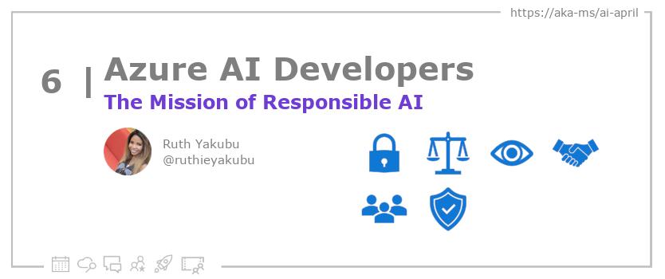

<head>

  <link rel="canonical" href="https://www.microsoft.com/en-us/ai/our-approach"  />

</head>

- 📧 [Sign up for the Azure AI Developer Newsletter](https://aka.ms/azure-ai-dev-newsletter)
- 📰 [Subscribe to the #30DaysOfAzureAI RSS feed](https://azureaidevs.github.io/hub/blog/rss.xml)
- 📌 [Ask a question about this post on GitHub Discussions](https://github.com/AzureAiDevs/hub/discussions/categories/6-the-mission-of-responsible-ai)
- 💡 [Suggest a topic for a future post](https://github.com/AzureAiDevs/hub/discussions/categories/call-for-content)

## Day _6_ of #30DaysOfAzureAI

<!-- README
The following description is also used for the tweet. So it should be action oriented and grab attention 
If you update the description, please update the description: in the frontmatter as well.
-->

**Why you should care about Responsible AI and Microsoft role**

<!-- README
The following is the intro to the post. It should be a short teaser for the post.
-->

Microsoft approaches AI development and deployment with a focus on fairness, reliability and safety, privacy and security, inclusiveness, transparency, and accountability. Microsoft is dedicated to developing AI responsively and invests in research, collaborating with multiple disciplines to deliver cutting-edge advancements in AI, such as large-scale AI models that are sophisticated, intuitive, and based on deep learning and large datasets.

## What we'll cover

<!-- README
The following list is the main points of the post. There should be 3-4 main points.
 -->

- Microsoft invests in AI to benefit everyone in organizations, with a focus on responsible AI.
- Microsoft Research focuses on developing large-scale, sophisticated, and intuitive AI models. 
- Microsoft recognizes the importance of responsible AI.

<!-- 
- Main point 1
- Main point 2
- Main point 3 
- Main point 4
-->

<!-- README
Add or update a list relevant references here. These could be links to other blog posts, Microsoft Learn Module, videos, or other resources.
-->

### References

- [Microsoft's approach to using AI responsibly](https://news.microsoft.com/source/features/ai/microsoft-approach-to-ai/#using-ai-responsibly?WT.mc_id=aiml-89446-dglover)
- [Meeting the AI moment: advancing the future through responsible AI](https://blogs.microsoft.com/on-the-issues/2023/02/02/responsible-ai-chatgpt-artificial-intelligence?WT.mc_id=aiml-89446-dglover)

<!-- README
The following is the body of the post. It should be an overview of the post that you are referencing.
See the Learn More section, if you supplied a canonical link, then will be displayed here.
-->

## Why Responsible AI?

Microsoft is investing heavily in AI because it believes that it can benefit everyone at every level of every organization. However, Microsoft acknowledges the need for responsible AI by design, guided by a set of principles: fairness, reliability and safety, privacy and security, inclusiveness, transparency, and accountability. Microsoft believes that proactive, self-regulatory efforts by responsible companies help pave the way for new laws to ensure that AI is developed and deployed responsibly. Microsoft also believes that democratic law-making processes are necessary to create principled and actionable norms that ensure organizations develop and deploy AI responsibly.

Microsoft Research has been advancing the foundations of computing for over 30 years, and its researchers collaborate across disciplines, institutions, and geographies to deliver cutting-edge AI advances. Recent efforts have focused on developing large-scale AI models that can process information in increasingly sophisticated ways while also becoming more natural and intuitive to use. Advances in deep learning, coupled with internet-scale datasets and Microsoft Azure's increasingly powerful AI supercomputing resources, have made it possible to create AI models that perform a broad range of tasks across many different applications.

## Learn More

To learn more, check out this [article](https://www.microsoft.com/en-us/ai/our-approach).

## Questions?

[Remember, you can ask a question about this post on GitHub Discussions](https://github.com/AzureAiDevs/Discussions/discussions/categories/6-the-mission-of-responsible-ai)