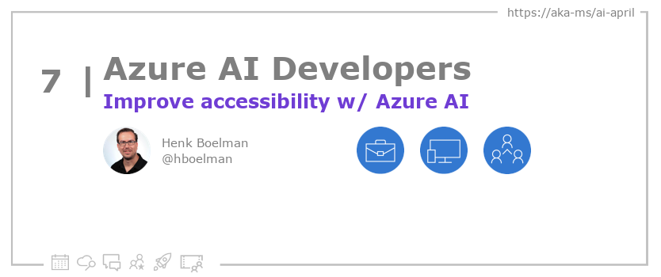

<head>

  <!-- <meta name="twitter:url" content="https://azureaidevs.github.io/hub/blog/2023-day7" />
  <meta name="twitter:title" content="Accessible AI Apps for Everyone" />
  <meta name="twitter:description" content="Learn to build AI for everyone with AI for Accessibility https://azureaidevs.github.io/hub/blog/2023-day7 #30DaysOfAzureAI #AzureAiDevs #AI #Accessibility" />
  <meta name="twitter:image" content="https://azureaidevs.github.io/hub/img/2023/banner-day7.png" />
  <meta name="twitter:card" content="summary_large_image" />

   -->

  <meta property="og:url" content="https://azureaidevs.github.io/hub/blog/2023-day7" />
  <meta property="og:title" content="Accessible AI Apps for Everyone" />
  <meta property="og:description" content="Learn to build AI for everyone with AI for Accessibility https://azureaidevs.github.io/hub/blog/2023-day7 #30DaysOfAzureAI #AzureAiDevs #AI #Accessibility" />
  <meta property="og:image" content="https://azureaidevs.github.io/hub/img/2023/banner-day7.png" />
  <meta property="og:type" content="article" />
  <meta property="og:site_name" content="Azure AI Developer" />

  <link rel="canonical" href="https://www.microsoft.com/ai/ai-for-accessibility"  />

</head>

- 📧 [Sign up for the Azure AI Developer Newsletter](https://aka.ms/azure-ai-dev-newsletter)
- 📰 [Subscribe to the #30DaysOfAzureAI RSS feed](https://azureaidevs.github.io/hub/blog/rss.xml)
- 📌 [Ask a question about this post on GitHub Discussions](https://github.com/AzureAiDevs/hub/discussions/categories/7-accessible-ai-apps-for-everyone)
- 💡 [Suggest a topic for a future post](https://github.com/AzureAiDevs/hub/discussions/categories/call-for-content)

## Day _7_ of #30DaysOfAzureAI

<!-- README
The following description is also used for the tweet. So it should be action oriented and grab attention 
If you update the description, please update the description: in the frontmatter as well.
-->

**Learn to build AI for everyone with AI for Accessibility**

<!-- README
The following is the intro to the post. It should be a short teaser for the post.
-->

The article overviews AI projects aimed at improving the lives of people with disabilities, from education to home and low-cost assistive technology. It highlights NWEA and AI4Bharat, and stresses the importance of FATE considerations in sign language AI, as well as Microsoft's AI for Accessibility grants. 

## What we'll cover

<!-- README
The following list is the main points of the post. There should be 3-4 main points.
 -->

1. Overview of AI projects aimed at improving the lives of people with disabilities in education, employment, community, home, and low-cost assistive technology. 
2. Highlighting specific projects like NWEA and AI4Bharat. 
3. The importance of FATE considerations in sign language AI and the existence of Microsoft's AI for Accessibility grants. 

<!-- 
- Main point 1
- Main point 2
- Main point 3 
- Main point 4
-->

<!-- README
Add or update a list relevant references here. These could be links to other blog posts, Microsoft Learn Module, videos, or other resources.
-->

### References

- [AI for Accessibility](https://www.microsoft.com/ai/ai-for-accessibility)

<!-- README
The following is the body of the post. It should be an overview of the post that you are referencing.
See the Learn More section, if you supplied a canonical link, then will be displayed here.
-->

The article provides an overview of various AI for Accessibility projects that aim to improve the lives of people with disabilities. The projects range from education to employment, community, home, and low-cost assistive technology. One of the projects highlighted is NWEA, which is developing math assessments to make them more accessible for students with vision disabilities, improving their access to higher-level math and STEM careers. Another project is AI4Bharat, which aims to improve accessibility for the deaf population in India by creating datasets to advance Indian Sign Language understanding.

The article also discusses the importance of intersectionality in disability and how technology can be a powerful tool to connect people. Additionally, it highlights the need for FATE (Fairness, Accountability, Transparency, and Ethics) considerations in sign language AI datasets to ensure equitable outcomes in training AI and machine learning. Lastly, the article discusses Microsoft's AI for Accessibility grants, which offer funding, technology, and expertise to individuals and teams passionate about creating a more inclusive world.

## Learn More

To learn more, check out this [article](https://www.microsoft.com/ai/ai-for-accessibility).

## Questions?

[Remember, you can ask a question about this post on GitHub Discussions](https://github.com/AzureAiDevs/Discussions/discussions/categories/7-accessible-ai-apps-for-everyone)