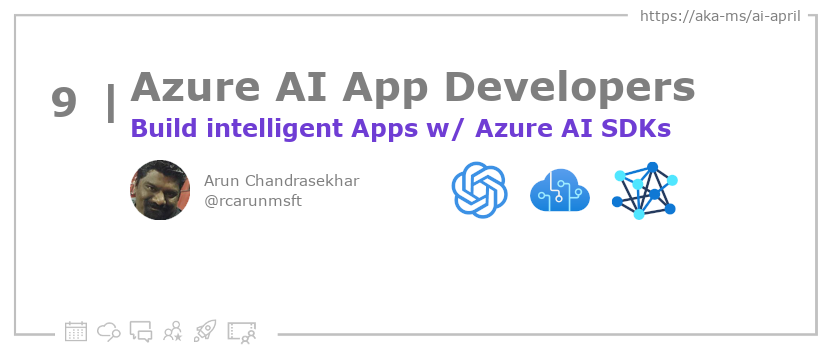

<head>

  <meta name="twitter:url" content="https://azureaidevs.github.io/hub/blog/2023-day9" />
  <meta name="twitter:title" content="Build intelligent Apps w/ Azure AI SDKs" />
  <meta name="twitter:description" content="Building intelligent apps? Then explore the Azure AI Hub for OpenAI and Cognitive Services SDK samples https://azureaidevs.github.io/hub/blog/2023-day9 #30DaysOfAzureAI #AzureAiDevs #AI #OpenAI" />
  <meta name="twitter:image" content="https://azureaidevs.github.io/hub/img/2023/banner-day9.png" />
  <meta name="twitter:card" content="summary_large_image" />

  

  <link rel="canonical" href="https://github.com/Azure-Samples/azure-ai"  />

</head>

- 📧 [Sign up for the Azure AI Developer Newsletter](https://aka.ms/azure-ai-dev-newsletter)
- 📰 [Subscribe to the #30DaysOfAzureAI RSS feed](https://azureaidevs.github.io/hub/blog/rss.xml)
- 📌 [Ask a question about this post on GitHub Discussions](https://github.com/AzureAiDevs/hub/discussions/categories/9-build-intelligent-apps-w/-azure-ai-sdks)
- 💡 [Suggest a topic for a future post](https://github.com/AzureAiDevs/hub/discussions/categories/call-for-content)

## Day _9_ of #30DaysOfAzureAI

<!-- README
The following description is also used for the tweet. So it should be action oriented and grab attention 
If you update the description, please update the description: in the frontmatter as well.
-->

**Building intelligent apps? Then explore the Azure AI Hub for OpenAI and Cognitive Services SDK samples**

<!-- README
The following is the intro to the post. It should be a short teaser for the post.
-->

Welcome to The Azure AI Hub, your go-to destination for Azure AI developers, where we provide curated samples, discussions channels, and suggestions from the community, with a focus on responsible AI to ensure transparency, fairness, and accountability in AI systems.

## What we'll cover

<!-- README
The following list is the main points of the post. There should be 3-4 main points.
 -->

- The Azure AI Hub is a repository for Azure AI developers with code samples and discussion channels.
- The hub focuses on promoting responsible AI practices, such as transparency, fairness, and accountability.
- The Azure AI Hub provides resources for developers to learn and implement responsible AI practices.

<!-- 
- Main point 1
- Main point 2
- Main point 3 
- Main point 4
-->

<!-- README
Add or update a list relevant references here. These could be links to other blog posts, Microsoft Learn Module, videos, or other resources.
-->

### References

- [Quickstart: Get started generating text using Azure OpenAI Service](https://learn.microsoft.com/azure/cognitive-services/openai/quickstart?pivots=programming-language-studio&WT.mc_id=aiml-89446-dglover)
- [Learn Module: Introduction to Azure OpenAI Service](https://learn.microsoft.com/training/modules/explore-azure-openai&WT.mc_id=aiml-89446-dglover)
- [Learn Module: Learn about Azure Cognitive Services](https://learn.microsoft.com/training/browse/?products=azure-cognitive-services&WT.mc_id=aiml-89446-dglover)
- [Case Study: Trelent powers source code documentation with OpenAI Service](https://startups.microsoft.com/blog/trelent-openai-service?WT.mc_id=aiml-89446-dglover)
- [Case Study: Hypergrowth startup harnesses deep learning to redefine enterprise productivity](https://customers.microsoft.com/story/1376278902865681018-instabase-partner-professional-services-azure?WT.mc_id=aiml-89446-dglover)

<!-- README
The following is the body of the post. It should be an overview of the post that you are referencing.
See the Learn More section, if you supplied a canonical link, then will be displayed here.
-->

## Introducing the Azure AI Hub

The Azure AI Hub is a repository designed to be the central hub of samples for Azure AI developers who are interested in integrating AI into their applications using various Azure AI services. It features a curated list of samples for popular end-to-end customer scenarios that use AI and active discussions channels for the community to ask questions or provide feedback to the Azure AI product teams. The Hub is open to any other suggestions to improve the experience for developers.

The repository provides a range of Azure AI code samples such as using OpenAI to make sense of a large dataset using Query based Summarization in a Python notebook, using Translator to translate documents from and into more than 100 different languages, automating paper-based processes using the New patient registration with Form Recognizer workshop, integrating Speech AI into apps using Speech SDK samples, and extracting structured data from forms, receipts, invoices, and cards using Form Recognizer in various programming languages. There are no prerequisites to using the Azure AI Hub, and 
developers are encouraged to join the discussions, introduce themselves, and share their thoughts on the samples.

## Learn More

To learn more, check out this [article](https://github.com/Azure-Samples/azure-ai).

## Questions?

[Remember, you can ask a question about this post on GitHub Discussions](https://github.com/AzureAiDevs/Discussions/discussions/categories/9-build-intelligent-apps-w/-azure-ai-sdks)