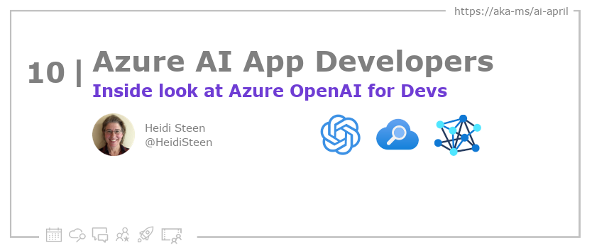
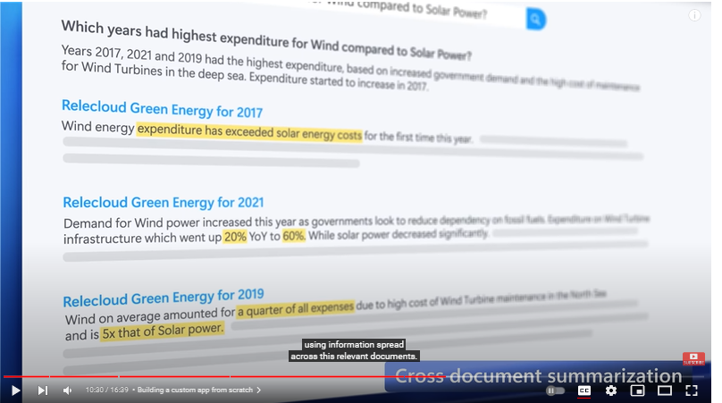

<head>

  <!-- <meta name="twitter:url" content="https://azureaidevs.github.io/hub/blog/2023-day10" />
  <meta name="twitter:title" content="Inside look at Azure OpenAI for Devs" />
  <meta name="twitter:description" content="Get ready to build dynamic, interactive and differentiated experiences with Azure OpenAI https://azureaidevs.github.io/hub/blog/2023-day10 #30DaysOfAzureAI #AzureAiDevs #AI #OpenAI" />
  <meta name="twitter:image" content="https://azureaidevs.github.io/hub/img/2023/banner-day10.png" />
  <meta name="twitter:card" content="summary_large_image" />

   -->

  <meta property="og:url" content="https://azureaidevs.github.io/hub/blog/2023-day10" />
  <meta property="og:title" content="Inside look at Azure OpenAI for Devs" />
  <meta property="og:description" content="Get ready to build dynamic, interactive and differentiated experiences with Azure OpenAI https://azureaidevs.github.io/hub/blog/2023-day10 #30DaysOfAzureAI #AzureAiDevs #AI #OpenAI" />
  <meta property="og:image" content="https://azureaidevs.github.io/hub/img/2023/banner-day10.png" />
  <meta property="og:type" content="article" />
  <meta property="og:site_name" content="Azure AI Developer" />

  <link rel="canonical"  href="https://azureaidevs.github.io/hub/blog/2023-day10"  />

</head>

- 📧 [Sign up for the Azure AI Developer Newsletter](https://aka.ms/azure-ai-dev-newsletter)
- 📰 [Subscribe to the #30DaysOfAzureAI RSS feed](https://azureaidevs.github.io/hub/blog/rss.xml)
- 📌 [Ask a question about this post on GitHub Discussions](https://github.com/AzureAiDevs/hub/discussions/categories/10-inside-look-at-azure-openai-for-devs)
- 💡 [Suggest a topic for a future post](https://github.com/AzureAiDevs/hub/discussions/categories/call-for-content)

## Day _10_ of #30DaysOfAzureAI

<!-- README
The following description is also used for the tweet. So it should be action oriented and grab attention 
If you update the description, please update the description: in the frontmatter as well.
-->

**Get ready to build dynamic, interactive and differentiated experiences with Azure OpenAI**

<!-- README
The following is the intro to the post. It should be a short teaser for the post.
-->

## What we'll cover

<!-- README
The following list is the main points of the post. There should be 3-4 main points.
 -->

- Core concepts
- Using prompts for user interaction (Minecraft example)
- Cross-pollination between apps (Cognitive Search example)
- Sign up to get started

<!-- 
- Main point 1
- Main point 2
- Main point 3 
- Main point 4
-->

<!-- README
Add or update a list relevant references here. These could be links to other blog posts, Microsoft Learn Module, videos, or other resources.
-->

### References

- [Learn Module: Introduction to Azure OpenAI Service](https://learn.microsoft.com/training/modules/explore-azure-openai?WT.mc_id=aiml-89446-dglover)
- [Learn Module: Azure Cognitive Search](https://learn.microsoft.com/training/browse/?expanded=azure&roles=ai-engineer&products=azure-cognitive-search&WT.mc_id=aiml-89446-dglover)
- [Case Study: Is data necessary for bootstrapping of AI models?](https://startups.microsoft.com/blog/bootstrapping-ai-models-pointers?WT.mc_id=aiml-89446-dglover)
- [Case Study: Metaverse training and AI-driven onboarding](https://startups.microsoft.com/blog/metaverse-training-stellarx?WT.mc_id=aiml-89446-dglover)

<!-- README
The following is the body of the post. It should be an overview of the post that you are referencing.
See the Learn More section, if you supplied a canonical link, then will be displayed here.
-->

**What's Azure OpenAI?**

Azure's OpenAI Service lets you leverage large scale generative AI
models based in Azure that have a deep understanding of language and
code as you build new applications. "Language understanding" means that
you can type or "talk" to an app to get it do the things you want.

In Azure OpenAI, you can work with these models:

-   GPT-3 generates content based on natural language input.

-   Codex translates natural language instructions directly into code.

-   DALL-E 2 generates realistic images and art from natural language
    descriptions.

These models are hosted on Azure, accessible to apps through REST APIs,
or through Azure OpenAI Studio for interactive exploration.

Azure OpenAI models include built-in content filtering. If inputs or
generated outputs include inappropriate content, the Azure OpenAI
Service catches it. Detection and mitigation of harmful use follows the
responsible AI principles, which you can find more about at
[aka.ms/AIprinciples](https://aka.ms/AIprinciples).

In this session, we'll unpack the core concepts for interacting with
models, using prompts, and demonstrate how you can use Azure's OpenAI
Studio to experiment with and test your models before bringing them into
your code to deliver differentiated app experiences, all with Azure's
enterprise-grade security for your app's foundation.

## Scenario One: Converse with Minecraft

Transforming the surface area of an app might be easier than you think!
In this video segment, Pablo shows us how he used Minecraft's extension
APIs to integrate a conversational user interaction model to build in
Minecraft.

The add-in module, named "conjure", collects a text input that's passed
to Codex, transforming user intent into actionable code that Minecraft
understands.

<iframe width="100%" height="420" src="https://www.youtube.com/embed/3t3qZu1Dy1k?start=341" title="YouTube video player" frameborder="0" allow="accelerometer; autoplay; clipboard-write; encrypted-media; gyroscope; picture-in-picture; web-share" allowfullscreen></iframe>

If your application supports plug-in or add-on modules, you can attach a
module that accepts text prompts as inputs, and then pass that input to
Codex to interpret the user intent. Codex returns native code that can
then be processed by your application.

## Scenario Two: Combine Content Discovery and Language Understanding to Create New Information

The next example combines the content discovery capabilities of Azure
Cognitive Search with the language understanding of the GPT-3 model.

The premise is an app for a green energy company that helps users find
the latest insights and developments by scanning content over large
volumes of unstructured content from various sources.

-   Cognitive Search accepts a user query and returns a set of matching
    documents in order of relevance. Instead of returning the results to
    the user, it sends them to GPT-3 for more analysis.

-   GPT-3 takes the documents and composes better answers and insights
    using content from all of them.

<iframe width="100%" height="420" src="https://www.youtube.com/embed/3t3qZu1Dy1k?start=576" title="YouTube video player" frameborder="0" allow="accelerometer; autoplay; clipboard-write; encrypted-media; gyroscope; picture-in-picture; web-share" allowfullscreen></iframe>

In this example, the app calls Azure Cognitive Search to discover
text-based documents related to the user's question. This step finds the
matches, ranks the documents, and returns the most relevant candidates.

But sometimes the best answer isn't in one document. By adding language
understanding, the app can use GPT-3 to derive a new answer using the
content from all of the matching documents. This isn't just a verbatim
answer from one document, but a new answer from multiple documents.

## Key Takeaways and Next Steps

Now that you've seen a few examples, here are some next steps:

See how Microsoft integrates OpenAI into applications. You can [catch
these examples in the video](https://youtu.be/3t3qZu1Dy1k?t=164).

-   Co-Pilot in the [Power
    Platform](https://learn.microsoft.com/en-us/power-platform/developer/)
    lets you author Power Fx commands and automation flow without having
    to know or type the syntax.

-   M365's [Microsoft Designer](https://designer.microsoft.com/) lets
    you use AI-generated images when creating visual content.

[Sign up for Azure
OpenAI](https://customervoice.microsoft.com/Pages/ResponsePage.aspx?id=v4j5cvGGr0GRqy180BHbR7en2Ais5pxKtso_Pz4b1_xUOFA5Qk1UWDRBMjg0WFhPMkIzTzhKQ1dWNyQlQCN0PWcu)
to get core building blocks for production-grade applications, including
hosting at scale, to enterprise-level security.

-   Call OpenAI from your code just like any other REST API.

-   Secure with strong authentication, role-based access control and the
    ability to configure virtual networks, private endpoints as you
    would for any Azure service.

[Sign up for Azure OpenAI Studio](https://oai.azure.com/portal) to
experiment and test your ideas before bringing them into your code.
[Watch this segment of the video](https://youtu.be/3t3qZu1Dy1k?t=721)
for a walkthrough.

## Questions?

[Remember, you can ask a question about this post on GitHub Discussions](https://github.com/AzureAiDevs/Discussions/discussions/categories/10-inside-look-at-azure-openai-for-devs)