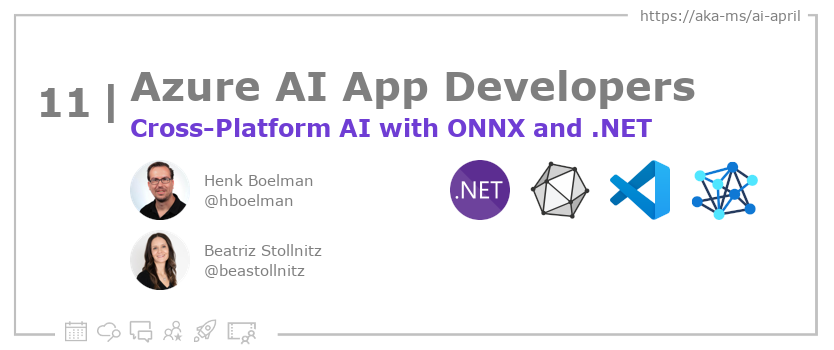

<head>

  <meta property="og:url" content="https://azureaidevs.github.io/hub/blog/2023-day11" />
  <meta property="og:title" content="Cross-Platform AI with ONNX and .NET" />
  <meta property="og:description" content="Building Cross-Platform AI Solutions with ONNX and .NET https://azureaidevs.github.io/hub/blog/2023-day11 #30DaysOfAzureAI #AzureAiDevs #AI #ONNX" />
  <meta property="og:image" content="https://azureaidevs.github.io/hub/img/2023/banner-day11.png" />
  <meta property="og:type" content="article" />
  <meta property="og:site_name" content="Azure AI Developer" />
  

  <link rel="canonical" href="https://youtu.be/h6HWP5jpA5s"  />

</head>

- 📧 [Sign up for the Azure AI Developer Newsletter](https://aka.ms/azure-ai-dev-newsletter)
- 📰 [Subscribe to the #30DaysOfAzureAI RSS feed](https://azureaidevs.github.io/hub/blog/rss.xml)
- 📌 [Ask a question about this post on GitHub Discussions](https://github.com/AzureAiDevs/hub/discussions/categories/11-cross-platform-ai-with-onnx-and-.net)
- 💡 [Suggest a topic for a future post](https://github.com/AzureAiDevs/hub/discussions/categories/call-for-content)

## 🗓️ Day _11_ of #30DaysOfAzureAI

<!-- README
The following description is also used for the tweet. So it should be action oriented and grab attention 
If you update the description, please update the description: in the frontmatter as well.
-->

**Building Cross-Platform AI Solutions with ONNX and .NET**

<!-- README
The following is the intro to the post. It should be a short teaser for the post.
-->

Yesterday was all about the power of OpenAI to create intelligent dynamic apps. Today is for people looking to build cross-platform intelligent apps with .NET MAUI and ONNX.

## 🎯 What we'll cover

<!-- README
The following list is the main points of the post. There should be 3-4 main points.
 -->

1. The presentation is about machine learning models with ONNX and .NET, presented by Beatriz Stollnitz and Henk.
2. They start with a dataset of Lego figures, create a model, and demonstrate how to run it in a .NET Maui application that can run on a mobile phone.
3. The presentation covers an overview of AI, machine learning, expert systems, and deep learning, and how they relate to traditional programming.

<!-- 
- Main point 1
- Main point 2
- Main point 3 
- Main point 4
-->

<!-- README
Add or update a list relevant references here. These could be links to other blog posts, Microsoft Learn Module, videos, or other resources.
-->

### 📚 References

- [Open Neural Network Exchange (ONNX) Open Standard](https://onnx.ai/index.html)
- [.NET Multi-platform App UI](https://dotnet.microsoft.com/apps/maui?WT.mc_id=aiml-89446-dglover)
- [ONNX and Azure Machine Learning: Create and accelerate ML models](https://learn.microsoft.com/azure/machine-learning/concept-onnx?WT.mc_id=aiml-89446-dglover)
- [Create a machine learning model for offline use on a Windows device](https://learn.microsoft.com/training/modules/add-machine-learning-to-uwp-app?WT.mc_id=aiml-89446-dglover)

<!-- README
The following is the body of the post. It should be an overview of the post that you are referencing.
See the Learn More section, if you supplied a canonical link, then will be displayed here.
-->

The video is a presentation on machine learning models using ONNX and .NET. The presenters, Bea and Henk, start with an overview of AI and machine learning, explaining that machine learning is a subset of AI that involves creating a model that can learn from data and make predictions without being explicitly programmed. They explain that deep learning, a subset of machine learning that uses artificial neural networks, is well-suited to big data.

The presentation then goes on to demonstrate how to create a machine learning model using ONNX and .NET. The presenters use a dataset of Lego figures and explain how to create a model that can predict the color of a Lego figure based on its shape. They use tools like Visual Studio and the ML.NET library to create the model, and then show how to use the ONNX format to export the model for use in a .NET Maui application.

The presentation concludes with a demo of the .NET Maui application, which uses the machine learning model to predict the color of a Lego figure from an image. The presenters explain how the application works and discuss some of the challenges they faced in creating the model and the application. They also emphasize the importance of testing and evaluating machine learning models to ensure their accuracy and reliability. Overall, the presentation provides an accessible introduction to machine learning using ONNX and .NET, and demonstrates how these tools can be used to create practical applications.

<iframe width="100%" height="420" src="https://www.youtube.com/embed/h6HWP5jpA5s" title="YouTube video player" frameborder="0" allow="accelerometer; autoplay; clipboard-write; encrypted-media; gyroscope; picture-in-picture; web-share" allowfullscreen></iframe>

## 👓 Read today's reference article

Read today's [article](https://youtu.be/h6HWP5jpA5s).

## 🙋🏾‍♂️ Questions?

[Remember, you can ask a question about this post on GitHub Discussions](https://github.com/AzureAiDevs/Discussions/discussions/categories/11-cross-platform-ai-with-onnx-and-.net)