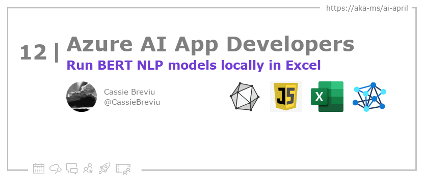

<head>

  <meta property="og:url" content="https://azureaidevs.github.io/hub/blog/2023-day12" />
  <meta property="og:title" content="Run BERT NLP models locally in Excel" />
  <meta property="og:description" content="Run BERT NLP models locally in Excel with ONNX and JavaScript https://azureaidevs.github.io/hub/blog/2023-day12 #30DaysOfAzureAI #AzureAiDevs #AI #ONNX" />
  <meta property="og:image" content="https://azureaidevs.github.io/hub/img/2023/banner-day12.png" />
  <meta property="og:type" content="article" />
  <meta property="og:site_name" content="Azure AI Developer" />
  

  <link rel="canonical" href="https://onnxruntime.ai/docs/tutorials/web/excel-addin-bert-js.html"  />

</head>

- 📧 [Sign up for the Azure AI Developer Newsletter](https://aka.ms/azure-ai-dev-newsletter)
- 📰 [Subscribe to the #30DaysOfAzureAI RSS feed](https://azureaidevs.github.io/hub/blog/rss.xml)
- 📌 [Ask a question about this post on GitHub Discussions](https://github.com/AzureAiDevs/hub/discussions/categories/12-run-bert-nlp-models-locally-in-excel)
- 💡 [Suggest a topic for a future post](https://github.com/AzureAiDevs/hub/discussions/categories/call-for-content)

## Day _12_ of #30DaysOfAzureAI

<!-- README
The following description is also used for the tweet. So it should be action oriented and grab attention 
If you update the description, please update the description: in the frontmatter as well.
-->

**Run BERT NLP models locally in Excel with ONNX and JavaScript**

<!-- README
The following is the intro to the post. It should be a short teaser for the post.
-->

Yesterday was all about building cross-platform intelligent apps with .NET MAUI and ONNX. Today is for people looking to extend Excel with BERT-JS and the ONNX Runtime. What? You can do that, yup, follow along to learn more.

## What we'll cover

<!-- README
The following list is the main points of the post. There should be 3-4 main points.
 -->

1. The article provides a guide to building an Excel add-in that performs natural language processing tasks using the BERT model and ONNX Runtime. 
2. BERT is a deep learning model that is designed to understand the context and meaning of words in text. 
3. The article includes step-by-step instructions, code examples, and screenshots to help readers follow along.

<!-- 
- Main point 1
- Main point 2
- Main point 3 
- Main point 4
-->

<!-- README
Add or update a list relevant references here. These could be links to other blog posts, Microsoft Learn Module, videos, or other resources.
-->

### References

- [Open Neural Network Exchange (ONNX) Open Standard](https://onnx.ai/index.html)

<!-- README
The following is the body of the post. It should be an overview of the post that you are referencing.
See the Learn More section, if you supplied a canonical link, then will be displayed here.
-->

The article "Building an Excel Add-in with BERT-JS and ONNX Runtime" highlights the importance of using responsible AI in developing applications. The use of BERT-JS and ONNX Runtime enables the creation of an Excel add-in that performs natural language processing tasks within a spreadsheet. BERT, a deep learning model developed by Google, is designed to understand the context and meaning of words in text. By using a transformer-based architecture, BERT can analyze entire sentences or paragraphs rather than processing words one by one. The article provides step-by-step instructions and code examples to help readers follow along in building the add-in.

The article emphasizes the importance of responsible AI in building applications that use machine learning models. By using ONNX Runtime, the performance of the BERT-JS model can be optimized, resulting in faster and more efficient processing of natural language tasks. Additionally, the article encourages developers to be mindful of potential biases and ethical considerations when building applications that use machine learning models. By considering responsible AI practices, developers can create applications that are fair, transparent, and trustworthy.

## Learn More

To learn more, check out this [article](https://onnxruntime.ai/docs/tutorials/web/excel-addin-bert-js.html).

## Questions?

[Remember, you can ask a question about this post on GitHub Discussions](https://github.com/AzureAiDevs/Discussions/discussions/categories/12-run-bert-nlp-models-locally-in-excel)