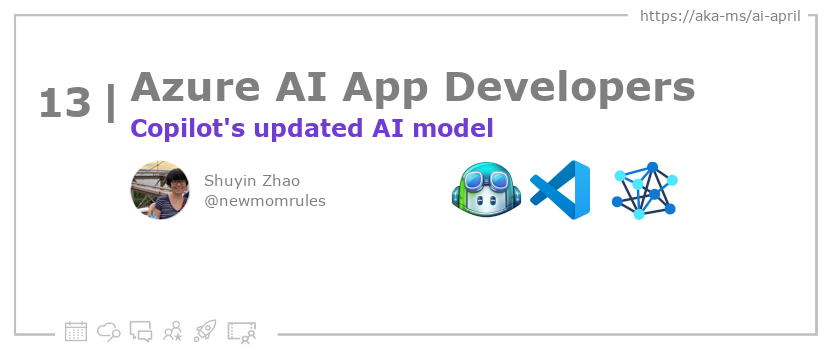
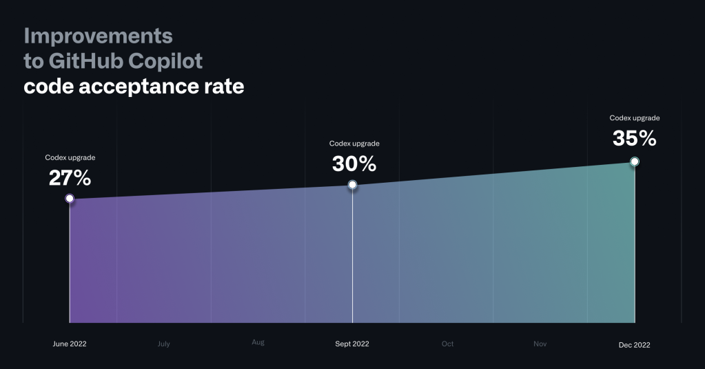

<head>

  <!-- <meta name="twitter:url" content="https://azureaidevs.github.io/hub/blog/2023-day13" />
  <meta name="twitter:title" content="Copilot's updated AI model" />
  <meta name="twitter:description" content="GitHub Copilot Upgraded: Faster, More Accurate, and More Secure Code https://azureaidevs.github.io/hub/blog/2023-day13 #30DaysOfAzureAI #AzureAiDevs #AI #Copilot" />
  <meta name="twitter:image" content="https://azureaidevs.github.io/hub/img/2023/banner-day13.png" />
  <meta name="twitter:card" content="summary_large_image" />

   -->

  <meta property="og:url" content="https://azureaidevs.github.io/hub/blog/2023-day13" />
  <meta property="og:title" content="Copilot's updated AI model" />
  <meta property="og:description" content="GitHub Copilot Upgraded: Faster, More Accurate, and More Secure Code https://azureaidevs.github.io/hub/blog/2023-day13 #30DaysOfAzureAI #AzureAiDevs #AI #Copilot" />
  <meta property="og:image" content="https://azureaidevs.github.io/hub/img/2023/banner-day13.png" />
  <meta property="og:type" content="article" />
  <meta property="og:site_name" content="Azure AI Developer" />

  <link rel="canonical" href="https://github.blog/2023-02-14-github-copilot-now-has-a-better-ai-model-and-new-capabilities/"  />

</head>

- 📧 [Sign up for the Azure AI Developer Newsletter](https://aka.ms/azure-ai-dev-newsletter)
- 📰 [Subscribe to the #30DaysOfAzureAI RSS feed](https://azureaidevs.github.io/hub/blog/rss.xml)
- 📌 [Ask a question about this post on GitHub Discussions](https://github.com/AzureAiDevs/hub/discussions/categories/13-copilot's-updated-ai-model)
- 💡 [Suggest a topic for a future post](https://github.com/AzureAiDevs/hub/discussions/categories/call-for-content)

## Day _13_ of #30DaysOfAzureAI

<!-- README
The following description is also used for the tweet. So it should be action oriented and grab attention 
If you update the description, please update the description: in the frontmatter as well.
-->

**GitHub Copilot Upgraded: Faster, More Accurate, and More Secure Code**

<!-- README
The following is the intro to the post. It should be a short teaser for the post.
-->

GitHub has improved its AI tool, Copilot, with updated Codex model and Fill-In-the-Middle prompts for code suggestions, as well as a new lightweight client-side model for the VS Code extension. Additionally, they have introduced an AI-based system for preventing vulnerabilities in code that quickly detects insecure coding patterns and provides alternative suggestions. These updates are available to both individual and business users of Copilot and aim to improve the coding speed, accuracy, and security for developers.

## What we'll cover

<!-- README
The following list is the main points of the post. There should be 3-4 main points.
 -->

- GitHub updated Copilot with improved suggestions and a new Fill-In-the-Middle paradigm.
- The VS Code extension was updated with a lightweight model and improved acceptance rate.
- A new AI-based vulnerability prevention system was introduced with language models to provide alternative suggestions. 

<!-- 
- Main point 1
- Main point 2
- Main point 3 
- Main point 4
-->

<!-- README
Add or update a list relevant references here. These could be links to other blog posts, Microsoft Learn Module, videos, or other resources.
-->

### References

- [Introducing GitHub Copilot: your AI pair programmer](https://github.blog/2021-06-29-introducing-github-copilot-ai-pair-programmer?WT.mc_id=aiml-89446-dglover)

<!-- README
The following is the body of the post. It should be an overview of the post that you are referencing.
See the Learn More section, if you supplied a canonical link, then will be displayed here.
-->

## What's new in Copilot

GitHub has made updates to its AI-powered coding tool, Copilot, with the goal of improving code suggestions and responsiveness for developers. The underlying Codex model has been updated to deliver better results for code synthesis and the Fill-In-the-Middle paradigm has been introduced for better prompts for code suggestions. The extension for Visual Studio Code has also been updated with a lightweight client-side model that reduces unwanted suggestions and improves acceptance rates.

Additionally, an AI-based vulnerability prevention system has been introduced to identify and block insecure coding patterns in real-time. The system uses language models to quickly detect vulnerable patterns, including hardcoded credentials and SQL injections, even in incomplete code fragments. Vulnerable code suggestions are replaced with alternative suggestions.

These updates are available on Copilot for Individuals and Copilot for Business and GitHub aims to continue enhancing the developer experience. These updates will help developers code faster and more accurately while improving the security of their code.

## Learn More

To learn more, check out this [article](https://github.blog/2023-02-14-github-copilot-now-has-a-better-ai-model-and-new-capabilities/).

## Questions?

[Remember, you can ask a question about this post on GitHub Discussions](https://github.com/AzureAiDevs/Discussions/discussions/categories/13-copilot's-updated-ai-model)