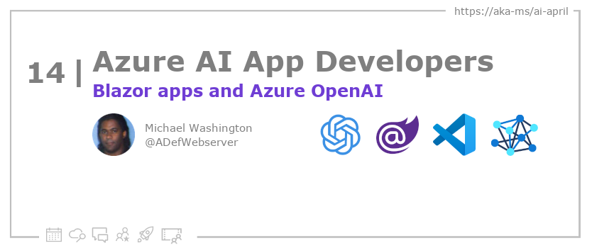
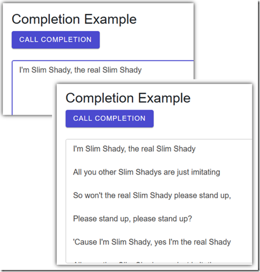

<head>

  <meta property="og:url" content="https://azureaidevs.github.io/hub/blog/2023-day14" />
  <meta property="og:title" content="Blazor Apps and Azure OpenAI" />
  <meta property="og:description" content="Build Interactive Web Applications with Microsoft Blazor and Azure OpenAI https://azureaidevs.github.io/hub/blog/2023-day14 #30DaysOfAzureAI #AzureAiDevs #AI #OpenAI" />
  <meta property="og:image" content="https://azureaidevs.github.io/hub/img/2023/banner-day14.png" />
  <meta property="og:type" content="article" />
  <meta property="og:site_name" content="Azure AI Developer" />
  

  <link rel="canonical" href="https://blazorhelpwebsite.com/ViewBlogPost/2065"  />

</head>

- 📧 [Sign up for the Azure AI Developer Newsletter](https://aka.ms/azure-ai-dev-newsletter)
- 📰 [Subscribe to the #30DaysOfAzureAI RSS feed](https://azureaidevs.github.io/hub/blog/rss.xml)
- 📌 [Ask a question about this post on GitHub Discussions](https://github.com/AzureAiDevs/hub/discussions/categories/14-blazor-apps-and-azure-openai)
- 💡 [Suggest a topic for a future post](https://github.com/AzureAiDevs/hub/discussions/categories/call-for-content)

## Day _14_ of #30DaysOfAzureAI

<!-- README
The following description is also used for the tweet. So it should be action oriented and grab attention 
If you update the description, please update the description: in the frontmatter as well.
-->

**Build Interactive Web Applications with Microsoft Blazor and Azure OpenAI**

<!-- README
The following is the intro to the post. It should be a short teaser for the post.
-->

Yesterday we learned about some of the advances with GitHub Coplit. Today is all about building web assemblies with Microsoft Blazor and how you can call upon the Azure OpenAI service to create a rich, interactive, and intelligent web app. 

## What we'll cover

<!-- README
The following list is the main points of the post. There should be 3-4 main points.
 -->

- The article covers Microsoft Blazor and Azure OpenAI consumption, including text-davinci-002 model.
- A guide is provided for setting up the Azure OpenAI service.
- The article includes code for a Blazor app wrapping the OpenAIClient class and creating a UI. It serves as a comprehensive tutorial for integrating Azure OpenAI into Blazor apps.

<!-- 
- Main point 1
- Main point 2
- Main point 3 
- Main point 4
-->

<!-- README
Add or update a list relevant references here. These could be links to other blog posts, Microsoft Learn Module, videos, or other resources.
-->

### References

- [Build beautiful, web apps with Blazor](https://dotnet.microsoft.com/apps/aspnet/web-apps/blazor)
- [Azure OpenAI Service](https://azure.microsoft.com/products/cognitive-services/openai-service?WT.mc_id=aiml-89446-dglover)
- [Learn Module: Introduction to Azure OpenAI Service](https://learn.microsoft.com/training/modules/explore-azure-openai?WT.mc_id=aiml-89446-dglover)

<!-- README
The following is the body of the post. It should be an overview of the post that you are referencing.
See the Learn More section, if you supplied a canonical link, then will be displayed here.
-->

Blazor is a new web framework for building single-page applications (SPAs) using .NET and C#. It allows developers to create client-side web applications with the same language and tools they use to build server-side applications. One of the benefits of Blazor is that it eliminates the need for JavaScript, which can often cause compatibility issues and make development more challenging. Blazor provides a more cohesive development experience, with full-stack web development using .NET.

Blazor Help Website is a popular online resource that provides a wealth of information and tutorials about Blazor. The website is dedicated to helping developers get up to speed with Blazor quickly and efficiently. It offers a range of resources for both beginners and advanced developers, including articles, tutorials, and videos. The website also has a community forum where developers can ask questions and share their knowledge with others.

One of the most useful features of the Blazor Help Website is its extensive library of code samples and demos. These code samples provide developers with practical examples of how to use Blazor to build real-world applications. The website covers a range of topics related to Blazor, including components, data binding, navigation, and authentication. With its comprehensive and up-to-date content, the Blazor Help Website is an excellent resource for anyone looking to learn more about Blazor and how to use it to build modern web applications.

## Learn More

To learn more, check out this [article](https://blazorhelpwebsite.com/ViewBlogPost/2065).

## Questions?

[Remember, you can ask a question about this post on GitHub Discussions](https://github.com/AzureAiDevs/Discussions/discussions/categories/14-blazor-apps-and-azure-openai)