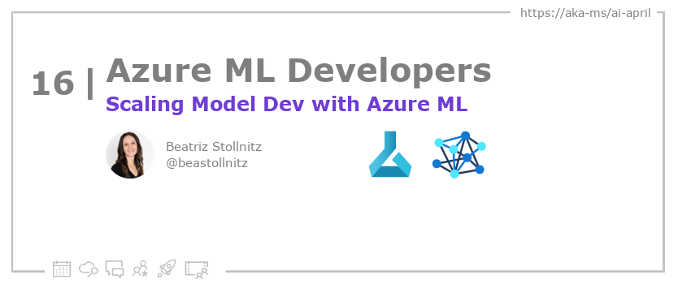

<head>

  <meta property="og:url" content="https://azureaidevs.github.io/hub/blog/2023-day16" />
  <meta property="og:title" content="Scaling Model Dev with Azure ML" />
  <meta property="og:description" content="Azure ML: Train and Deploy ML Models at Scale https://azureaidevs.github.io/hub/blog/2023-day16 #30DaysOfAzureAI #AzureAiDevs #AI #AzureML" />
  <meta property="og:image" content="https://azureaidevs.github.io/hub/img/2023/banner-day16.png" />
  <meta property="og:type" content="article" />
  <meta property="og:site_name" content="Azure AI Developer" />
  

  <link rel="canonical" href="https://bea.stollnitz.com/blog/aml-command"  />

</head>

- 📧 [Sign up for the Azure AI Developer Newsletter](https://aka.ms/azure-ai-dev-newsletter)
- 📰 [Subscribe to the #30DaysOfAzureAI RSS feed](https://azureaidevs.github.io/hub/blog/rss.xml)
- 📌 [Ask a question about this post on GitHub Discussions](https://github.com/AzureAiDevs/hub/discussions/categories/16-scaling-model-dev-with-azure-ml)
- 💡 [Suggest a topic for a future post](https://github.com/AzureAiDevs/hub/discussions/categories/call-for-content)

## Day _16_ of #30DaysOfAzureAI

<!-- README
The following description is also used for the tweet. So it should be action oriented and grab attention 
If you update the description, please update the description: in the frontmatter as well.
-->

**Azure ML: Train and Deploy ML Models at Scale**

<!-- README
The following is the intro to the post. It should be a short teaser for the post.
-->

Last week was for Azure AI App developers. This week, we switch gears and focus on Azure Machine Learning services for people building, deploying, and "productionalizing" ML models. If you're a Data Scientist, or an ML or MLOps engineer, then this week is for you. 

Today, learn about training, deploying and "productionalizing" machine learning models using Azure ML.

## What we'll cover

<!-- README
The following list is the main points of the post. There should be 3-4 main points.
 -->

The three main bullet points of this article are:
1. Outlines the advantages of training models in the cloud using Azure ML
2. Provides three methods for working with Azure ML: Azure ML CLI, Python SDK, and Studio UI
3. Covers the use of the open-source MLflow framework to run training code and save the model, with commands to test the model on a dev machine. 

<!-- 
- Main point 1
- Main point 2
- Main point 3 
- Main point 4
-->

<!-- README
Add or update a list relevant references here. These could be links to other blog posts, Microsoft Learn Module, videos, or other resources.
-->

### References

- [Learn Module: Introduction to Azure Machine Learning](https://learn.microsoft.com/training/modules/intro-to-azure-ml?WT.mc_id=aiml-89446-dglover)
- [What is Azure Machine Learning?](https://learn.microsoft.com/azure/machine-learning/overview-what-is-azure-machine-learning?WT.mc_id=aiml-89446-dglover)

<!-- README
The following is the body of the post. It should be an overview of the post that you are referencing.
See the Learn More section, if you supplied a canonical link, then will be displayed here.
-->

This article discusses how to train and deploy machine learning models using Azure ML. The article outlines the advantages of training and deploying models in the cloud, which include the ability to handle larger datasets and models and the ability to scale to many more inference requests. The article provides three ways to perform tasks using Azure ML: using the Azure ML CLI, the Python SDK, or the Studio UI. Two GitHub repositories are included to help readers train and deploy models using the Azure ML CLI and the Python SDK.

The article then shows how to run the training code and save the model using the open-source MLflow framework, which allows for easy visualization of metrics and testing of the trained model. The author also includes commands to invoke the trained model on the dev machine for testing purposes. The article uses the Fashion MNIST dataset as an example and recommends testing code on the development machine first to reduce overhead before moving to the cloud.

## Learn More

To learn more, check out this [article](https://bea.stollnitz.com/blog/aml-command).

## Questions?

[Remember, you can ask a question about this post on GitHub Discussions](https://github.com/AzureAiDevs/Discussions/discussions/categories/16-scaling-model-dev-with-azure-ml)